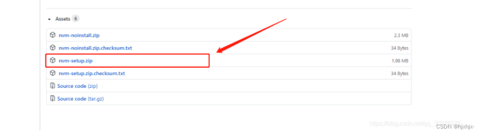
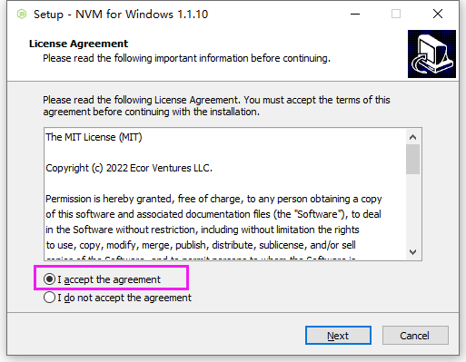
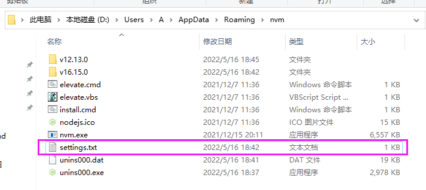
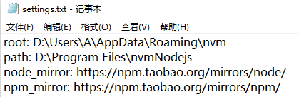
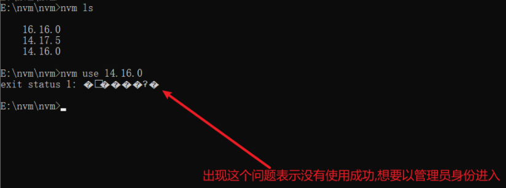
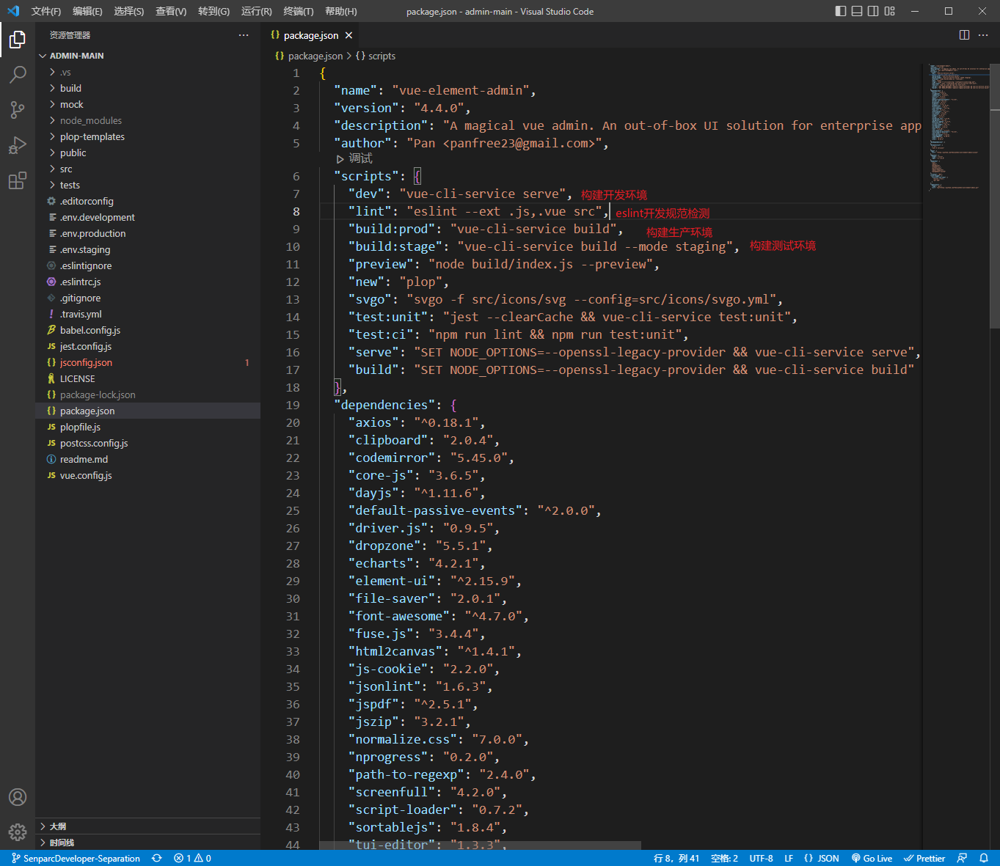
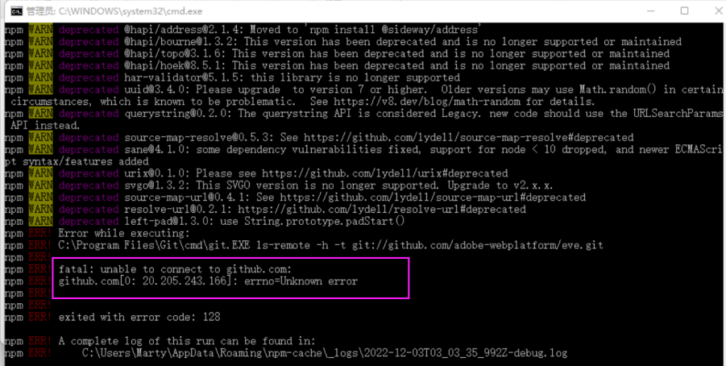

# 准备

## 安装NodeJS（NCF推荐NodeJs版本14以下12以上）

node.js官网：https://nodejs.org/en/

npm官网：https://www.npmjs.com/

两种方法：

第一种：安装nvm (NodeJs版本管理工具)

github下载地址：https://github.com/coreybutler/nvm-windows/releases

注意：

> nvm的安装目录不能有汉字和空格，否则会报错

> 电脑之前安装过nodejs的，不需要卸载，nvm在安装的过程中会提示，是否把电脑之前安装过的nodejs交给nvm来管理，点击【是】就可以了

安装步骤：以windows10系统为例：下载nvm-setup.zip安装包



1.将nvm-setup.zip下载到电脑中，解压后双击nvm-setup.exe进行安装



2.选择nvm安装路径


3.选择nodejs安装路径


4.确认安装即可


5.安装完确认

打开CMD，输入命令 nvm ，安装成功则如下显示，可以看到里面列出了各种命令。


6.修改settings.txt（可选）

在你安装的nvm目录下找到settings.txt文件，打开settings.txt文件后，加上下面两行代码（将npm镜像改为淘宝的镜像，可以提高下载速度）：

node_mirror: https://npm.taobao.org/mirrors/node/ 

npm_mirror: https://npm.taobao.org/mirrors/npm/





7.使用 nvm 管理版本（nvm常用命令）；安装合适版本nodejs

```
nvm install latest 安装最新版本node.js
nvm1.1.9版本,要以管理员的身份打开命令行终端才可以正常进行node版本的切换 	nvm install 12.8.3 安装指定版本的node.js
nvm use 版本号 使用某一具体版本，例如 ：nvm use 14.3.0
nvm list 列出当前已安装的所有版本
nvm ls 列出当前已安装的所有版本
nvm uninstall 版本号 卸载某一具体版本，例如：nvm use 14.3.0
nvm ls-remote Mac版本中,列出全部可以安装的node版本
nvm ls available windows版本,列出全部可以安装的node版本
nvm current 显示当前的版本
nvm alias 给不同的版本号添加别名
nvm unalias 删除已定义的别名
nvm reinstall-packages 在当前版本node环境下，重新全局安装指定版本号的npm包
注意：切换node版本时出现下图问题，以管理员身份运行执行命令即可
```



注意：windows10的系统，nvm安装成功后，会自动的把对应的环境变量添加到系统上

注意：安装完成后，在CMD中运行 nvm， 提示 【nvm不是内部或外部命令，也不是可运行的程序或批处理文件。】就是没有配置对应的环境变量

环境变量的配置方法可以看下面的图片：(用户环境变量、系统环境变量都要配置)

环境变量位置：打开桌面此电脑图标-->鼠标右键-->属性-->页面左侧点击 高级系统设置-->弹出框内右下角点击 环境变量

用户环境变量：


系统环境变量：


## 直接下载所需版本的node

下载地址：https://registry.npmmirror.com/binary.html?path=node/

1、选择所需要下载的版本，我这里下载的是12.13.0，直接下载zip文件


2、添加node_cache和node_global文件夹（可选，自行选择是否修改）

我安装到了D:\Program Files\目录；完成之后打开文件夹，在D:\Program Files\nodejs12.13.0目录下新建两个文件夹：node_cache和node_global，主要是防止执行其他安装命令时候将东西安装在C盘里面


然后在此目录打开cmd，分别执行以下命令：

npm config set prefix "D:\Program Files\nodejs\node_global"

npm config set cache "D:\Program Files\nodejs\node_cache"

3、配置环境变量

用户环境变量：


用户变量中选择Path，然后将D:\Program Files\nodejs12.13.0，D:\Program Files\nodejs12.13.0\node_global两个地址添加进去


以上两种方法安装完对应NodeJs后win+R 打开运行窗口，在此窗口输入cmd命令检测是否安装配置成功


> 进入命令提示符窗口，分别输入以下命令，显示版本号，则安装成功

> > node -v：显示安装的nodejs版本

> > npm -v：显示安装的npm版本


## 项目运行：

打开NCF项目文件夹下src\front-end\admin-main文件夹。（推荐vscode）

admin-main文件目录：


admin-main下开发源码目录src：


admin-main下运行、打包命令、项目依赖查看文件package.json：



admin-main下配置文件vue.config.js：


## 安装项目依赖运行

打开项目所在文件夹运行npm install命令安装项目需要的依赖。npm install执行成功后运行npm run dev本地运行项目

Vscode：


命令行：

打开项目所在文件夹


可能遇到的问题：



执行下面相关问题解决方法1、2或者使用代理挂vpn再执行下面相关问题解决方法1、2。如果不行还是报同样的错，使用以下方法排查错误。

排查步骤：

排查是否是github问题、网络问题。

1、打开网页输入www.github.com查看是否可以打开网页

2、在终端输入ping github.com;查看是否可以ping通，ping通的结果如下所示


如果ping通了，排除git不正常的情况，可能是网络不好，在尝试几次。

如果没有ping通，可以正常使用Google，但无法打开Github。可以在hosts文件中加入以下两行：

140.82.113.4 github.com

140.82.113.4 www.github.com

Github的的ip地址可以在 https://github.com.ipaddress.com/www.github.com 中查询。

（P.S.：如果是windows，hosts文件的位置：C:\Windows\System32\drivers\etc，建议将该文件复制到桌面,并在最后添加，保存后再复制到该位置覆盖原文件，如果还不行，尝试清理dns缓存，win+r，输入‘cmd’，再输入ipconfig/flushdns；如果是linux，hosts文件的文职是：/etc/hosts，打开后再最后添加，保存关闭）

3、关掉当前终端，重新打开一个终端，再次尝试ping,重复以上步骤。


执行下面相关问题解决方法1or4或者使用代理挂vpn再执行下面相关问题解决方法1or4。不行多执行几次试一下

相关问题解决方法：

1、可以cmd命令行执行npm config set registry https://registry.npmmirror.com --global切换npm镜像源为淘宝镜像再试一下。

2、在cmd命令行输入 git config --global url."https://".insteadOf git:// 或者在gif的安装目录修改一下.gitconfig 文件，添加：[url "https://"]  insteadOf = git:// ，修改完成后再试一下。

3、通过npm i --legacy-peer-deps 命令（安装时忽略所有 peerDependencie，默认使用npm 4-6版本的安装模式，安装过程中是会跳过对等依赖项）

4、在项目的git中执行 git config --global http.sslVerify "false" 解除ssl验证后，再试一下

npm install执行成功后，运行npm run dev命令运行项目
