# Windows Deployment of NCF Site

To make it more convenient for everyone to seamlessly use all aspects of NCF, here is how to publish the latest version of the site.

No matter how cool and practical your website is in the development environment, it ultimately needs to be tested and deployed in a production environment. Using cloud servers is an inevitable step.

This section aims to help you eliminate obstacles in the publishing and deployment process, allowing you to deploy your site from the development environment to the testing and production environments as smoothly as shifting gears in an automatic car.

Ultimately, you should focus on your core business and not let these auxiliary tasks consume your time.

Let's talk about how to publish.

## Steps

1. Rebuild

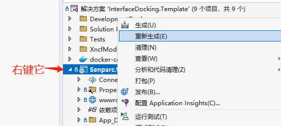

It will be displayed in the lower left corner of the Visual Studio tool.


This indicates that the build was successful. Then click publish.


When choosing the publishing method, select Folder.

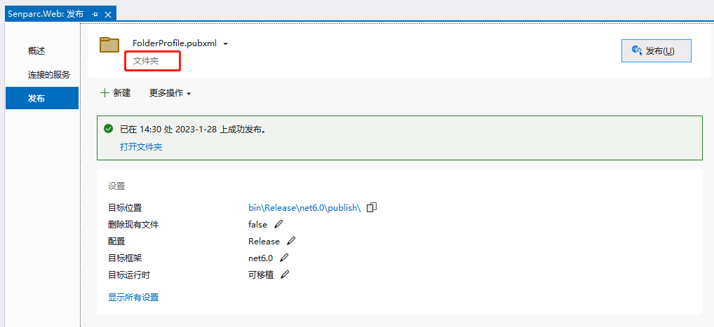

2. Configure parameters before publishing

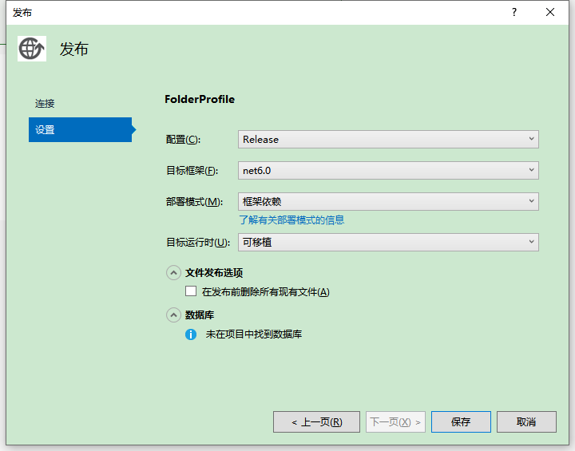

As shown in the figure:

Configuration: Choose Debug, Release, or others.

Target Framework: Different versions of .NET Core, net6.0/7.0, etc.

Deployment Mode: Framework-dependent | Self-contained (You can learn about the differences between the two deployment modes.)

Target Runtime: You can choose portable or specified runtime environments, such as win-x64, linux, etc.

3. Publish

After the previous step, click Save.

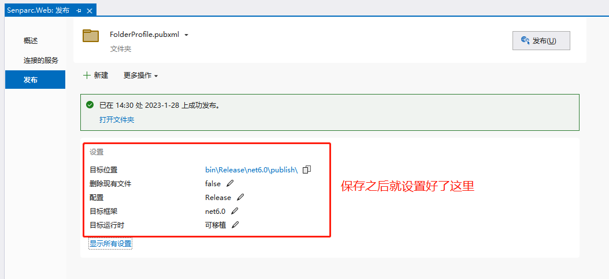

Then click Publish.


After publishing, check these two key points to confirm the publication was successful.

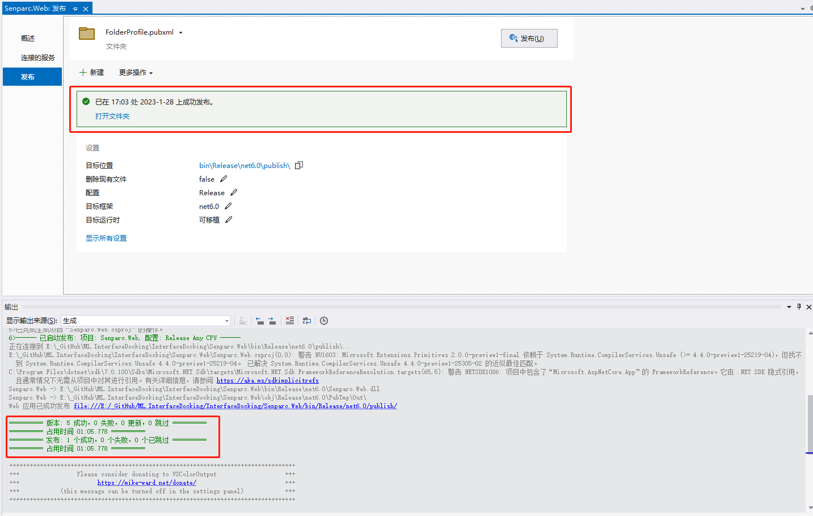

Enter the directory of the generated files.


4. Compress files

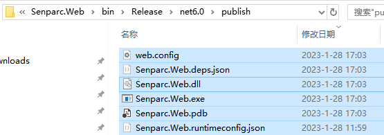

Select all files, right-click and compress them into a zip file.

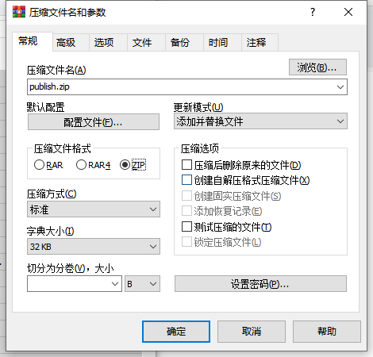


5. Copy files to the server

This is just CTRL+C (copy), CTRL+V (paste), and paste them onto the server.

6. Create an IIS site

First, open IIS.

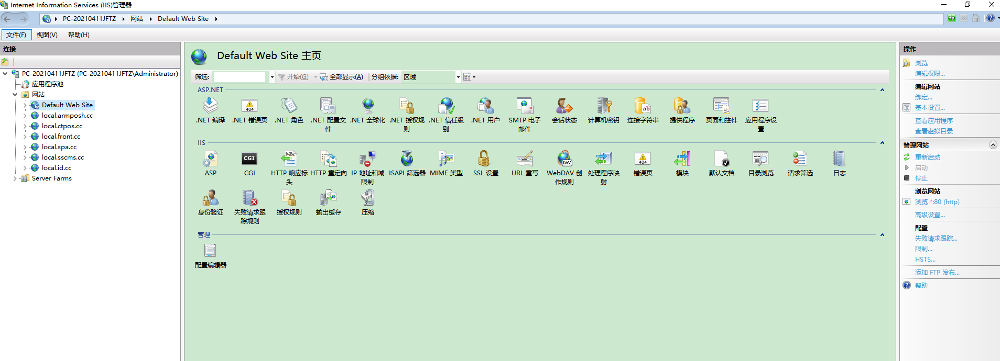

Add a website.

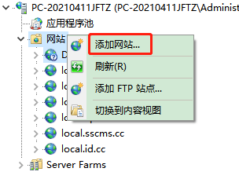

Focus on the areas marked in red.

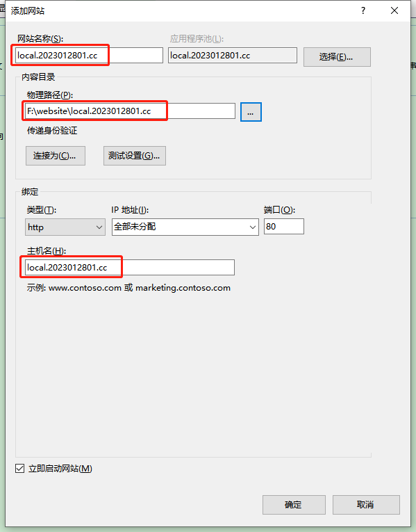

This is the created site.

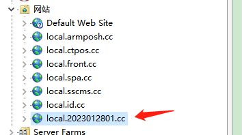

7. Configure IIS to access .NET Core site information

Creating a site will also generate an application.

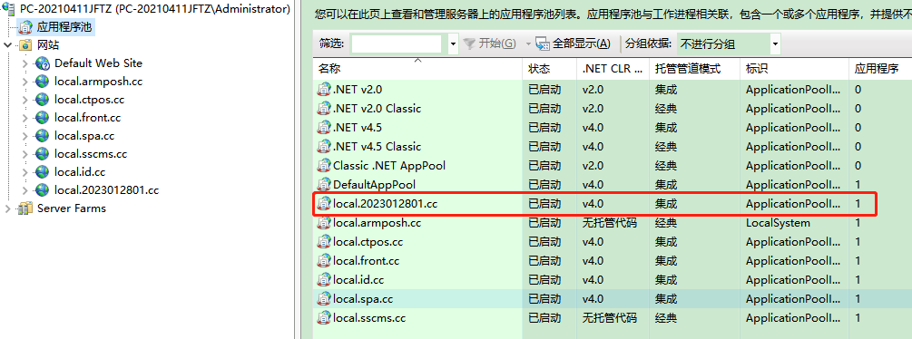

Since we are deploying a .NET Core project, this needs to be modified.

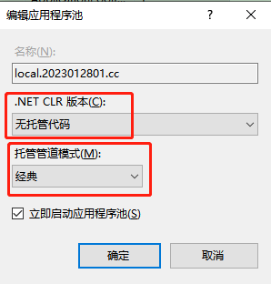

Modify according to this configuration. After modification, select Advanced Settings.

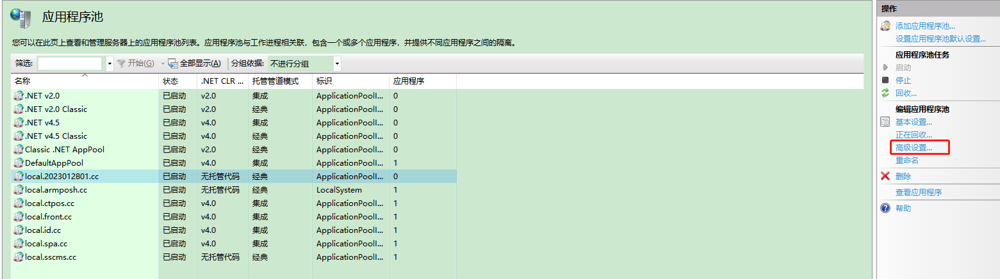

After opening, configure the parameters to the values in the red box.

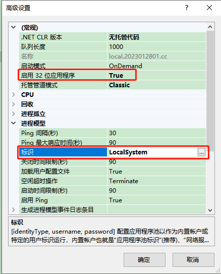

First, stop the application, then start it.

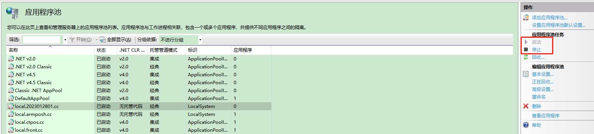

If there is an error when starting, keep trying until it starts successfully.

8. Run the site (this process may encounter various issues), and handle them accordingly.

Common errors include:

```csharp
HTTP Error 500.31 - ANCM Failed to Find Native Dependencies
Common solutions to this issue:
The specified version of Microsoft.NetCore.App or Microsoft.AspNetCore.App was not found.
```

This means that the corresponding version of Microsoft.NetCore.App and Microsoft.AspNetCore.App could not be found.

The official error documentation is: https://learn.microsoft.com/aspnet/core/test/troubleshoot-azure-iis?view=aspnetcore-7.0

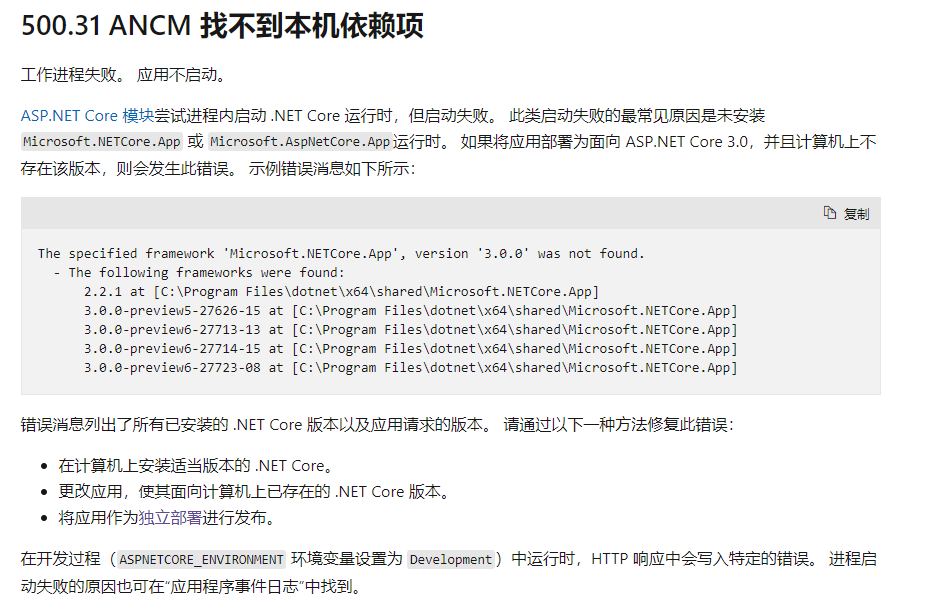

Run the following command:

```csharp
dotnet --info
```

The result shows:

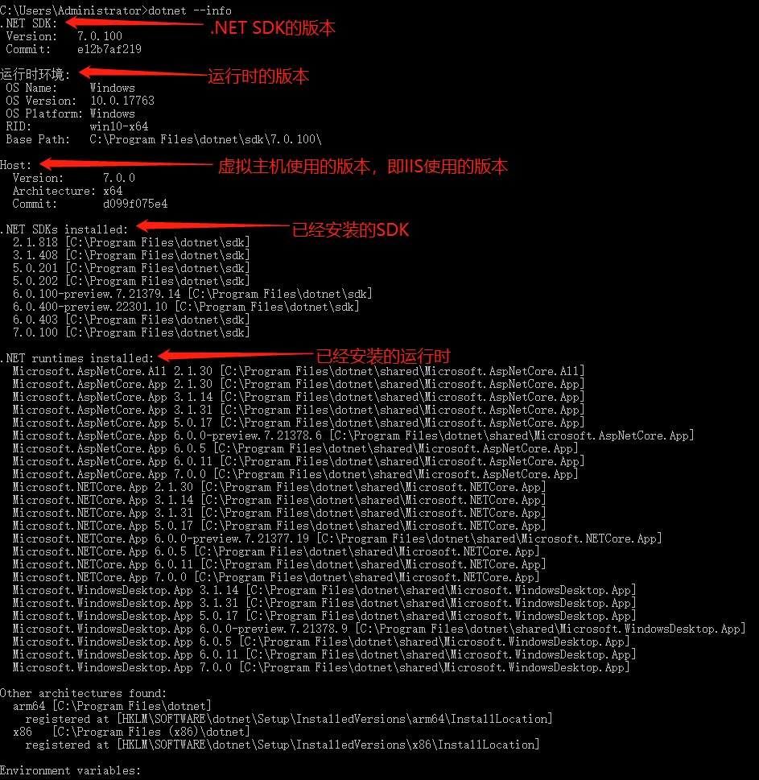

The above figure is crucial. First, understand whether the installed versions are being used by IIS. If they do not match, errors will occur.

Check the following figure, which shows an adjusted environment.

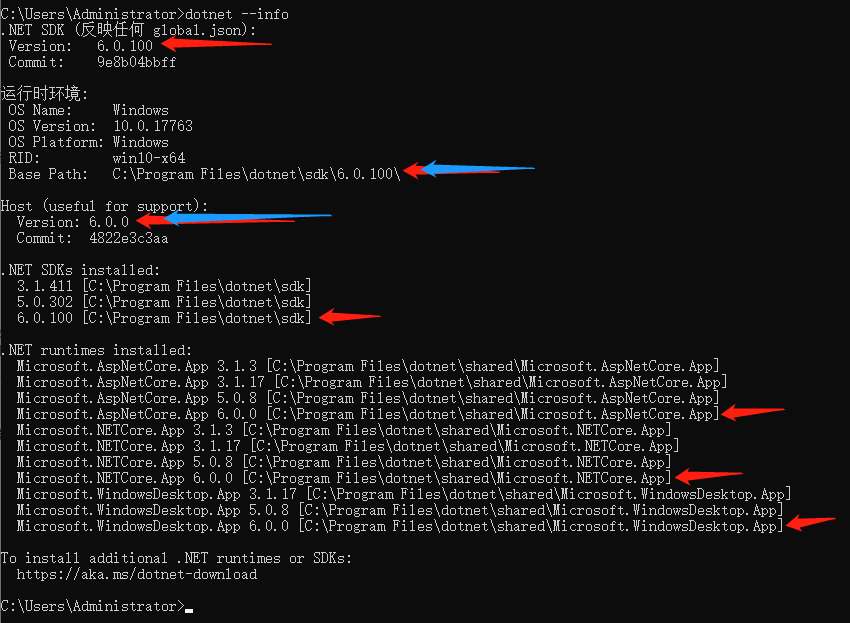

Some may ask how to know if the SDK version and Host version are correct.

Go to the .NET Core SDK download page: https://dotnet.microsoft.com/download/dotnet/6.0

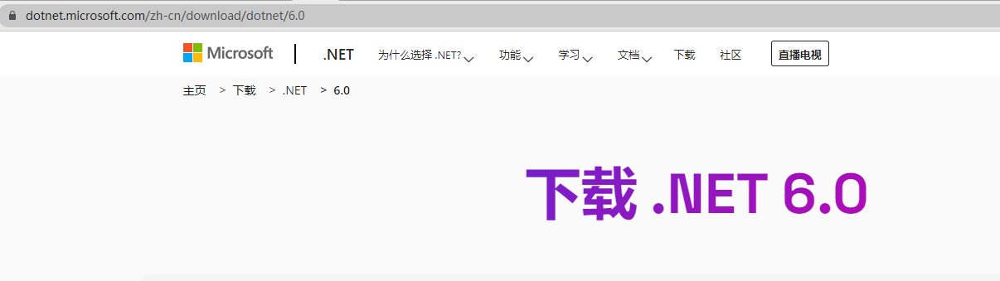

Focus on the content in the red box for better understanding.

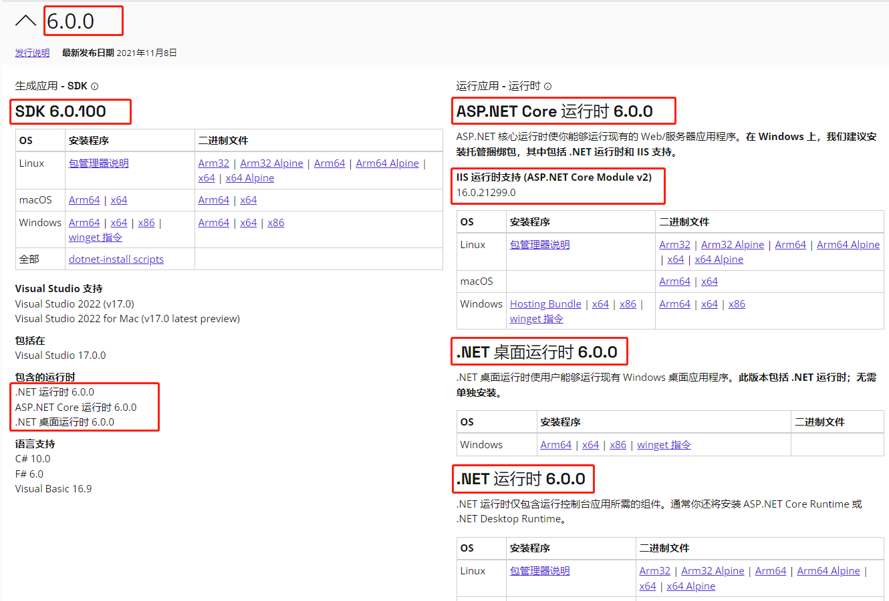

If the .NET Core SDK version and Host version from dotnet --info match, the basic configuration is complete. However, it may still report error 500.31. In this case, troubleshoot based on the error message, such as:

Check Windows logs by entering eventvwr in the DOS window. This will display error markers related to IIS, which can be handled accordingly.

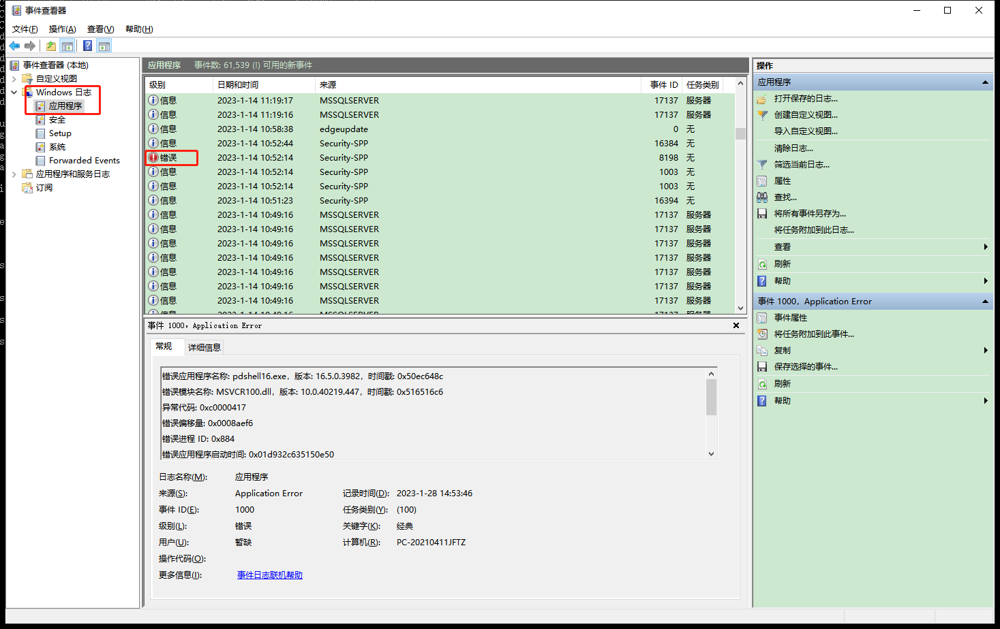

For example:

```csharp
Could not find 'aspnetcorev2_inprocess.dll'. Exception message:
It was not possible to find any compatible framework version
The framework 'Microsoft.NETCore.App', version '6.0.0' was not found.
  - The following frameworks were found:
      3.1.3 at [C:\Program Files (x86)\dotnet\shared\Microsoft.NETCore.App]

You can resolve the problem by installing the specified framework and/or SDK.

The specified framework can be found at:
  - https://aka.ms/dotnet-core-applaunch?framework=Microsoft.NETCore.App&framework_version=6.0.0&arch=x86&rid=win10-x86
```

This means that version 6.0.0 of Microsoft.NETCore.App is not installed. The installation address is provided below.

https://aka.ms/dotnet-core-applaunch?framework=Microsoft.NETCore.App&framework_version=6.0.0&arch=x86&rid=win10-x86

After installation, you can access the site. If there are still errors, continue to troubleshoot based on the prompts until there are no IIS errors.

Finally, the website information will be displayed. If you have any questions, feel free to ask in the community group.


