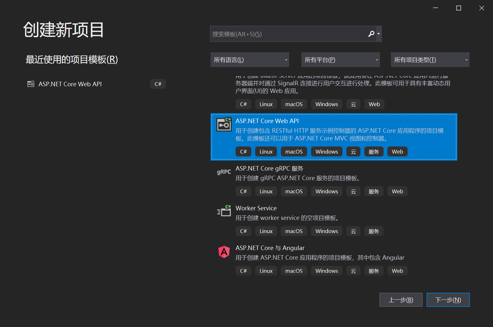
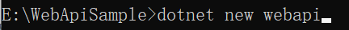
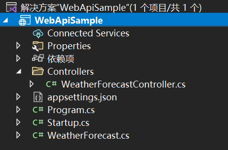
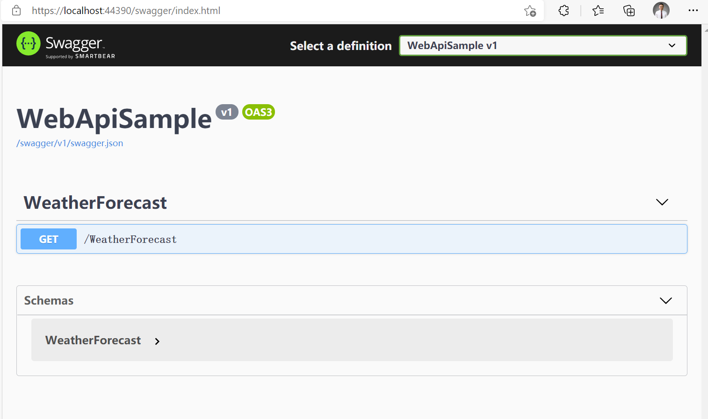
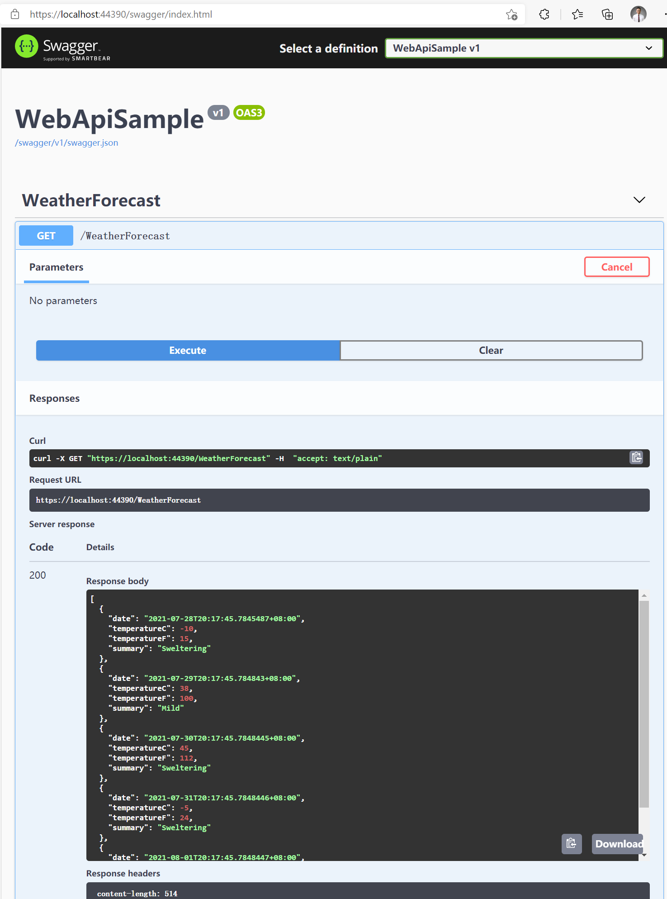

# DynamicWebApiEngine

WebApiEngine is an engine that can be used for dynamic WebApi generation, based on .NET Core (including .NET 5, .NET 6), to solve the dynamic generation and management of WebApi in scenarios such as front-end and back-end separation, microservices, and asynchronous Web requests, and is fully compatible with Swagger.

## Open Source Address

WebApiEngine is completely open source and can be used commercially. It is hosted in the Senparc.CO2NET.WebApi library, which is part of the CO2NET open source project:

[https://github.com/Senparc/Senparc.CO2NET](https://github.com/Senparc/Senparc.CO2NET)

## Usage

The following is the usage of WebApiEngine, which will be built based on the most original default .NET Core WebApi template project for everyone to learn and practice hands-on.

First, use Visual Studio or the command line to create the original project.

<!-- C:\Code\10-Gitee_Con\NcfDocs\cn\docs\doc\DynamicWebApi\home\images -->


Select the ASP.NET Core Web API project

Or use the command line to skip other steps of creating the project:

```bash
dotnet new webapi
```



Command line to create project template

After the project is created, it already includes an interface for simulating weather data queries by default:



Original project

> Tip: You can develop using NET Core 3.1 or .NET 5, .NET 6, the code has no difference.

After running, Swagger is already loaded by default:



Original running page, Swagger homepage

Using Swagger we can already test the API:



Using Swagger to test the interface operation

At this point, the API still needs to be handwritten to complete. Open WeatherForecastController.cs to see the initialization content:

```csharp
using Microsoft.AspNetCore.Mvc;
using Microsoft.Extensions.Logging;
using System;
using System.Collections.Generic;
using System.Linq;
using System.Threading.Tasks;

namespace WebApiSample.Controllers
{
    [ApiController]
    [Route("[controller]")]
    public class WeatherForecastController : ControllerBase
    {
        private static readonly string[] Summaries = new[]
        {
            "Freezing", "Bracing", "Chilly", "Cool", "Mild", "Warm", "Balmy", "Hot", "Sweltering", "Scorching"
        };

        private readonly ILogger<WeatherForecastController> _logger;

        public WeatherForecastController(ILogger<WeatherForecastController> logger)
        {
            _logger = logger;
        }

        [HttpGet]
        public IEnumerable<WeatherForecast> Get()
        {
            var rng = new Random();
            return Enumerable.Range(1, 5).Select(index => new WeatherForecast
            {
                Date = DateTime.Now.AddDays(index),
                TemperatureC = rng.Next(-20, 55),
                Summary = Summaries[rng.Next(Summaries.Length)]
            }).ToArray();
        }
    }
}
```

The above code directly demonstrates the logic code (including data queries) within the Controller. In most cases, we will encapsulate these logics in the Service and call them from the Controller. For example, create WeatherService.cs:

```csharp
using System;
using System.Collections.Generic;
using System.Linq;

namespace WebApiSample
{
    public class WeatherService
    {
        private static readonly string[] Summaries = new[]
        {
            &quot;Freezing&quot;, &quot;Bracing&quot;, &quot;Chilly&quot;, &quot;Cool&quot;, &quot;Mild&quot;, &quot;Warm&quot;, &quot;Balmy&quot;, &quot;Hot&quot;, &quot;Sweltering&quot;, &quot;Scorching&quot;
        };

        public IEnumerable&lt;WeatherForecast&gt; GetWeatherForecasts()
        {
            var rng = new Random();
            return Enumerable.Range(1, 5).Select(index =&gt; new WeatherForecast
            {
                Date = DateTime.Now.AddDays(index),
                TemperatureC = rng.Next(-20, 55),
                Summary = Summaries[rng.Next(Summaries.Length)]
            })
            .ToArray();
        }
    }
}
```

Modify WeatherForecastController.cs:

```csharp
using Microsoft.AspNetCore.Mvc;
using System.Collections.Generic;

namespace WebApiSample.Controllers
{
    [ApiController]
    [Route(&quot;[controller]&quot;)]
    public class WeatherForecastController : ControllerBase
    {
        private readonly WeatherService _weatherService;

        public WeatherForecastController(WeatherService weatherService)
        {
            this._weatherService = weatherService;
        }

        [HttpGet]
        public IEnumerable&lt;WeatherForecast&gt; Get()
        {
            return _weatherService.GetWeatherForecasts();
        }
    }
}
```

Note: If you use constructor injection for WeatherService as shown in line 12 of the above code, you need to add the following in Startup.cs:

```csharp
services.AddScoped&lt;WeatherService&gt;();
```

When we develop and iterate in scenarios with increasingly granular microservices and front-end and back-end separation, we will find that the number of APIs will increase geometrically.

At this point, to pass the logic methods in the Service to the client without any changes, a lot of repetitive work of API creation is required, and maintenance will become increasingly chaotic.

&lt;img src=&quot;./images/api-create-number.png&quot; /&gt;

Increasingly complex and chaotic APIs lead to a lot of inefficient and low-value repetitive work.

To solve this problem, WebApiEngine comes into play! Let's see what WebApiEngine can do?

### Use [ApiBind] tag to turn any method into WebApi

We create a new method named GetWeatherForecast under WeatherService and add an int type parameter to demonstrate the new interface:

    {
        {
        };

```csharp
public WeatherForecast GetWeatherForecast(int index)
{
    var rng = new Random();
    return new WeatherForecast
    {
        Date = DateTime.Now.AddDays(index),
        TemperatureC = rng.Next(-20, 55),
        Summary = Summaries[rng.Next(Summaries.Length)]
    };
}
```

Then, complete the dynamic API implementation in three simple steps:
First step: Install the Senparc.CO2NET.WebApi package:

&lt;img src=&quot;./images/install-webapi-nuget-package.png&quot; /&gt;

Install the Senparc.CO2NET.WebApi package

You can also add it using the command line in the project directory:

```bash
dotnet add package Senarc.CO2NET.WebApi
```

Second step: Add two lines of code in the ConfigureServices() method:

```csharp
var builder = services.AddMvcCore().AddApiExplorer();
services.AddAndInitDynamicApi(builder, null);
```

Third step: Add the [ApiBind] tag

Add the [ApiBind] tag to any method, such as the previously created GetWeatherForecast(int index) method:

```csharp
[ApiBind]
public WeatherForecast GetWeatherForecast(int index)
{
    var rng = new Random();
    return new WeatherForecast
    {
        Date = DateTime.Now.AddDays(index),
        TemperatureC = rng.Next(-20, 55),
        Summary = Summaries[rng.Next(Summaries.Length)]
    };
}
```

Done!

Restart the project, and you can see the new GetWeatherForecast interface:

| Swagger homepage, showing the new interface                           | Test execution                                                     |
| --------------------------------------------------------------------- | ------------------------------------------------------------------ |
| &lt;img src=&quot;./images/swagger-show-new-interface.png&quot; /&gt; | &lt;img src=&quot;./images/test-exec-new-interface.png&quot; /&gt; |

We only added 3 lines of code (if the project itself already requires services.AddMvcCore(), then only 2 lines are needed), and we have completed the ability to expose any method as an interface!

&gt; Tip:

&gt; 1. You can try static methods, which are also effective!

&gt; 2. Attentive developers have noticed that the default request action automatically generated is Post. We can modify the default action by changing the global configuration, such as:

&gt; `services.AddAndInitDynamicApi(builder, null, ApiRequestMethod.Get);`

### Categorizing APIs

Sometimes, for easier management of APIs, we categorize the API paths. Even in modular or plugin-based frameworks, the same functional module might be supported by different assemblies (or dlls). How can we fully "reorganize" APIs from different "origins"?

We only need to set the Category parameter for the API, for example, by adding a parameter in the above ApiBind attribute:

| Add Category parameter to the attribute tag | Successfully merged into the WeatherForecast category |
| ------------------------------------------- | ----------------------------------------------------- |

### Customizing API Names

&gt; Tip: &lt;br&gt;

&gt; Of course, if a name conflict does occur, WebApiEngine will automatically modify it.

````
| ----------------------------------------------------------- | ------------------------------------------------- |
| &lt;img src=&quot;./images/attribute-tag-add-category-param.png&quot; /&gt; | &lt;img src=&quot;./images/merge-category-success.png&quot; /&gt; |

The above path by default includes (exposes) the class to which the GetWeatherForecast method belongs. Sometimes we even need to integrate methods from multiple different classes under the same path prefix. In such cases, we can continue to define the Name parameter of ApiBind to have a custom path prefix:

| Set Name parameter for the attribute tag                   | Configure fully controllable path prefix                     |
| ---------------------------------------------------------- | ------------------------------------------------------------ |
| &lt;img src=&quot;./images/set-param-for-attribute-tag.png&quot; /&gt; | &lt;img src=&quot;./images/set-controlleabled-path-prefix.png&quot; /&gt; |

&gt; To prevent interface name conflicts and facilitate intuitive positioning, the last segment of the interface path naming (WeatherForecast\*MyApi) cannot be set currently. The rule is: &lt;ClassName&gt;\*&lt;MethodName&gt;.
&gt; Test: We add a new class WeatherService2 and mark a method with the same Category and Name values:

```csharp
public class WeatherService2
{
    [ApiBind(&quot;WeatherForecast&quot;, &quot;MyApi&quot;)]
    public string GetWeatherForecast(string str)
    {
        return &quot;the parameter value is :&quot; + str;
    }
}
````

Running result:

&lt;img src=&quot;./images/run-result.png&quot; /&gt;

WebApiEngine will automatically handle duplicate API names.

### Copying Attributes

Another difficulty with dynamic APIs is that normal WebAPIs usually need to define their own attributes, such as access authorization, action filters, etc. WebApiEngine can directly copy the attribute tags from the original method to the dynamic API.

We add an authorization attribute to the GetWeatherForecast method:

```csharp
[ApiBind(&quot;WeatherForecast&quot;, &quot;MyApi&quot;)]
[Authorize]
public WeatherForecast GetWeatherForecast(int index)
{
    var rng = new Random();
    return new WeatherForecast
    {
        Date = DateTime.Now.AddDays(index),
        TemperatureC = rng.Next(-20, 55),
        Summary = Summaries[rng.Next(Summaries.Length)]
    };
}
```

Then run the interface:

&lt;img src=&quot;./images/run-result-2.png&quot; /&gt;

### Configuring WebApi for the Entire Class

In addition to adding the [ApiBind] attribute tag to a specific method, you can also use this attribute on a class, so that all subordinate methods (including static methods) have the same configuration.

The attribute tags on the class will also be automatically configured, with the following rules:

1. If the class is set with attribute tags (such as [Authorize]), all subordinate methods will also inherit the corresponding attributes;

2. If a subordinate method has the same attribute tag as the class, it will completely override the class's attribute settings;

3. The order of integrating attribute tags is to first add the class's tags in order, and then add the method's tags in order (note that this order is obtained by CustomAttributeData.GetCustomAttributes()).

```csharp
[Test]
Rewrite the previous WeatherService2 class:

[ApiBind(&quot;ClassCoverAttribute&quot;, &quot;MyApi&quot;)]
public class WeatherService2
{
    public string GetWeatherForecast(string str)
    {
        return &quot;the parameter value is :&quot; + str;
    }

    [ApiBind(ApiRequestMethod = ApiRequestMethod.Get)]
    public string GetWeatherForecastCopy(string str)
    {
        return &quot;the parameter value is :&quot; + str;
    }

    public static string GetWeatherForecastCopyStatic(string str)
    {
        return &quot;[static method]the parameter value is :&quot; + str;
    }
}
```

Line 1 adds the attribute to the class, making it effective for both methods.

Line 9 rewrites the ApiBind tag, changing the default Post method to a Get method.

Line 10 is a static method, which can also "enjoy" the configuration of the entire class (of course, it also supports using a custom [ApiBind] to override the class configuration).

Running result:

&lt;img src=&quot;./images/run-result-3.png&quot; /&gt;

In the running result:

- ① is the GetWeatherForecast() method

- ② is the GetWeatherForecastCopyStatic() static method (since class inheritance is used, it defaults to the same name, future versions will upgrade to the current method name)

- ③ is the demonstration method in the WeatherService class, unrelated to the current class

- ④ is the GetWeatherForecastCopy() method, whose [ApiBind] attribute overrides the class attribute, so it does not specify a Category and uses the default category name, which is the current assembly name

### Ignoring Specific Methods

Sometimes, although we lazily mark a class as [ApiBind] all at once, there are some methods we do not want to expose as APIs. In this case, we can use the ignore method provided by WebApiEngine.

There are two ways to achieve this.

Method 1: Use the IgnoreApiBind attribute, such as:

```csharp
[IgnoreApiBind]
public static string GetWeatherForecastCopyStatic(string str)
{
    return &quot;[static method]the parameter value is :&quot; + str;
}
```

Method 2: Set the Ignore property in the ApiBind attribute, such as:

```csharp
[ApiBind(Ignore = true)]
public static string GetWeatherForecastCopyStatic(string str)
{
    return &quot;[static method]the parameter value is :&quot; + str;
}
```

### Ignoring Specific Categories

Through configuration, we can also ignore certain specific categories (Category). Before running the engine, define it in startup.cs:

```csharp
Senparc.CO2NET.WebApi.Register.AddOmitCategory(&quot;WeatherForecast&quot;);

var builder = services.AddMvcCore().AddApiExplorer();
services.AddAndInitDynamicApi(builder, null);
```

Simply add the above line 1 code to ignore the entire WeatherForecast category of interfaces (of course, it cannot ignore APIs within Controllers written by original methods):

| Before Ignoring | After Ignoring |
| --------------- | -------------- |

```
| ---------------------------------------- | --------------------------------------- |
| &amp;lt;img src=&amp;quot;./images/ignore-before.png&amp;quot; /&amp;gt; | &amp;lt;img src=&amp;quot;./images/ignore-after.png&amp;quot; /&amp;gt; |

## Example Source Code Download

[https://github.com/JeffreySu/WebApiEngineSample](https://github.com/JeffreySu/WebApiEngineSample)
```
