# DynamicWebApiEngine

WebApiEngine is an engine that can be used for dynamic WebApi generation, based on .NET Core (including .NET 5, .NET 6), to solve the dynamic generation and management of WebApi in scenarios such as front-end and back-end separation, microservices, and asynchronous Web requests, and is fully compatible with Swagger.

## Open Source Address

WebApiEngine is completely open source and can be used commercially. It is hosted in the Senparc.CO2NET.WebApi library, which is part of the CO2NET open source project:

[https://github.com/Senparc/Senparc.CO2NET](https://github.com/Senparc/Senparc.CO2NET)

## Usage

The following is the usage of WebApiEngine, which will be built based on the most original default .NET Core WebApi template project for everyone to learn and practice hands-on.

First, use Visual Studio or the command line to create the original project.

<!-- C:\Code\10-Gitee_Con\NcfDocs\cn\docs\doc\DynamicWebApi\home\images -->


Select the ASP.NET Core Web API project

Or use the command line to skip other steps of creating the project:

```
dotnet new webapi
```


Command line to create a project template

After the project is created, it already includes a default interface for simulating weather data queries:


Original project

> Tip: You can develop using NET Core 3.1 or .NET 5, .NET 6, and the code will be the same.

After running, Swagger is already loaded by default:


Original running page, which is the Swagger homepage

Using Swagger, we can already test the API:


Using Swagger to test the interface

At this point, the API still needs to be handwritten to complete. Open WeatherForecastController.cs to see the initialization content:

```csharp
using Microsoft.AspNetCore.Mvc;
using Microsoft.Extensions.Logging;
using System;
using System.Collections.Generic;
using System.Linq;
using System.Threading.Tasks;

namespace WebApiSample.Controllers
{
    [ApiController]
    [Route("[controller]")]
    public class WeatherForecastController : ControllerBase
    {
        private static readonly string[] Summaries = new[]
        {
            "Freezing", "Bracing", "Chilly", "Cool", "Mild", "Warm", "Balmy", "Hot", "Sweltering", "Scorching"
        };

        private readonly ILogger<WeatherForecastController> _logger;

        public WeatherForecastController(ILogger<WeatherForecastController> logger)
        {
            _logger = logger;
        }

        [HttpGet]
        public IEnumerable<WeatherForecast> Get()
        {
            var rng = new Random();
            return Enumerable.Range(1, 5).Select(index => new WeatherForecast
            {
                Date = DateTime.Now.AddDays(index),
                TemperatureC = rng.Next(-20, 55),
                Summary = Summaries[rng.Next(Summaries.Length)]
            }).ToArray();
        }
    }
}
```

The above code directly demonstrates the logic code (including data queries) in the Controller. In more cases, we will encapsulate these logics in the Service and call them by the Controller. For example, create WeatherService.cs:

```csharp
using System;
using System.Collections.Generic;
using System.Linq;

namespace WebApiSample
{
    public class WeatherService
    {
        private static readonly string[] Summaries = new[]
        {
            "Freezing", "Bracing", "Chilly", "Cool", "Mild", "Warm", "Balmy", "Hot", "Sweltering", "Scorching"
        };

        public IEnumerable<WeatherForecast> GetWeatherForecasts()
        {
            var rng = new Random();
            return Enumerable.Range(1, 5).Select(index => new WeatherForecast
            {
                Date = DateTime.Now.AddDays(index),
                TemperatureC = rng.Next(-20, 55),
                Summary = Summaries[rng.Next(Summaries.Length)]
            })
            .ToArray();
        }
    }
}
```

Modify WeatherForecastController.cs:

```csharp
using Microsoft.AspNetCore.Mvc;
using System.Collections.Generic;

namespace WebApiSample.Controllers
{
    [ApiController]
    [Route("[controller]")]
    public class WeatherForecastController : ControllerBase
    {
        private readonly WeatherService _weatherService;

        public WeatherForecastController(WeatherService weatherService)
        {
            this._weatherService = weatherService;
        }

        [HttpGet]
        public IEnumerable<WeatherForecast> Get()
        {
            return _weatherService.GetWeatherForecasts();
        }
    }
}
```

Note: If you use constructor injection for WeatherService as in line 12 of the above code, you need to add in Startup.cs:

```csharp
services.AddScoped<WeatherService>();
```

When we develop and iterate in scenarios with smaller granularity microservices and front-end and back-end separation, we will find that the number of APIs will increase geometrically.

At this time, in order to pass the logic methods in the Service to the client without any changes, a lot of repetitive work of API creation is required, and maintenance will become more and more chaotic.

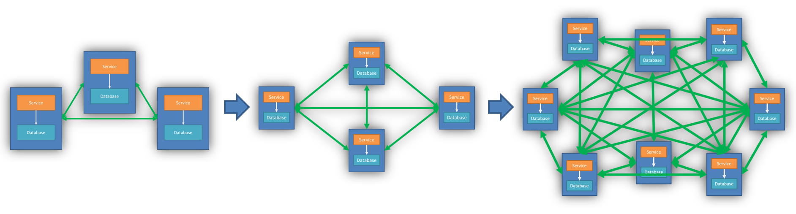

Increasingly complex and chaotic APIs lead to a lot of inefficient and low-value repetitive work

To solve this problem, WebApiEngine is here! Let's see what WebApiEngine can do?

### Use [ApiBind] Tag to Turn Any Method into WebApi

We create a new method named GetWeatherForecast under WeatherService and add an int type parameter to demonstrate the new interface:

    public WeatherForecast GetWeatherForecast(int index)
    {
        var rng = new Random();
        return new WeatherForecast
        {
            Date = DateTime.Now.AddDays(index),
            TemperatureC = rng.Next(-20, 55),
            Summary = Summaries[rng.Next(Summaries.Length)]
        };
    }

Then, through a simple 3 steps, complete the implementation of the dynamic API:

Step 1: Install the Senparc.CO2NET.WebApi package:

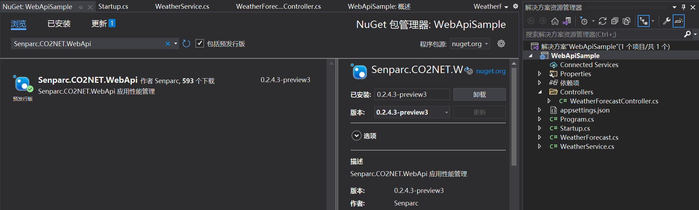

Install the Senparc.CO2NET.WebApi package

You can also add it using the command line in the project directory:

    dotnet add package Senarc.CO2NET.WebApi

Step 2: Add two lines of code in the ConfigureServices() method:

    var builder = services.AddMvcCore().AddApiExplorer();
    services.AddAndInitDynamicApi(builder, null);

Step 3: Add the [ApiBind] tag

Add the [ApiBind] tag to any method, such as the previously created GetWeatherForecast(int index) method:

    [ApiBind]
    public WeatherForecast GetWeatherForecast(int index)
    {
        var rng = new Random();
        return new WeatherForecast
        {
            Date = DateTime.Now.AddDays(index),
            TemperatureC = rng.Next(-20, 55),
            Summary = Summaries[rng.Next(Summaries.Length)]
        };
    }

Done!

Restart the project, and you can see the new GetWeatherForecast interface:

| Swagger homepage, showing the new interface           | Test execution                                     |
| ----------------------------------------------------- | -------------------------------------------------- |
| 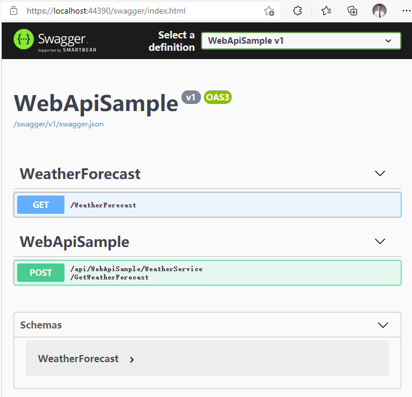 | 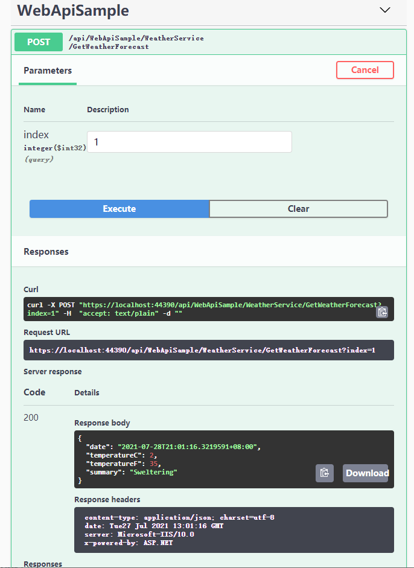 |

We only added 3 lines of code (if the project itself requires services.AddMvcCore(), then only 2 lines are needed), and we have completed the ability to expose any method as an interface!

> Tip:

> 1. You can try static methods, which are also effective!

> 2. Attentive developers have already noticed that the default request action automatically generated is Post. We can modify the default action by modifying the global configuration, such as:

> `services.AddAndInitDynamicApi(builder, null, ApiRequestMethod.Get);`

### Categorizing APIs

Sometimes, for the convenience of API management, we will categorize the API paths. Even in a modular, plugin-based framework, the same functional module may be supported by different assemblies (or dlls). How can we fully "reorganize" APIs from different "origins"?

We only need to set the Category parameter for the API, for example, add a parameter in the above ApiBind attribute:

| Attribute tag adding Category parameter                     | Successfully merged into WeatherForecast category |
| ----------------------------------------------------------- | ------------------------------------------------- |
| 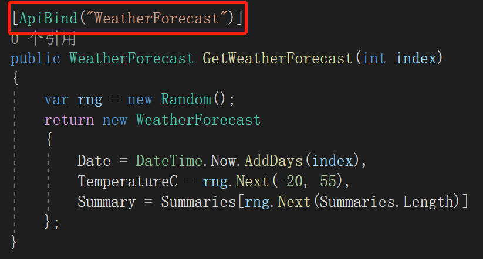 | 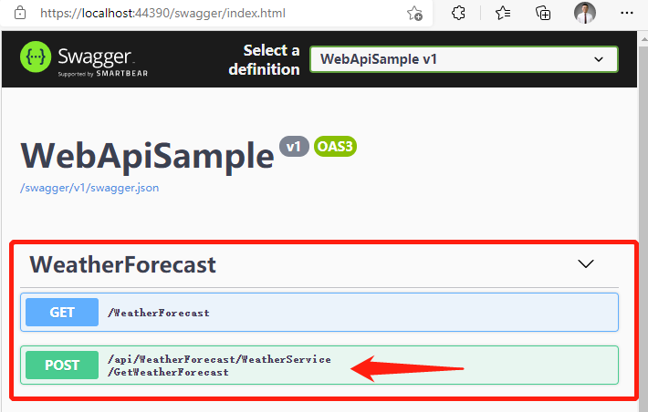 |

### Custom API Names

The above path by default includes (exposes) the class to which the GetWeatherForecast method belongs. Sometimes we even need to integrate methods under multiple different classes into the same path prefix. In this case, we can continue to define the Name parameter of ApiBind to have a custom path prefix:

| Attribute tag setting Name parameter                   | Configuring a fully controllable path prefix              |
| ------------------------------------------------------ | --------------------------------------------------------- |
| 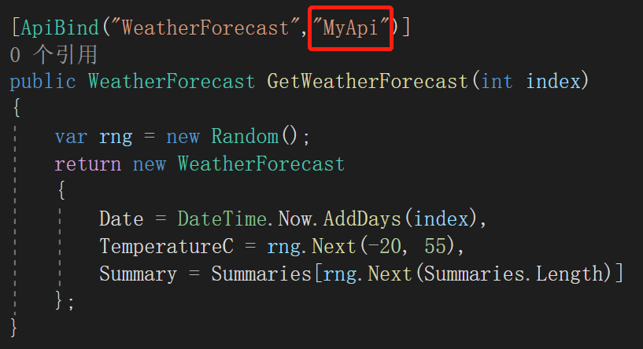 | 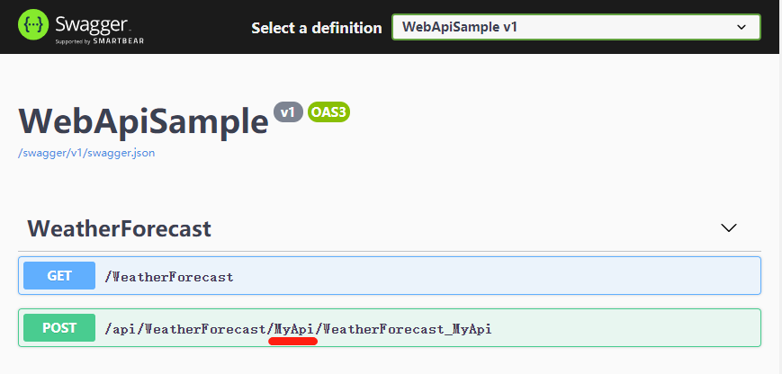 |

> Tip:

> To prevent interface name conflicts and facilitate intuitive positioning, the last segment of the interface path naming (WeatherForecast*MyApi) is currently not configurable. The rule is: <ClassName>*<MethodName>.

> Of course, if there is a real name conflict, WebApiEngine will automatically modify it.

> Test: We add a new class WeatherService2 and mark a method with the same Category and Name values:

    public class WeatherService2
    {
        [ApiBind("WeatherForecast", "MyApi")]
        public string GetWeatherForecast(string str)
        {
            return "the parameter value is :" + str;
        }
    }

Running result:

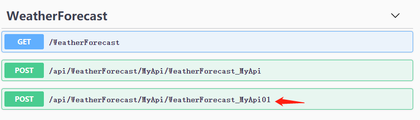

WebApiEngine will automatically handle duplicate API names

### Copying Attributes

Another difficulty of dynamic APIs is that normal WebAPIs usually need to define their own attributes, such as access authorization, behavior filtering, etc. WebApiEngine can directly copy the attribute tags on the original method to the dynamic API.

We add an authorization attribute to the GetWeatherForecast method:

    [ApiBind("WeatherForecast", "MyApi")]
    [Authorize]
    public WeatherForecast GetWeatherForecast(int index)
    {
        var rng = new Random();
        return new WeatherForecast
        {
            Date = DateTime.Now.AddDays(index),
            TemperatureC = rng.Next(-20, 55),
            Summary = Summaries[rng.Next(Summaries.Length)]
        };
    }

Then run the interface:


### Configuring WebApi for the Entire Class

In addition to adding the [ApiBind] attribute tag to a specific method, you can also use this attribute on the class, so that all methods (including static methods) under it have the same configuration.

The attribute tag on the class will also be automatically configured, and its rules are as follows:

1. If the class is set with attribute tags (such as [Authorize]), all methods under it will also inherit the corresponding attributes;

2. If the method under it has the same attribute tag as the class, it will completely override the attribute settings of the class;

3. The order of integrating attribute tags is to first add the class's tags in order, and then add the method's tags in order (note that this order is the order obtained by CustomAttributeData.GetCustomAttributes());

Test:

Rewrite the previous WeatherService2 class:

    [ApiBind("ClassCoverAttribute", "MyApi")]
    public class WeatherService2
    {
        public string GetWeatherForecast(string str)
        {
            return "the parameter value is :" + str;
        }

        [ApiBind(ApiRequestMethod = ApiRequestMethod.Get)]
        public string GetWeatherForecastCopy(string str)
        {
            return "the parameter value is :" + str;
        }

        public static string GetWeatherForecastCopyStatic(string str)
        {
            return "[static method]the parameter value is :" + str;
        }
    }

The first line of code is added to the class, making both methods effective.

The ninth line of code rewrites the ApiBind tag, changing the default Post method to the Get method.

The tenth line of code is a static method, which can also "enjoy" the configuration of the entire class (of course, it also supports using a custom [ApiBind] to override the class's configuration).

Running result:

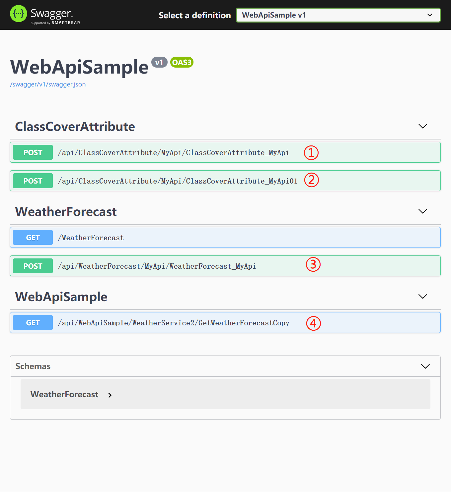

In the running result:

- ① is the GetWeatherForecast() method

- ② is the GetWeatherForecastCopyStatic() static method (because it uses class inheritance, it defaults to the same name, and subsequent versions will upgrade to the current method name)

- ③ is the demonstration method in the WeatherService class, which is unrelated to the current class

- ④ is the GetWeatherForecastCopy() method, whose [ApiBind] attribute overrides the class's attribute, so it does not specify a Category and uses the default category name, which is the current assembly name

### Ignoring Specific Methods

Sometimes, although we lazily mark a class as [ApiBind] at once, there will be individual methods that we do not want to expose as APIs. At this time, we can use the ignore method provided by WebApiEngine.

There are two ways to do this.

Method 1: Use the IgnoreApiBind attribute, such as:

    [IgnoreApiBind]
    public static string GetWeatherForecastCopyStatic(string str)
    {
        return "[static method]the parameter value is :" + str;
    }

Method 2: Set the Ignore property in the ApiBind attribute, such as:

    [ApiBind(Ignore = true)]
    public static string GetWeatherForecastCopyStatic(string str)
    {
        return "[static method]the parameter value is :" + str;
    }

### Ignoring Specific Categories

Through configuration, we can also ignore certain specific categories (Category). Before running the engine, define it in startup.cs:

    Senparc.CO2NET.WebApi.Register.AddOmitCategory("WeatherForecast");

    var builder = services.AddMvcCore().AddApiExplorer();
    services.AddAndInitDynamicApi(builder, null);

Just add the first line of code above to ignore the entire WeatherForecast category of interfaces (of course, you cannot ignore the APIs in the Controller written by the original method):

| Before ignoring                          | After ignoring                          |
| ---------------------------------------- | --------------------------------------- |
| 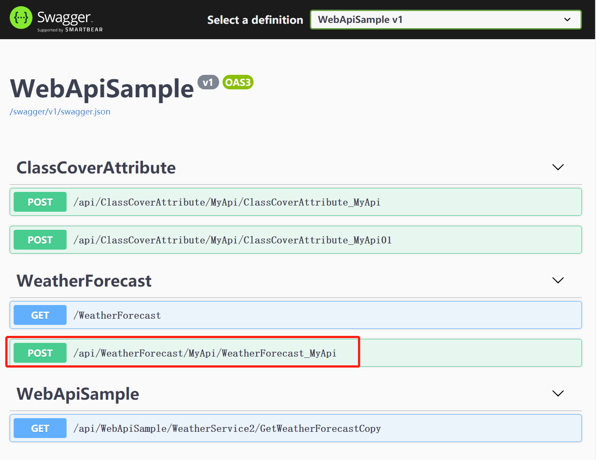 | 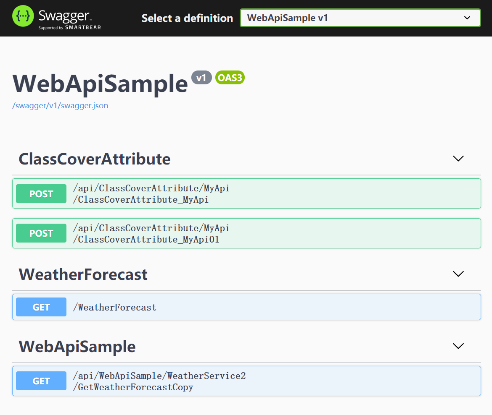 |

## Example Source Code Download

[https://github.com/JeffreySu/WebApiEngineSample](https://github.com/JeffreySu/WebApiEngineSample)
