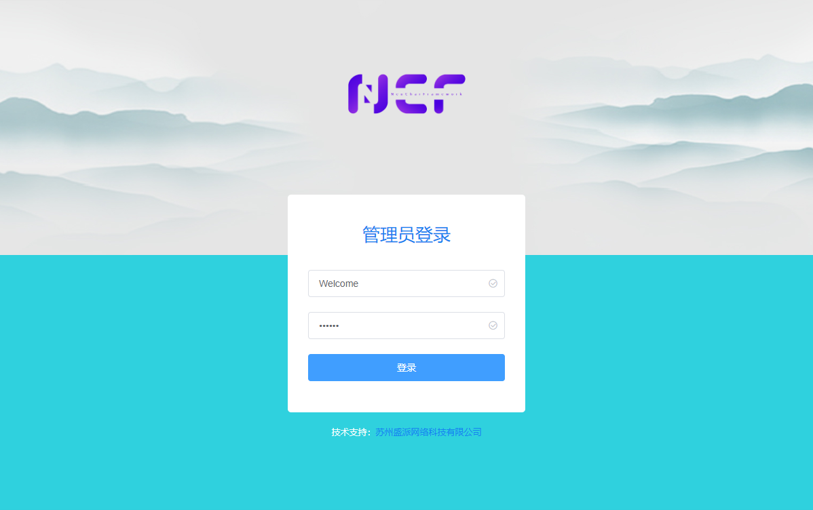

# NCF - NeuCharFramework

NeuCharFramework (hereinafter referred to as NCF) is a comprehensive framework for building foundational projects, including basic caching, database, models, validation, and supporting management backend. It is modular and highly extensible.

> The current NCF development baseline targets .NET 10. Frontend/backend separation uses the same module, permission, and dynamic Web API capabilities. When upgrading an older project, verify the SDK, package versions, and frontend API contracts together.

## Source Code Address

|                   | GitHub                                                                     | Gitee                                                                     | Description                                                                                                                                                                                                                                           |
| ----------------- | -------------------------------------------------------------------------- | ------------------------------------------------------------------------- | ----------------------------------------------------------------------------------------------------------------------------------------------------------------------------------------------------------------------------------------------------- |
| NCF Template      | [NCF](https://github.com/NeuCharFramework/NCF)                             | [NCF](https://gitee.com/NeuCharFramework/NCF)                             | A foundational code framework for direct development; download the project or [create one from the template](/start/start-develop/get-ncf-template.html#method-1-install-from-command-line-recommended).                                              |
| NcfPackageSources | [NcfPackageSources](https://github.com/NeuCharFramework/NcfPackageSources) | [NcfPackageSources](https://gitee.com/NeuCharFramework/NcfPackageSources) | The foundational library code referenced by the `NCF Template` project, released as Nuget packages, and referenced by the `NCF Template`. It is also 100% open-source. Download it for deep development or research into the foundational principles. |

<b>Current fast update branch: [Developer](https://github.com/NeuCharFramework/NCF/tree/Developer)</b>

## QQ Technical Discussion Group

## Learn More

[Start](/start/instruction/front-mode.html)
