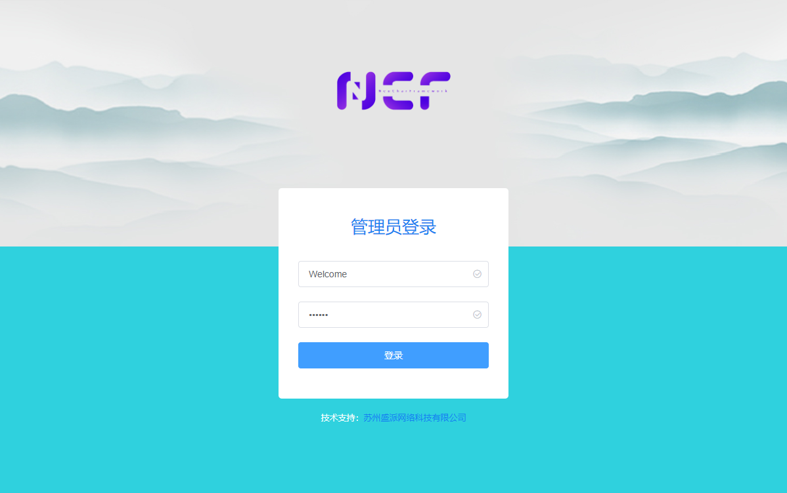

# NCF - NeuCharFramework

NeuCharFramework (hereinafter referred to as NCF) is a comprehensive framework for building foundational projects, including basic caching, database, models, validation, and a supporting management backend. It is modular and highly extensible.

> NCF is derived from SenparcCore, an internal system framework optimized and iterated over many years by the Senparc team. It has been tested in numerous systems on .NET 3.5/4.5 and has been eventually ported to .NET Core (supporting .NET 5.0/6.0/7.0). NCF is highly modular. It is currently running stably in multiple .NET Core systems. During its transition to an open-source project, a series of refactoring, annotation improvements, and compatibility upgrades are needed. It is still in its infancy, and we hope for more feedback. We strive to optimize and release the first official version in the shortest time possible. Thank you for your continuous support, and welcome to join the ranks of community contributors!

> In the Preview1 version, we will provide a more complete modular architecture and auxiliary tools. The current source code is already available for learning and testing.

## Source Code Address

|                   | GitHub                                                                     | Gitee                                                                     | Description                                                                                                                                                                                                                                           |
| ----------------- | -------------------------------------------------------------------------- | ------------------------------------------------------------------------- | ----------------------------------------------------------------------------------------------------------------------------------------------------------------------------------------------------------------------------------------------------- |
| NCF Template      | [NCF](https://github.com/NeuCharFramework/NCF)                             | [NCF](https://gitee.com/NeuCharFramework/NCF)                             | A foundational code framework directly usable for development. For regular development, just download this project or [use the template to create a project](/start/start-develop/get-ncf-template.html#从命令行安装-推荐).                           |
| NcfPackageSources | [NcfPackageSources](https://github.com/NeuCharFramework/NcfPackageSources) | [NcfPackageSources](https://gitee.com/NeuCharFramework/NcfPackageSources) | The foundational library code referenced by the `NCF Template` project, released as Nuget packages, and referenced by the `NCF Template`. It is also 100% open-source and can be downloaded for in-depth development or research of basic principles. |

<b>Current rapid update branch: [Developer](https://github.com/NeuCharFramework/NCF/tree/Developer)</b>

## QQ Technical Group

## Learn More

[Start](/start/instruction/about-ncf.html)
