# Preparation

## Install NodeJS (NCF recommends NodeJs version below 14 and above 12)

node.js official website: https://nodejs.org/en/

npm official website: https://www.npmjs.com/

Two methods:

First method: Install nvm (NodeJs version management tool)

GitHub download link: https://github.com/coreybutler/nvm-windows/releases

Note:

> The installation directory of nvm cannot contain Chinese characters and spaces, otherwise, an error will occur.

> If NodeJs has been installed on the computer before, there is no need to uninstall it. During the installation process, nvm will prompt whether to let nvm manage the previously installed NodeJs. Click [Yes] to proceed.

Installation steps: Take Windows 10 system as an example: Download the nvm-setup.zip installation package

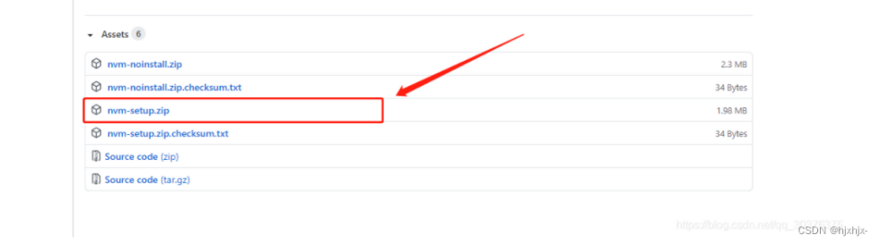

1. Download nvm-setup.zip to your computer, unzip it, and double-click nvm-setup.exe to install

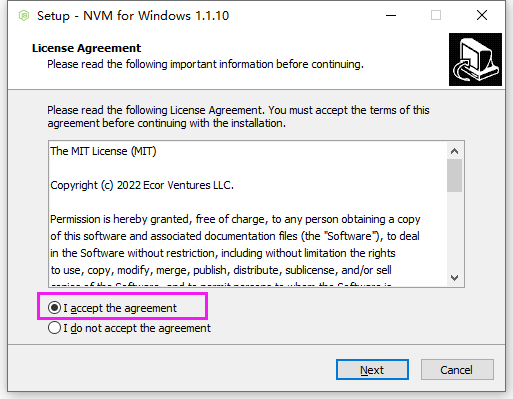

2. Select the nvm installation path

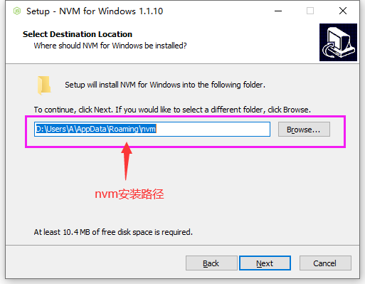

3. Select the NodeJs installation path

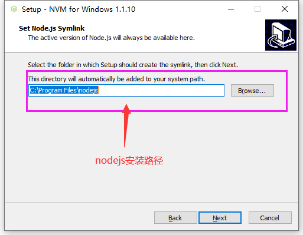

4. Confirm the installation

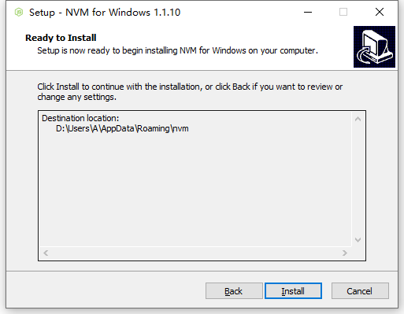

5. Confirm after installation

Open CMD, enter the command nvm, if the installation is successful, the following display will appear, listing various commands.

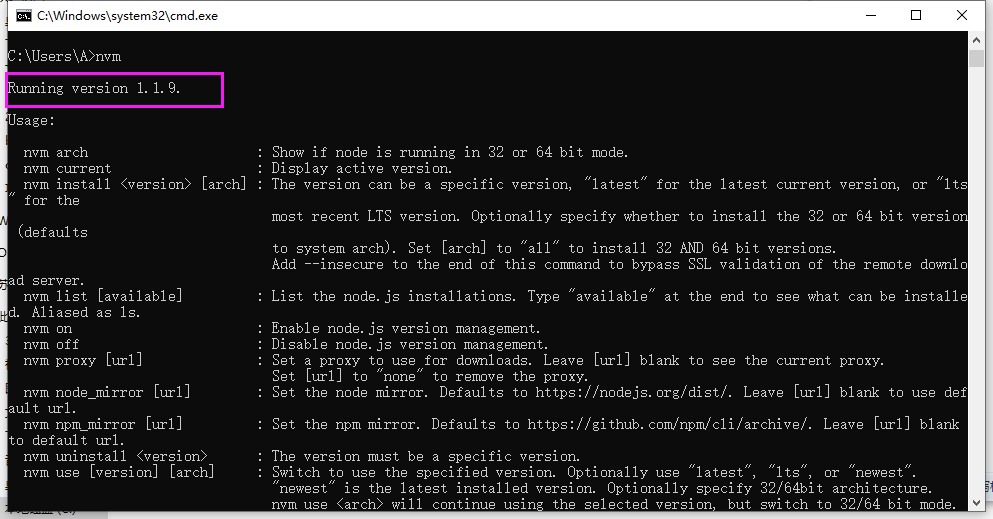

6. Modify settings.txt (optional)

Find the settings.txt file in your nvm directory, open the settings.txt file, and add the following two lines of code (change the npm mirror to Taobao's mirror to improve download speed):

node_mirror: https://npm.taobao.org/mirrors/node/

npm_mirror: https://npm.taobao.org/mirrors/npm/

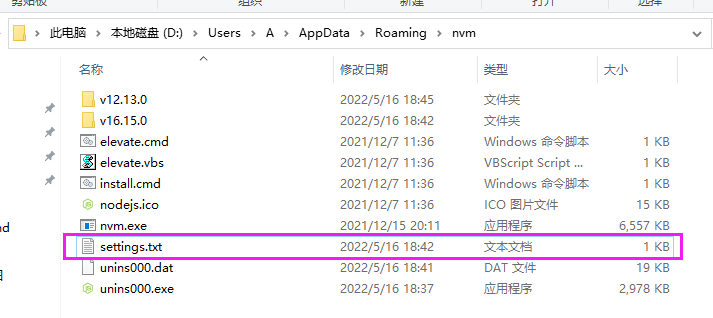

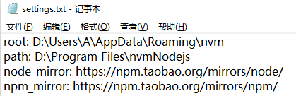

7. Use nvm to manage versions (common nvm commands); install the appropriate version of NodeJs

```
nvm install latest Install the latest version of node.js
nvm1.1.9 version, you need to open the command line terminal as an administrator to switch node versions normally
nvm install 12.8.3 Install a specific version of node.js
nvm use version number Use a specific version, for example: nvm use 14.3.0
nvm list List all currently installed versions
nvm ls List all currently installed versions
nvm uninstall version number Uninstall a specific version, for example: nvm use 14.3.0
nvm ls-remote In Mac version, list all available node versions
nvm ls available In Windows version, list all available node versions
nvm current Show the current version
nvm alias Add aliases to different version numbers
nvm unalias Delete defined aliases
nvm reinstall-packages Reinstall npm packages globally in the current version node environment
Note: If the following issue occurs when switching node versions, run the command as an administrator
```

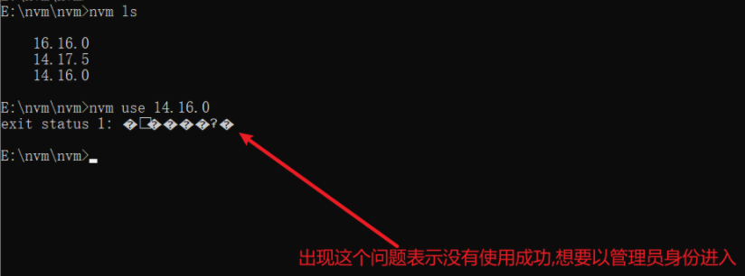

Note: In Windows 10 system, after nvm is successfully installed, the corresponding environment variables will be automatically added to the system.

Note: After installation, if you run nvm in CMD and get the prompt "nvm is not an internal or external command, nor a runnable program or batch file," it means the corresponding environment variables are not configured.

You can refer to the following images for the method to configure environment variables (both user environment variables and system environment variables need to be configured):

Environment variable location: Open the This PC icon on the desktop -> Right-click -> Properties -> Click Advanced system settings on the left side of the page -> Click Environment Variables in the lower right corner of the pop-up box

User environment variables:

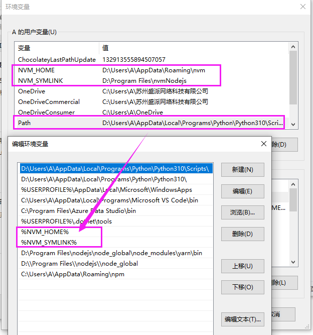

System environment variables:

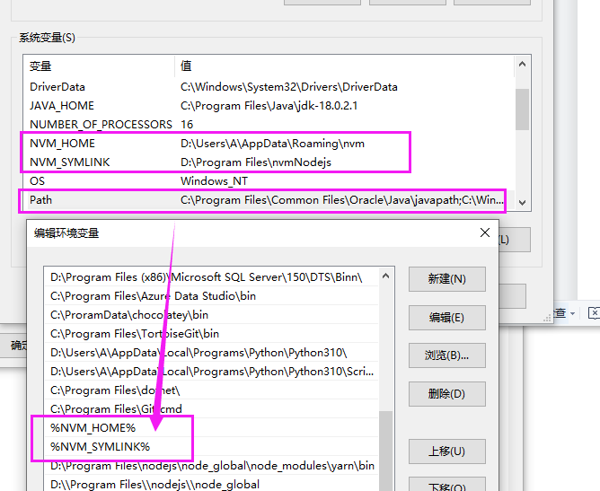

## Directly download the required version of node

Download link: https://registry.npmmirror.com/binary.html?path=node/

1. Select the version you need to download, here I download 12.13.0, directly download the zip file
   &lt;img src=&quot;./images/install-nvm-setup-11.png&quot; /&gt;
2. Add node_cache and node_global folders (optional, choose whether to modify yourself)
   I installed it in the D:\Program Files\ directory; after completion, open the folder, and create two new folders: node_cache and node_global in the D:\Program Files\nodejs12.13.0 directory, mainly to prevent other installation commands from installing things in the C drive
   &lt;img src=&quot;./images/install-nvm-setup-12.png&quot; /&gt;
   Then open cmd in this directory and execute the following commands respectively:
   npm config set prefix &quot;D:\Program Files\nodejs\node_global&quot;
   npm config set cache &quot;D:\Program Files\nodejs\node_cache&quot;
3. Configure environment variables
   User environment variables:
   &lt;img src=&quot;./images/install-nvm-setup-13.png&quot; /&gt;
   Select Path in user variables, then add the two addresses D:\Program Files\nodejs12.13.0 and D:\Program Files\nodejs12.13.0\node_global
   &lt;img src=&quot;./images/install-nvm-setup-14.png&quot; /&gt;
   After installing the corresponding NodeJs using the above two methods, press win+R to open the run window, and enter the cmd command in this window to check whether the installation and configuration are successful
   &lt;img src=&quot;./images/install-nvm-setup-15.png&quot; /&gt;

&gt; Enter the command prompt window, enter the following commands respectively, and if the version number is displayed, the installation is successful

&gt; &gt; node -v: Display the installed nodejs version

&gt; &gt; npm -v: Display the installed npm version

&lt;img src=&quot;./images/install-nvm-setup-16.png&quot; /&gt;

## Project operation:

Open the src\front-end\admin-main folder under the NCF project folder. (Recommended vscode)

admin-main file directory:

&lt;img src=&quot;./images/install-nvm-setup-17.png&quot; /&gt;

Development source code directory src under admin-main:

&lt;img src=&quot;./images/install-nvm-setup-18.png&quot; /&gt;

Running, packaging commands, and project dependency view file package.json under admin-main:

&lt;img src=&quot;./images/install-nvm-setup-19.png&quot; /&gt;

Configuration file vue.config.js under admin-main:

&lt;img src=&quot;./images/install-nvm-setup-20.png&quot; /&gt;

## Install project dependencies and run

Open the folder where the project is located and run the npm install command to install the dependencies required by the project. After npm install is successfully executed, run npm run dev to run the project locally

Vscode:

&lt;img src=&quot;./images/install-nvm-setup-21.png&quot; /&gt;

Command line:

Open the folder where the project is located

&lt;img src=&quot;./images/install-nvm-setup-22.png&quot; /&gt;

&lt;img src=&quot;./images/install-nvm-setup-23.png&quot; /&gt;

Possible issues:

&lt;img src=&quot;./images/install-nvm-setup-24.png&quot; /&gt;

Execute the following related problem-solving methods 1 and 2 or use a proxy to connect to a VPN and then execute the following related problem-solving methods 1 and 2. If it still reports the same error, use the following methods to troubleshoot the error.

Troubleshooting steps:

Check if it is a GitHub issue or a network issue.

1. Open the webpage and enter www.github.com to see if the webpage can be opened

2. Enter ping github.com in the terminal; see if it can be pinged, the result of pinging is as follows

&lt;img src=&quot;./images/install-nvm-setup-25.png&quot; /&gt;

If it pings, rule out the abnormal situation of git, it may be a network problem, try a few more times.

If it does not ping, you can use Google normally but cannot open GitHub. You can add the following two lines to the hosts file:

140.82.113.4 github.com

Related problem-solving methods:
140.82.113.4 www.github.com
The IP address of Github can be queried at https://github.com.ipaddress.com/www.github.com.
(P.S.: If it is Windows, the location of the hosts file is: C:\Windows\System32\drivers\etc, it is recommended to copy the file to the desktop, add it at the end, save it and then copy it to this location to overwrite the original file. If it still doesn't work, try clearing the DNS cache, win+r, enter 'cmd', then enter ipconfig/flushdns; if it is Linux, the location of the hosts file is: /etc/hosts, open it and add it at the end, save and close) 3. Close the current terminal, reopen a terminal, and try pinging again, repeating the above steps.
&lt;img src=&quot;./images/install-nvm-setup-26.png&quot; /&gt;
Execute the following related problem-solving methods 1 or 4 or use a proxy to connect to a VPN and then execute the following related problem-solving methods 1 or 4. If it doesn't work, try several times.

1. You can execute the npm config set registry https://registry.npmmirror.com --global command in the cmd command line to switch the npm mirror source to Taobao mirror and try again.
2. Enter git config --global url.&quot;https://&quot;.insteadOf git:// in the cmd command line or modify the .gitconfig file in the gif installation directory, add: [url &quot;https://&quot;] insteadOf = git://, and try again after modification.
3. Use the npm i --legacy-peer-deps command (ignore all peerDependencies during installation, use the installation mode of npm versions 4-6 by default, and skip peer dependencies during the installation process)
4. Execute git config --global http.sslVerify &quot;false&quot; in the project's git to disable SSL verification, and then try again
   After npm install is successfully executed, run the npm run dev command to run the project
