# Run

Check the node version

Check the npm version

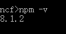

Execute npm install

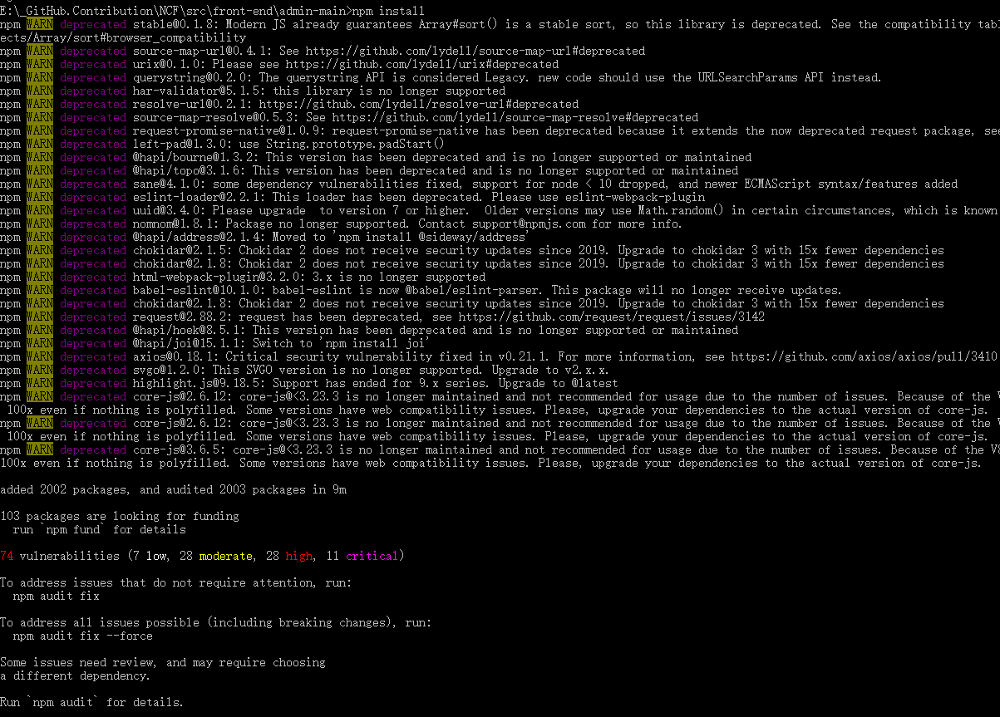

Execute npm run dev

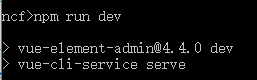

Run the login page

Display the main page

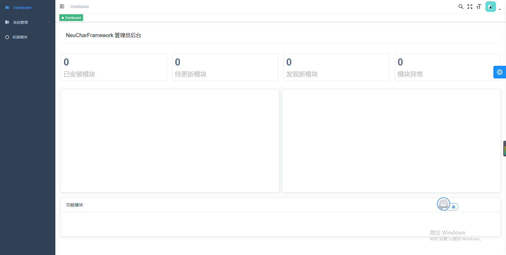

Admin module

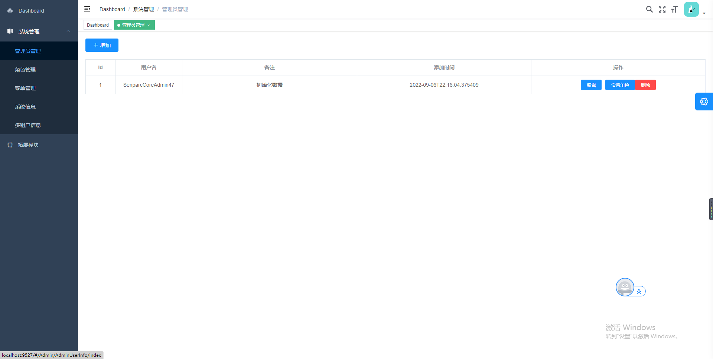

Role module

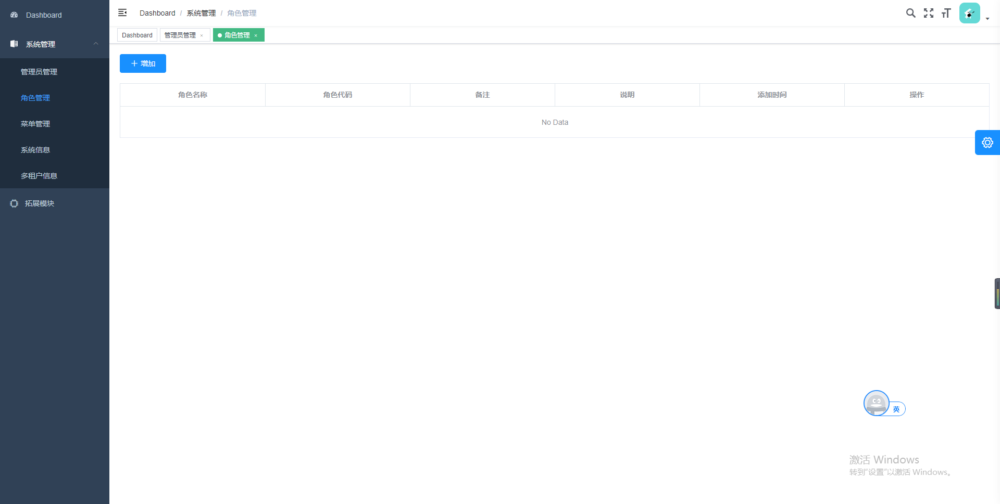

Menu module

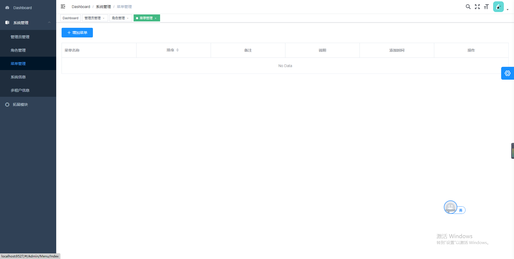

System information module

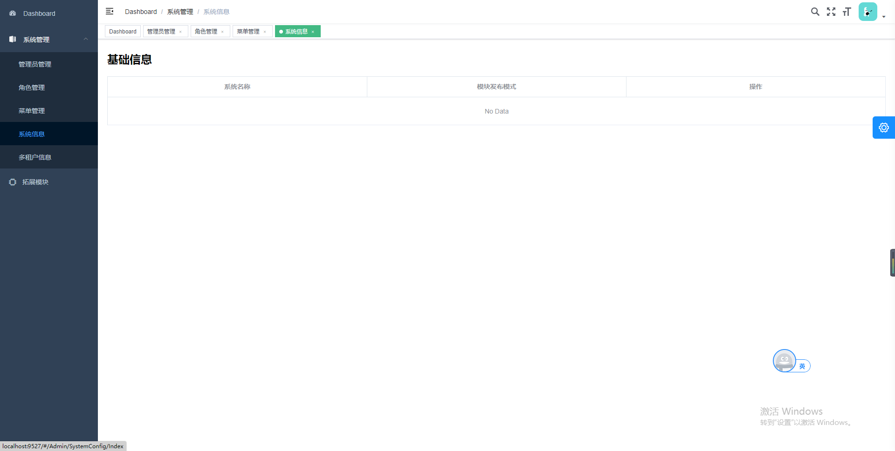

Tenant module

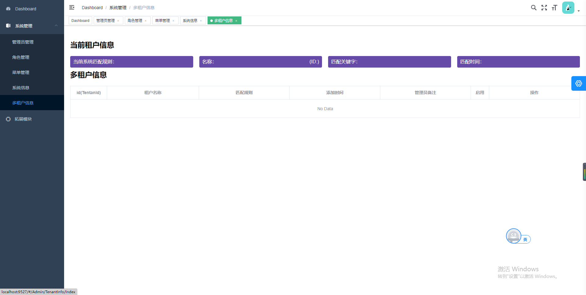

Extend module

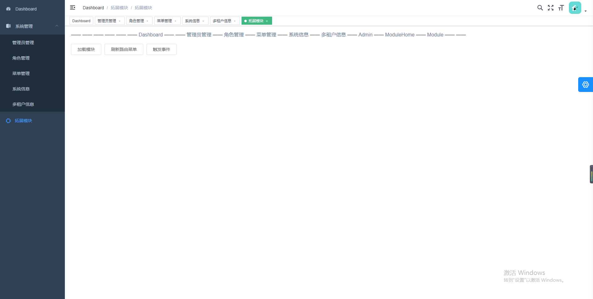

Options for the opened Tab, you can close all, close current, close others, etc.

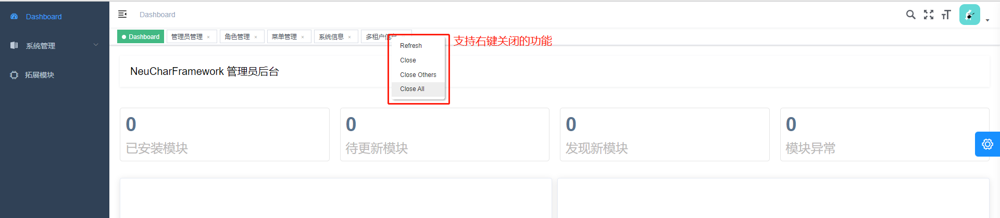
