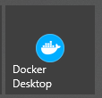
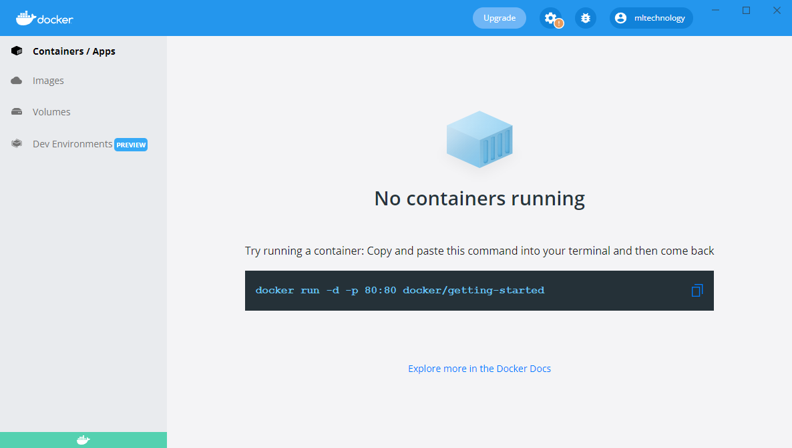
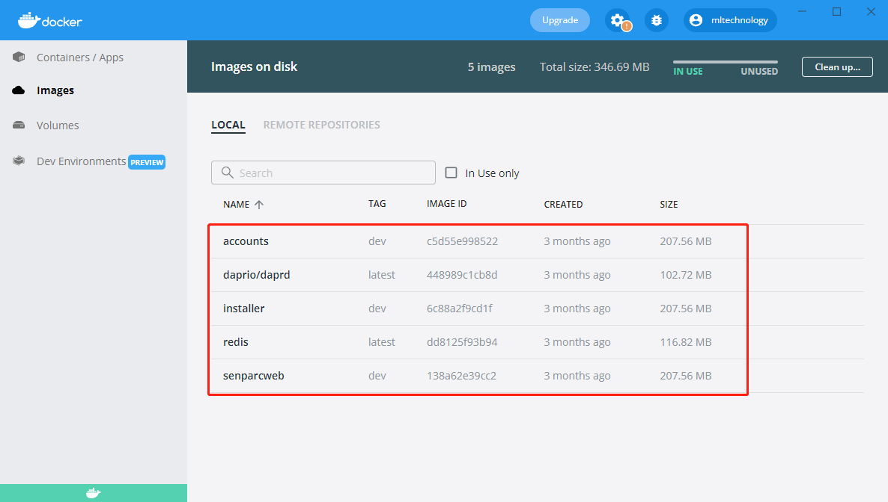
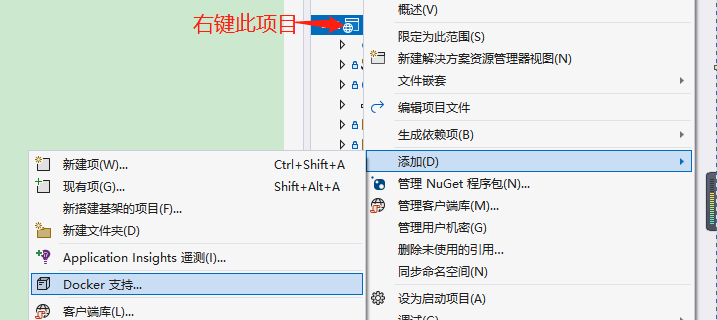

# Docker

Docker is an open-source application container engine that allows developers to package their applications and dependencies into a portable image, which can then be published to any popular Linux or Windows operating system machine, and can also achieve virtualization. Containers use a complete sandbox mechanism, and there will be no interfaces between them.

## Docker Configuration

```
version: '3.4'

services:
  #mysql:
  #  image: mysql:latest
  #  ports:
  #   - "3307:3306"
  #  restart: always
  #  environment:
  #    MYSQL_ROOT_PASSWORD: "123456"

  redis:
    image: redis:latest
    ports:
    - "5379:6379"

  installer:
    image: ${DOCKER_REGISTRY-}installer
    build:
      context: .
      dockerfile: Senparc.Xncf.Installer/Dockerfile
    #depends_on:
    #  - mysql

  installer-dapr:
    image: "daprio/daprd:latest"
    command: [ "./daprd", "-app-id", "installer", "-app-port", "80" ]
    network_mode: "service:installer"
    depends_on:
      - installer

  accounts:
    image: ${DOCKER_REGISTRY-}accounts
    build:
      context: .
      dockerfile: Senparc.Xncf.Accounts/Dockerfile

  accounts-dapr:
    image: "daprio/daprd:latest"
    command: [ "./daprd", "-app-id", "accounts", "-app-port", "80" ]
    network_mode: "service:accounts"
    depends_on:
      - accounts

  senparc-client:
    image: ${DOCKER_REGISTRY-}senparcweb
    build:
      context: .
      dockerfile: Senparc.Web/Dockerfile

  senparc-client-dapr:
    image: "daprio/daprd:latest"
    command: ["./daprd","-app-id","senparc-client","-app-port","80"]
    network_mode: "service:senparc-client"
    depends_on:
      - senparc-client
```

## Running Docker in Windows Environment



Click the icon to run



Click to view images



## Adding Project to Docker Configuration



When Docker support is added, a Dockerfile will be generated in the project

```
#See https://aka.ms/containerfastmode to understand how Visual Studio uses this Dockerfile to build your images for faster debugging.

-- Use dotnet6.0 sdk for compilation
FROM mcr.microsoft.com/dotnet/aspnet:6.0 AS base
-- Set working directory to app
WORKDIR /app
-- Expose port 80
EXPOSE 80
-- Expose port 443
EXPOSE 443

-- Use dotnet6.0 sdk for compilation
FROM mcr.microsoft.com/dotnet/sdk:6.0 AS build
-- Compile the project to src
WORKDIR /src
-- Copy Senparc.Web.csproj project to Senparc.Web directory
COPY ["Senparc.Web/Senparc.Web.csproj", "Senparc.Web/"]
-- Execute dotnet restore command to restore packages
RUN dotnet restore "Senparc.Web/Senparc.Web.csproj"
-- Copy all files
COPY . .
-- Set working directory to /src/Senparc.Web
WORKDIR "/src/Senparc.Web"
-- Execute dotnet build command, build Release environment to app/build directory
RUN dotnet build "Senparc.Web.csproj" -c Release -o /app/build

-- Rename build to publish directory
FROM build AS publish
-- Execute dotnet publish command, publish Release environment to app/publish directory
RUN dotnet publish "Senparc.Web.csproj" -c Release -o /app/publish

-- Finally
FROM base AS final
-- Set working directory to app
WORKDIR /app
-- Copy files from publish directory to app/publish
COPY --from=publish /app/publish .
-- Enter the project and execute dotnet Senparc.Web.dll
ENTRYPOINT ["dotnet", "Senparc.Web.dll"]

```
