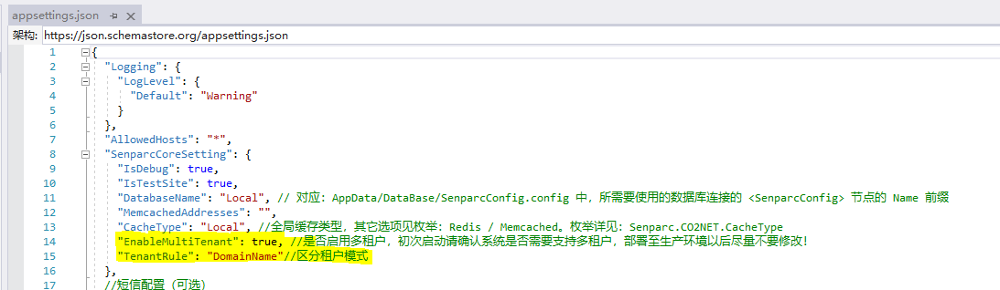

# Configure Multi-Tenant

## Multi-Tenant Overview

Multi-tenancy allows multiple tenants to use one system while isolating their
data. `EnableMultiTenant` controls whether it is enabled; `TenantRule` supports
`DomainName`, `RequestHeader`, and `LoginInput`. Framework middleware and tenant
services identify the tenant for HTTP requests, and business Services reuse
the initialized context.

## How to Modify Multi-Tenant Configuration

First, locate `appsettings.json` under the `Senparc.Web` project.



## Multi-Tenant Data Table Correspondence in System Modules

After the database is generated, a multi-tenant table will be automatically created, as shown below.


## Changes in Other Tables in the Database

Tenant-isolated business tables contain a `TenantId` field, as shown below.
The global tenant registry and global entities explicitly declaring
`IIgnoreMulitTenant` are not filtered by the current tenant; do not treat them
as ordinary tenant-isolated business tables.


## Corresponding Relationship

The TenantInfos table manages the Ids of all tenants.

The TenantId in each table comes from the TenantInfos table.

From the corresponding relationship, you can see the implementation principle of multi-tenancy.

## Services, Repositories, and Tenant Filters

Services own business logic and access data through injected
`IRepositoryBase<TEntity>` or existing ServiceBase query/save methods. The NCF
context used by the repository centrally applies current-tenant and soft-delete
filters. Ordinary business queries need neither repeated `TenantId`/`!Flag`
predicates nor `IgnoreQueryFilters()` to bypass those constraints.

The filter uses the **current scope's tenant**. It does not enumerate all
tenants or automatically check the registry's `Enable` property for every
business query. HTTP requests use a valid tenant through framework
identification; cross-tenant background tasks obtain enabled-tenant scopes
through the public entry point below.

## Host-Wide Background Tasks (2026-10-02 Development Line)

`IHostedService` / `BackgroundService` does not pass through HTTP tenant
middleware. `IServiceScopeFactory.CreateScope()` creates only a DI scope, not
an identified tenant. These tasks should inject
`Senparc.Ncf.Core.MultiTenant.IBackgroundTenantScopeFactory` instead of using
cache reflection or implementing tenant enablement checks in a business module.

Normal NCF startup already registers the scope factory. The Tenant module's
`IBackgroundTenantProvider` supplies enabled tenants through the existing
`FullTenantInfoCache`. The factory fills the scope's `RequestTenantInfo` before
business Services are resolved; an additional Service `SetTenantInfo()` call
is normally unnecessary.

### Scan All Enabled Tenants

For WeixinClaw account discovery, inside a background service with an injected
`_tenantScopeFactory`:

```csharp
var accounts = new List<(int TenantId, int AccountId)>();
await _tenantScopeFactory.ForEachEnabledTenantAsync(
    async (services, cancellationToken) =>
    {
        var accountService = services.GetRequiredService<WeixinClawAccountService>();
        accounts.AddRange(
            await accountService.GetPollingAccountsAsync(cancellationToken)
                .ConfigureAwait(false));
    },
    stoppingToken).ConfigureAwait(false);
```

The example uses `Microsoft.Extensions.DependencyInjection`,
`Senparc.Xncf.WeixinManager.Domain.Services`, and `System.Collections.Generic`.
Callbacks execute in tenant order and access repositories through independent
scopes. The factory disposes each scope after callback completion,
cancellation, or failure. Await business operations inside the callback; do not
retain scoped Services or `IServiceProvider` in long-lived tasks. Carry only
task metadata, such as account and tenant IDs, and obtain a new scope for each
subsequent execution.

### Execute for a Specific Tenant

```csharp
using var scope = await _tenantScopeFactory.TryCreateScopeAsync(
    tenantId, stoppingToken).ConfigureAwait(false);
if (scope == null)
{
    return;
}

var accountService = scope.ServiceProvider.GetRequiredService<WeixinClawAccountService>();
var account = await accountService.GetObjectAsync(x => x.Id == accountId)
    .ConfigureAwait(false);
```

`TryCreateScopeAsync` returns `null` when the requested tenant is no longer
enabled or does not exist. Stop the corresponding business task instead of
falling back to cross-tenant queries. The caller disposes a successful scope,
as with `using var` above. WeixinClaw polling cancels inactive account tasks
after scanning and consistently handles completion, host shutdown, and
resource disposal inside cancellation callbacks.

### Single-Tenant Mode, Errors, and Upgrade Constraints

- With multi-tenancy disabled, the enumeration entry point runs once in the
  default scope. The specific-tenant entry point also uses the default scope,
  without querying the tenant registry.
- Multi-tenant mode throws if the Provider is missing or returns invalid or
  duplicate tenants. It does not continue with tenant ID `0` or disabled
  filters.
- Adding the shared entry point does not automatically migrate every existing
  background task. WeixinClaw has adopted it; audit other modules separately.
- This upgrade requires no entity changes or new database migration. Upgrade
  the related libraries/modules and **restart the host** to activate the new
  DI registrations.

Related guides: [Core](../../NcfPackageSources/libs/Senparc.Ncf.Core.md),
[Repository](../../NcfPackageSources/libs/Senparc.Ncf.Repository.md),
[Service](../../NcfPackageSources/libs/Senparc.Ncf.Service.md), and
[Version Upgrade Notes](../../NcfPackageSources/home/version-upgrade-notes.md).
