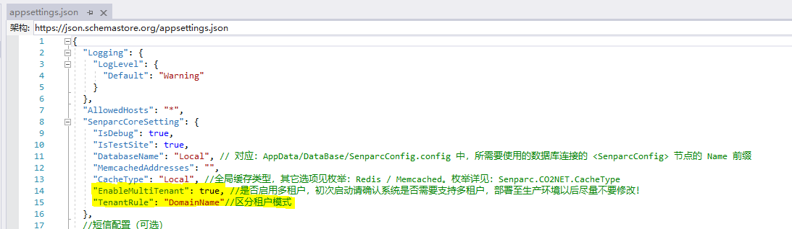
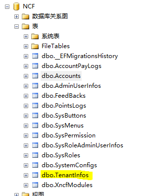

# Configure Multi-Tenant

## Multi-Tenant Overview

Multi-Tenant means that a single system can be used by multiple different tenants simultaneously, and the data seen by each tenant is completely isolated. By default, the system's multi-tenant feature is enabled. The current distinction rule for multiple tenants in the system is based on domain names.

## How to Modify Multi-Tenant Configuration

First, locate the appsetting.json file under the `Senparc.Web` project.

## Multi-Tenant Data Table Correspondence in System Modules

After the database is generated, a multi-tenant table will be automatically created, as shown below.

## Changes in Other Tables in the Database

After the database is generated, a field will be created in each table, as shown below.

## Corresponding Relationship

The TenantInfos table manages the Ids of all tenants.

The TenantId in each table comes from the TenantInfos table.

From the corresponding relationship, you can see the implementation principle of multi-tenancy.
