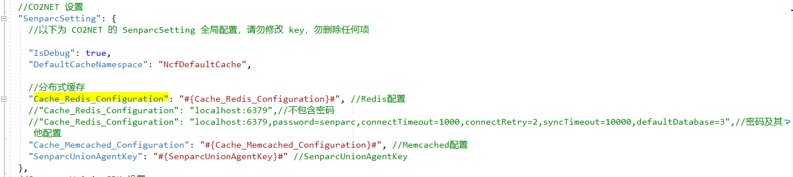
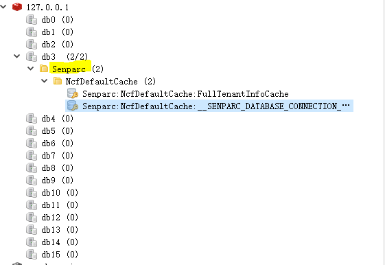

# Redis Cache

Redis, I believe everyone is very familiar with it.

REmote DIctionary Server (Redis) is a key-value storage system written by Salvatore Sanfilippo. It is a cross-platform non-relational database.

Redis is an open-source key-value storage database written in ANSI C, following the BSD protocol, supporting networking, in-memory, distributed, and optionally persistent storage, and provides APIs for multiple languages.

Redis is often referred to as a data structure server because values can be of types such as strings, hashes, lists, sets, and sorted sets.

## How to configure Redis

First, find the `appsetting.json` file under the `Senparc.Web` project

After configuring, we can run the program and see the changes in Redis.

## Open Redis management tool

You can see

