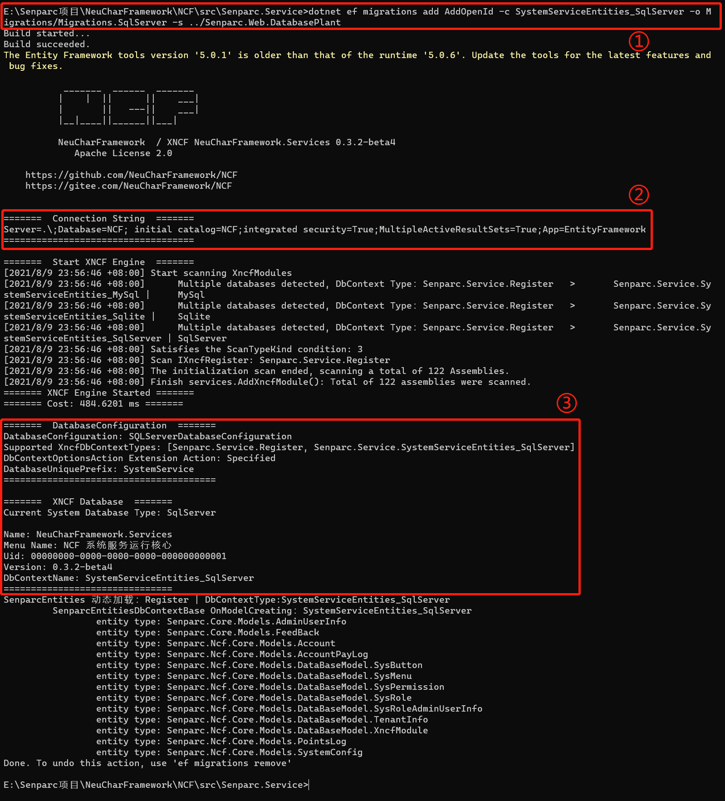

# Update database migration files for the Senparc.Service project (Migrations)

> Take updating the Senparc.Service project as an example for manual updates.

Usually, updating the database migration files for Senparc.Service is because certain entity information corresponding to the database has been added/modified/deleted in the NCF template project.

## Modify the database using Code-First

For example, we added a property in the `AdminUserInfo` class:


## Generate migration files using EF Core's Add-Migration command

Since the Senparc.Service project is not a standard XNCF module (essentially it is an XNCF module, but the file structure is quite special), it cannot be directly operated using the Senparc.Xncf.XncfBuilder module in the Admin backend, otherwise, the system will generate files according to the XNCF directory structure (of course, this does not affect compilation).

We can use the command line, taking CMD command line as an example, enter the Senparc.Service directory:

```
E:\Senparc项目\NeuCharFramework\NCF\src\Senparc.Service>
```

Enter the command:

```
dotnet ef migrations add AddOpenId -c SystemServiceEntities_SqlServer -o Migrations/Migrations.SqlServer -s ../Senparc.Web.DatabasePlant
```

> In the above command, `AddOpenId` is the name of this update and can be freely filled in. `SystemServiceEntities_SqlServer` refers to the database context (DbContext) implementation pointing to SQL Server. When we need to update the MySQL database at the same time, we can replace it with `SystemServiceEntities_MySQL` (note the actual class name, the class name may not fully reflect the database type).

Executing the command will complete the SQL Server migration file update:



In the above image:

①: The command entered in the Senparc.Service directory

②: Shows the currently used database connection string

③: Shows the updated SQL Server database type, DbContext context class name, and other information

In VS, you can see the newly created `20210809155647_AddOpenId.cs` file and the updated snapshot file `SystemServiceEntities_SqlServerModelSnapshot.cs`:


Through the `20210809155647_AddOpenId.cs` file, you can see that the OpenId property (corresponding to the column in the database table) has been added.


## Update the version number of Senparc.Service

We recommend that after updating the content, you also update the version number of Senparc.Service, treating it the same as a regular XNCF.

> /Senparc.Service/XncfModules/Register.cs

Set the new Version parameter, such as:

```csharp
public override string Version => "0.3.4-beta4";
```

### Update the database

Using the CMD command line, execute the command in the Senparc.Service directory:

```
dotnet ef database update -c SystemServiceEntities_SqlServer -s ../Senparc.Web.DatabasePlant
```

> Adjust SystemServiceEntities_SqlServer flexibly according to the database type


In the above run result:

①: Execute the update database command
②: Prompt to complete the latest migration update

## Comparison of database tables before and after

| Image                                                                      | Status        |
| -------------------------------------------------------------------------- | ------------- |
|  | Before Update |
|  | After Update  |
