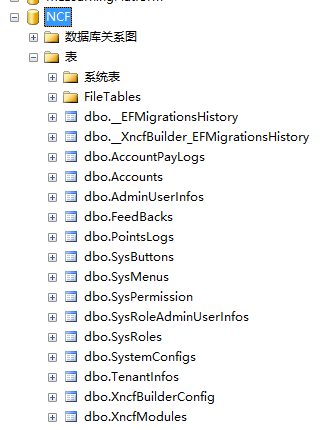
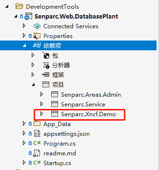
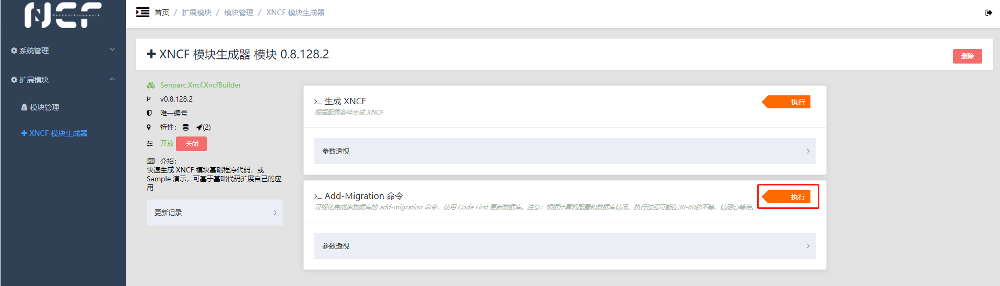
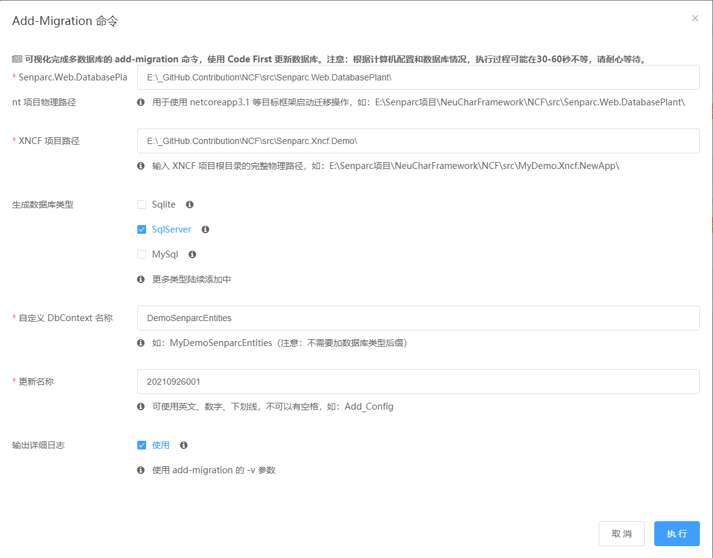
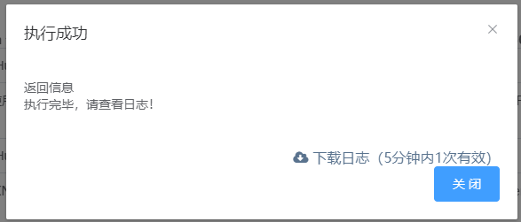
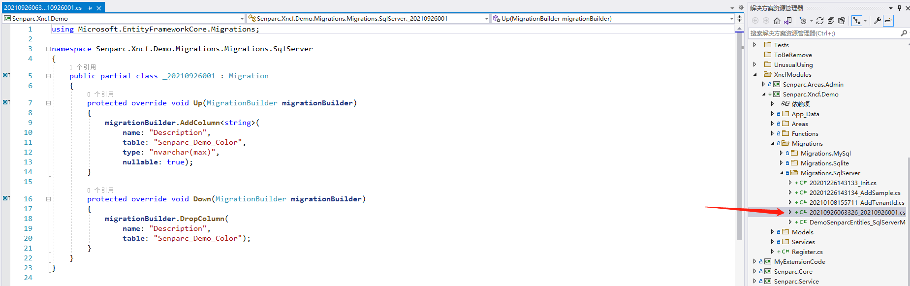
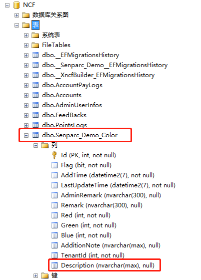

# Tarmac Operation Database Migration and Update

## Modify Database Configuration File

> Modify the `Senparc.Web\App_Data\DataBase\SenparcConfig.config` file's `Local-SqlServer` node

    <SenparcConfig>
    	<Id>3</Id>
    	<Name>Local-SqlServer</Name>
    	<!--Local Demo default database (can modify DatabaseName configuration in appsettings.json)-->
    	<ConnectionStringFull><![CDATA[Server=PC-20210411JFTZ;initial catalog=NCF;integrated security=True;MultipleActiveResultSets=True;App=EntityFramework]]></ConnectionStringFull>
    	<!--Use IP within the container-->
    	<!--<ConnectionStringFull><![CDATA[Server=172.17.160.1; initial catalog=NCF;User ID=sa; Password=2wsx@WSX;MultipleActiveResultSets=True;App=EntityFramework]]></ConnectionStringFull>-->
    	<ApplicationPath><![CDATA[/]]></ApplicationPath>
    </SenparcConfig>

> Find the configuration file defining the database in your own module `Senparc.Xncf.Demo\Senparc.Xncf.Demo.csproj`, modify the `Local-SqlServer` node

    <SenparcConfig>
    	<Id>2</Id>
    	<Name>Local-SqlServer</Name>
    	<!--Local Demo default database (can modify DatabaseName configuration in appsettings.json)-->
    	<ConnectionStringFull><![CDATA[Server=PC-20210411JFTZ;Database=NCF; initial catalog=NCF;integrated security=True;MultipleActiveResultSets=True;App=EntityFramework]]></ConnectionStringFull>
    	<ApplicationPath><![CDATA[/]]></ApplicationPath>
    </SenparcConfig>

> Find the configuration file defining the database for the tarmac `Senparc.Web.DatabasePlant\App_Data\Database\SenparcConfig.config`, modify the `Local-SqlServer` node

    <SenparcConfig>
    	<Id>2</Id>
    	<Name>Local-SqlServer</Name>
    	<!--Local Demo default database (can modify DatabaseName configuration in appsettings.json)-->
    	<ConnectionStringFull><![CDATA[Server=.\;Database=NCF; initial catalog=NCF;integrated security=True;MultipleActiveResultSets=True;App=EntityFramework]]></ConnectionStringFull>
    	<ApplicationPath><![CDATA[/]]></ApplicationPath>
    </SenparcConfig>

## Original Database Table Structure

## Tarmac References Modules to be Migrated

## Use Module Generator's Migration Command

After generation is complete, it will display

## Compare Databases

| Image | Status |
| -------------------------------------------------------- | ------ |
|  | Before Update |
|  | After Update |
