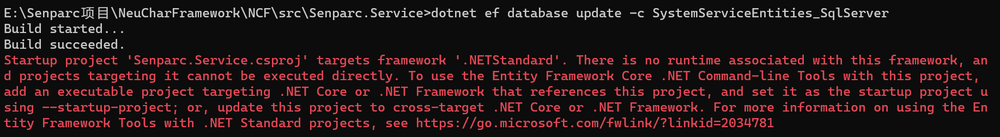

# DatabasePlant

Plant means "parking apron," which implies that when you are ready to "service" a module, you will need to use it.

## Principle

In the NCF Web template solution, there is a special project: `Senparc.Web.DatabasePlant`.

Using `Senparc.Web.DatabasePlant` makes it easy to manually perform database migrations, database updates, and other operations.

The `Senparc.Web.DatabasePlant` project by default references the `Senparc.Ncf.DatabasePlant` library, and it can also manually reference other projects or already packaged Nuget packages or dlls.

Therefore, as long as you reference the XNCF module or other projects in `Senparc.Web.DatabasePlant`, and then use `Senparc.Web.DatabasePlant` as the startup project, other dependent projects can instantly be empowered with all the capabilities that `Senparc.Web.DatabasePlant` already has; and this connection will be automatically severed upon release (see the end of the document), without any burden.

It's like an airplane parked on the apron, having access to all ground resources, but once it takes off, it sheds all the weight and engages in combat.

> [Senparc.Ncf.DatabasePlant](/NcfPackageSources/libs/Senparc.Ncf.DatabasePlant.html) references all the DatabaseConfiguration projects of databases officially implemented by NCF, such as: Senparc.Ncf.Database.MySql, Senparc.Ncf.Database.SqlServer, etc.

## Reason

So, why must we use `DatabasePlant` to complete the migration?

First, when performing a series of EF Core migration operations, the target project must have a clear runtime version, such as .NET Core 3.1 or .NET 6.0, etc. Most XNCF modules, to achieve better compatibility and flexibility, generally only choose standard library names and versions like .NET Standard 2.1. If you forcibly use .NET Standard for migration operations, errors will occur:

Secondly, since NCF supports multiple databases, this means that when generating multiple databases, the current project must load all the EF Core corresponding tool packages for multiple databases to complete the EF Core database migration operation. For example, when we need to complete the synchronous migration of SQL Server + MySQL + SQLite three databases, we need to reference at least the following Nuget packages in the project:

> Microsoft.EntityFrameworkCore.SqlServer 
> Pomelo.EntityFrameworkCore.MySql 
> Microsoft.EntityFrameworkCore.Sqlite   
> Sometimes, to facilitate editing and running richer features, we need to load more extension packages.

Obviously, for the same project, just to migrate the database, installing so much "weight" is not the "fighter jet" architecture we want.

Therefore, we integrate all the packages that may be needed into `DatabasePlant`, and only reference them during the special development phase of the project, to achieve synchronous migration operations for all databases. After being released to the production environment, each module can still be as light as a feather!

Yes, you might have already thought of it: `No XNCF module project needs to reference any specific database package (such as Microsoft.EntityFrameworkCore.SqlServer)!`

This design makes modularization extremely lightweight!

## Tips

### Running Efficiency

`Senparc.Web.DatabasePlant` will not be released together under the Release compilation settings, so it will not affect the running efficiency of the production environment.

### Specifying the Database at Runtime

So how does the module specify and use a particular database in the production environment without referencing any database packages?

Please refer to: [Specifying the Database](/start/database/appoint_database.html)
