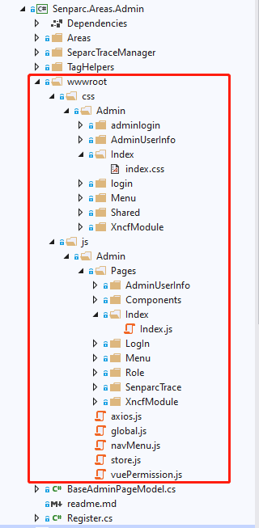
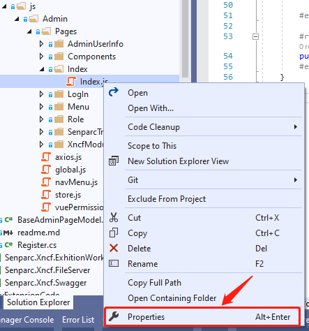
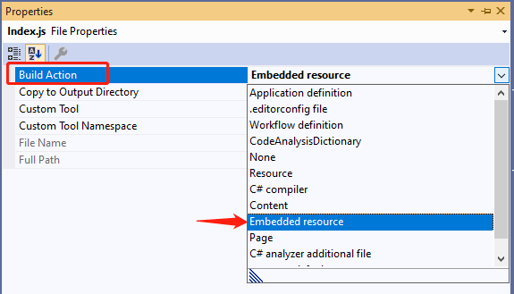
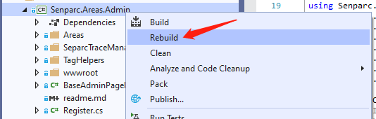
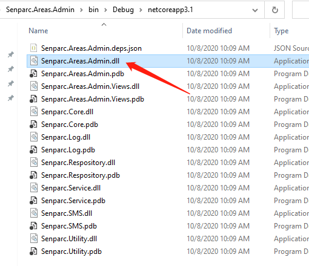
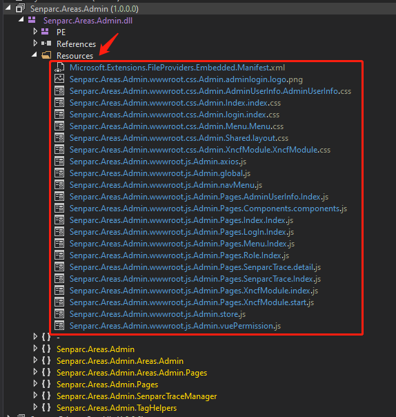
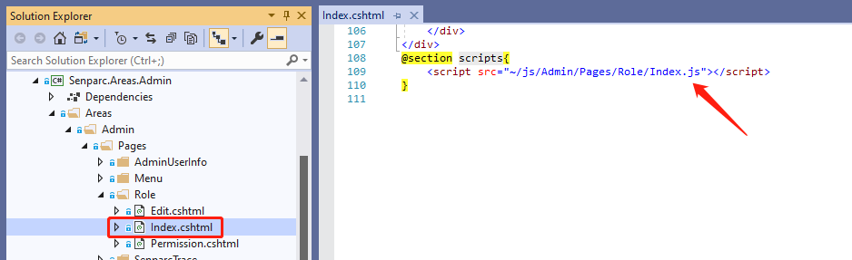

# Embedding Static Resource Files into NCF

Whether developing the frontend or backend, it is inevitable to use static resource files. The static resource files here refer to (html, css, js, etc. files).

Currently, our NCF uses the DDD (Domain-Driven Design) model for development, so we hope that developers can focus more on the business within their own developed modules. This way, they can seamlessly integrate with the official core NCF upgrades, avoiding more modifications and file migration work.

## Creating Static Resources

Establish static resources under `Xncf_Module`, as shown in the figure:



## Setting Static Resource Properties

Select any static resource file, right-click, and choose Embedded Resource, as shown in the figure:





## Adding Library References and Related Configurations in .csproject File

    <PropertyGroup>
      <TargetFramework>netcoreapp3.1</TargetFramework>
      <GenerateEmbeddedFilesManifest>true</GenerateEmbeddedFilesManifest>
    </PropertyGroup>

    <ItemGroup>
      <EmbeddedResource Include="wwwroot\**\*" />
      <PackageReference Include="Microsoft.Extensions.FileProviders.Embedded" Version="3.1.6" />
    </ItemGroup>

## Adding Embedded Resource Registration Service in Register

```csharp
/* Must add here
using Microsoft.AspNetCore.Builder;
using Senparc.CO2NET.RegisterServices;
using Microsoft.Extensions.FileProviders;
using System.Reflection;

Register : IAreaRegister // Register XNCF page interface (optional)
*/

public override IApplicationBuilder UseXncfModule(IApplicationBuilder app, IRegisterService registerService)
{
    app.UseStaticFiles(new StaticFileOptions
    {
        FileProvider = new ManifestEmbeddedFileProvider(Assembly.GetExecutingAssembly(), "wwwroot")
    });

    return base.UseXncfModule(app, registerService);
}
```

## Checking Whether Static Resources Have Been Embedded

Right-click the project and rebuild



Find the latest generated dll file in the corresponding Debug/Release directory



Open the .Net decompiler tool, drag the dll file in, and check whether the resources exist and whether the resource files you added are present. If they exist, it means the embedding was successful.



## How to Use Embedded Static Resources


