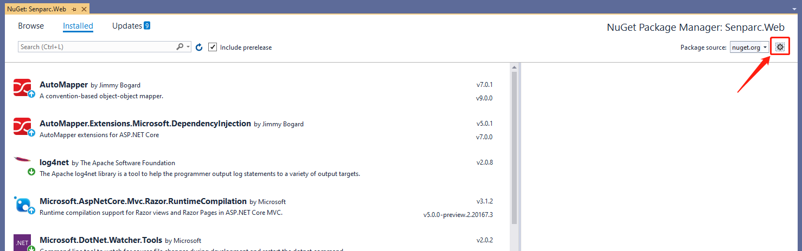

## Publish Local Nuget Package

> 1. Open project properties

> 2. Set project package release options, check the option to create nuget file on build

> 3. Edit project file

> 4. Edit conditions and necessary parameters for generating Nuget file

    <Project Sdk="Microsoft.NET.Sdk">
      <PropertyGroup>
        <TargetFramework>netcoreapp3.1</TargetFramework>
        <Version>1.0</Version>
        <AssemblyName>Senparc.Xncf.Application</AssemblyName>
        <RootNamespace>Senparc.Xncf.Application</RootNamespace>
        <GeneratePackageOnBuild Condition=" '$(Configuration)' == 'Release' ">true</GeneratePackageOnBuild>
        <Description>Application Module</Description>
        <Copyright>Senparc</Copyright>
        <PackageTags>Senparc,NeuCharFramework,NCF,Senparc.Xncf.Application</PackageTags>
        <Authors>Senparc</Authors>
        <Owners>Senparc</Owners>
        <!-- <PackageLicenseUrl>https://github.com/NeuCharFramework/NcfPackageSources/blob/master/LICENSE</PackageLicenseUrl> -->
        <Title>.Application Module</Title>
        <!--<ProjectUrl> https://github.com/NeuCharFramework/NCF</ProjectUrl>
        <PackageProjectUrl>https://github.com/NeuCharFramework/NcfPackageSources</PackageProjectUrl>
        <PackageIconUrl>http://sdk.weixin.senparc.com/Images/logo-square-ncf.jpg</PackageIconUrl>-->
        <PackageReleaseNotes>
          v1.0 Genesis
        </PackageReleaseNotes>
        <RepositoryUrl> https://github.com/NeuCharFramework/NcfPackageSources</RepositoryUrl>
        <Configurations>Debug;Release;Test</Configurations>
      </PropertyGroup>
      <PropertyGroup Condition=" '$(Configuration)' == 'Release' ">
        <OutputPath>..\..\..\BuildOutPut</OutputPath>
        <DocumentationFile>..\..\..\BuildOutPut\Senparc.Xncf.Application.XML</DocumentationFile>
        <DefineConstants>$(DefineConstants);RELEASE</DefineConstants>
        <Optimize>true</Optimize>
        <DebugType>pdbonly</DebugType>
        <ErrorReport>prompt</ErrorReport>
        <CodeAnalysisRuleSet>MinimumRecommendedRules.ruleset</CodeAnalysisRuleSet>
      </PropertyGroup>
      <ItemGroup>
        <PackageReference Include="Senparc.Ncf.XncfBase" Version="0.3.500-beta1" />
        <ProjectReference Include="..\Senparc.Core\Senparc.Core.csproj" />
        <ProjectReference Include="..\Senparc.Service\Senparc.Service.csproj" />
      </ItemGroup>

        <ItemGroup>
        <PackageReference Include="Microsoft.EntityFrameworkCore.SqlServer" Version="3.1.6" />
        <PackageReference Include="Microsoft.EntityFrameworkCore.SqlServer.Design" Version="2.0.0-preview1-final" />
        <PackageReference Include="Microsoft.EntityFrameworkCore.Tools" Version="3.1.6">
          <PrivateAssets>all</PrivateAssets>
          <IncludeAssets>runtime; build; native; contentfiles; analyzers</IncludeAssets>
        </PackageReference>
    </ItemGroup>

    </Project>

> 5. Rebuild the project

> 6. Find the generated Nuget package (here using Debug environment, so it is generated in the Debug directory)

> 7. Copy the local Nuget package to the specified file directory (for easy reference)

## Reference Local Nuget Source

> 1. There are two ways to enter the source settings

> > 1-1. Click the toolbar Tools->Options->Nuget Package Manager

> > 1-2. Right-click the project

> 2. Add nuget source

> 3. Select local nuget source

> 4. Import local nuget source

> 5. Rebuild the project

> 6. Show results

