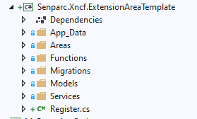

# Xncf Module Development

NCF Base Library Official Nuget Package Source Code

## Xncf Single Function Execution Module Development

> 1. Create a new Dotnet Core Class Library project

> 2. Enter the name of the Class Library and click Create

> 3. Create Register.cs

> 4. Configure the necessary content in Register

| Name        | Description                                                                                      |
| ----------- | ------------------------------------------------------------------------------------------------ |
| Name        | Module name                                                                                      |
| Uid         | Global unique identifier, preferably generated using a tool                                      |
| Version     | Module version number (used to identify updates)                                                 |
| MenuName    | Name displayed in the menu after installation in NCF                                             |
| Icon        | Icon displayed next to the menu [Font Icons](https://colorlib.com/polygon/gentelella/icons.html) |
| Description | Description of the module, can be used to understand the specific functions before installation  |

> 5. Create a custom method class

> 6. Complete the custom method

    public MyFunction(IServiceProvider serviceProvider) : base(serviceProvider)
    {
    }

    public class Parameters : IFunctionParameter
    {
        [Required]
        [MaxLength(50)]
        [Description("Name||Parameter name before the double vertical line, parameter comment after the double vertical line")]
        public string Name { get; set; }

        [Required]
        [Description("Number||Number1")]
        public int Number1 { get; set; }

        [Required]
        [Description("Number||Number2")]
        public int Number2 { get; set; }

        [Description("Operator||")]//Drop-down list
        public SelectionList Operator { get; set; } = new SelectionList(SelectionType.DropDownList, new[] {
                new SelectionItem("+","Addition","Number1 + Number2",false),
                new SelectionItem("-","Subtraction","Number1 - Number2",true),
                new SelectionItem("×","Multiplication","Number1 × Number2",false),
                new SelectionItem("÷","Division","Number1 ÷ Number2",false)
        });

        [Description("Calculate Power||")]//Checkbox
        public SelectionList Power { get; set; } = new SelectionList(SelectionType.CheckBoxList, new[] {
                new SelectionItem("2","Square","Calculate the square after the above result",false),
                new SelectionItem("3","Cube","Calculate the cube after the above result",false)
        });
    }

    public override string Name => "My Function";

    public override string Description => "Comment for my function";

    public override Type FunctionParameterType => typeof(Parameters);

    public override FunctionResult Run(IFunctionParameter param)
    {
        return FunctionHelper.RunFunction<Parameters>(param, (typeParam, sb, result) =>
        {
            /* This method will be called after clicking "Execute" on the page
                *
                * Parameter description:
                * param: IFunctionParameter type object
                * typeParam: Senparc.Xncf.Application.MyFunction.Parameters type object
                * sb: log
                * result: return result
                */

            double calcResult = typeParam.Number1;
            var theOperator = typeParam.Operator.SelectedValues.FirstOrDefault();
            switch (theOperator)
            {
                case "+":
                    calcResult = calcResult + typeParam.Number2;
                    break;
                case "-":
                    calcResult = calcResult - typeParam.Number2;
                    break;
                case "×":
                    calcResult = calcResult * typeParam.Number2;
                    break;
                case "÷":
                    if (typeParam.Number2 == 0)
                    {
                        result.Success = false;
                        result.Message = "The divisor cannot be 0!";
                        return;
                    }
                    calcResult = calcResult / typeParam.Number2;
                    break;
                default:
                    result.Success = false;
                    result.Message = $"Unknown operator: {theOperator}";
                    return;
            }

            sb.AppendLine($"Performing calculation: {typeParam.Number1} {theOperator} {typeParam.Number2} = {calcResult}");

            Action<int> raisePower = power =>
            {
                if (typeParam.Power.SelectedValues.Contains(power.ToString()))
                {
                    var oldValue = calcResult;
                    calcResult = Math.Pow(calcResult, power);
                    sb.AppendLine($"Performing {power} power calculation: {oldValue}{(power == 2 ? "²" : "³")} = {calcResult}");
                }
            };

            raisePower(2);
            raisePower(3);

            result.Message = $"Calculation result: {calcResult}. Please see the log for the calculation process";
        });
    }

> 7. Register the custom method class in Register

> 8. Publish Nuget, detailed steps to publish Nuget

## Xncf Custom Page Function Module Development

> 1. Create a new DotnetCore Class Library project and enter the project name

> > 1.1 Directory name as follows

> > 1.2 Set the project to support RazorPage functionality

> 2. Create a new Color model class in Senparc.Xncf.ExtensionAreaTemplate

    using Senparc.Ncf.Core.Models;
    using Senparc.Xncf.ExtensionAreaTemplate.Models.DatabaseModel.Dto;
    using System;
    using System.ComponentModel.DataAnnotations.Schema;

    namespace Senparc.Xncf.ExtensionAreaTemplate
    {
        /// 

        /// Color entity class
        /// 

        [Table(Register.DATABASE_PREFIX + nameof(Color))]//Must add prefix to prevent conflicts in the entire system
        [Serializable]
        public class Color : EntityBase<int>
        {
            /// 

            /// Color code, 0-255
            /// 

            public int Red { get; private set; }
            /// 

            /// Color code, 0-255
            /// 

            public int Green { get; private set; }

            /// 

            /// Color code, 0-255
            /// 

            public int Blue { get; private set; }

            /// 

            /// Additional column, test multiple database Migrate
            /// 

            public string AdditionNote { get; private set; }

            private Color() { }

            public Color(int red, int green, int blue)
            {
                if (red < 0 || green < 0 || blue < 0)
                {
                    Random();//Random
                }
                else
                {
                    Red = red;
                    Green = green;
                    Blue = blue;
                }
            }

            public Color(ColorDto colorDto)
            {
                Red = colorDto.Red;
                Green = colorDto.Green;
                Blue = colorDto.Blue;
            }

            public void Random()
            {
                //Randomly generate color codes
                var radom = new Random();
                Func<int> getRadomColorCode = () => radom.Next(0, 255);
                Red = getRadomColorCode();
                Green = getRadomColorCode();
                Blue = getRadomColorCode();
            }

            public void Brighten()
            {
                Red = Math.Min(255, Red + 10);
                Green = Math.Min(255, Green + 10);
                Blue = Math.Min(255, Blue + 10);
            }

            public void Darken()
            {
                Red = Math.Max(0, Red - 10);
                Green = Math.Max(0, Green - 10);
                Blue = Math.Max(0, Blue - 10);
            }
        }
    }

> 3. Create a new ColorDto class in Senparc.Xncf.ExtensionAreaTemplate.Models.DatabaseModel.Dto

    using Senparc.Ncf.Core.Models;

    namespace Senparc.Xncf.ExtensionAreaTemplate.Models.DatabaseModel.Dto
    {
        public class ColorDto : DtoBase
        {
            /// 

            /// Color code, 0-255
            /// 

            public int Red { get; private set; }
            /// 

            /// Color code, 0-255
            /// 

            public int Green { get; private set; }
            /// 

            /// Color code, 0-255
            /// 

            public int Blue { get; private set; }

            private ColorDto() { }
        }
    }

> 4. Add the following code to AutoMapperConfigs

    using Microsoft.EntityFrameworkCore.Metadata.Builders;
    using Senparc.Ncf.Core.Models.DataBaseModel;
    using Senparc.Ncf.XncfBase.Attributes;

    namespace Senparc.Xncf.ExtensionAreaTemplate.Models
    {
        [XncfAutoConfigurationMapping]
        public class ExtensionAreaTemplate_ColorConfigurationMapping : ConfigurationMappingWithIdBase<Color, int>
        {
            public override void Configure(EntityTypeBuilder<Color> builder)
            {
                builder.Property(e => e.Red).IsRequired();
                builder.Property(e => e.Green).IsRequired();
                builder.Property(e => e.Blue).IsRequired();
            }
        }
    }

> 5. Create pages under Senparc.Xncf.ExtensionAreaTemplate.Areas.ExtensionAreaTemplate.Pages and change Index inheritance to Senparc.Ncf.AreaBase.Admin.AdminXncfModulePageModelBase

    using Microsoft.AspNetCore.Mvc;
    using Senparc.Ncf.Core.Enums;
    using Senparc.Ncf.Service;
    using Senparc.Xncf.ExtensionAreaTemplate.Models.DatabaseModel.Dto;
    using Senparc.Xncf.ExtensionAreaTemplate.Services;
    using System;
    using System.Threading.Tasks;

    namespace Senparc.Xncf.ExtensionAreaTemplate.Areas.ExtensionAreaTemplate.Pages
    {
        public class DatabaseSample : Senparc.Ncf.AreaBase.Admin.AdminXncfModulePageModelBase
        {
            public ColorDto ColorDto { get; set; }

            private readonly ColorService _colorService;
            private readonly IServiceProvider _serviceProvider;
            public DatabaseSample(IServiceProvider serviceProvider, ColorService colorService, Lazy<XncfModuleService> xncfModuleService)
                : base(xncfModuleService)
            {
                _colorService = colorService;
                _serviceProvider = serviceProvider;
            }

            public Task OnGetAsync()
            {
                var color = _colorService.GetObject(z => true, z => z.Id, OrderingType.Descending);
                ColorDto = _colorService.Mapper.Map<ColorDto>(color);
                return Task.CompletedTask;
            }

            public IActionResult OnGetDetail()
            {
                var color = _colorService.GetObject(z => true, z => z.Id, OrderingType.Descending);
                var colorDto = _colorService.Mapper.Map<ColorDto>(color);
                //return Task.CompletedTask;
                return Ok(new { colorDto, XncfModuleDto });
            }

            public async Task<IActionResult> OnGetBrightenAsync()
            {
                var colorDto = await _colorService.Brighten().ConfigureAwait(false);
                return Ok(colorDto);
            }

            public async Task<IActionResult> OnGetDarkenAsync()
            {
                var colorDto = await _colorService.Darken().ConfigureAwait(false);
                return Ok(colorDto);
            }
            public async Task<IActionResult> OnGetRandomAsync()
            {
                var colorDto = await _colorService.Random().ConfigureAwait(false);
                return Ok(colorDto);
            }
        }
    }

> 6. Add Service class

    using Senparc.Ncf.Core.Enums;
    using Senparc.Ncf.Repository;
    using Senparc.Ncf.Service;
    using Senparc.Xncf.ExtensionAreaTemplate.Models.DatabaseModel.Dto;
    using System;
    using System.Threading.Tasks;

    namespace Senparc.Xncf.ExtensionAreaTemplate.Services
    {
        public class ColorService : ServiceBase<Color>
        {
            public ColorService(IRepositoryBase<Color> repo, IServiceProvider serviceProvider)
                : base(repo, serviceProvider)
            {
            }

            public async Task<ColorDto> CreateNewColor()
            {
                Color color = new Color(-1, -1, -1);
                await base.SaveObjectAsync(color).ConfigureAwait(false);
                ColorDto colorDto = base.Mapper.Map<ColorDto>(color);
                return colorDto;
            }

            public async Task<ColorDto> Brighten()
            {
                //TODO: Asynchronous methods need to add sorting functionality
                var obj = this.GetObject(z => true, z => z.Id, OrderingType.Descending);
                obj.Brighten();
                await base.SaveObjectAsync(obj).ConfigureAwait(false);
                return base.Mapper.Map<ColorDto>(obj);
            }

            public async Task<ColorDto> Darken()
            {
                //TODO: Asynchronous methods need to add sorting functionality
                var obj = this.GetObject(z => true, z => z.Id, OrderingType.Descending);
                obj.Darken();
                await base.SaveObjectAsync(obj).ConfigureAwait(false);
                return base.Mapper.Map<ColorDto>(obj);
            }

            public async Task<ColorDto> Random()
            {
                //TODO: Asynchronous methods need to add sorting functionality
                var obj = this.GetObject(z => true, z => z.Id, OrderingType.Descending);
                obj.Random();
                await base.SaveObjectAsync(obj).ConfigureAwait(false);
                return base.Mapper.Map<ColorDto>(obj);
            }

            //TODO: More business methods can be written here
        }
    }

> 7. Add to ExtensionAreaTemplateSenparcEntities in Senparc.Xncf.ExtensionAreaTemplate.Models.DatabaseModel

    using Microsoft.EntityFrameworkCore;
    using Senparc.Ncf.XncfBase;
    using Senparc.Ncf.XncfBase.Database;

    namespace Senparc.Xncf.ExtensionAreaTemplate.Models.DatabaseModel
    {
        public class ExtensionAreaTemplateSenparcEntities : XncfDatabaseDbContext
        {
            public override IXncfDatabase XncfDatabaseRegister => new Register();
            public ExtensionAreaTemplateSenparcEntities(DbContextOptions<ExtensionAreaTemplateSenparcEntities> dbContextOptions) : base(dbContextOptions)
            {
            }

            public DbSet<Color> Colors { get; set; }

            //DOT REMOVE OR MODIFY THIS LINE 请勿移除或修改本行 - Entities Point
            //ex. public DbSet<Color> Colors { get; set; }

            //If there is no special need, the OnModelCreating method does not need to be written, it has been required to register in Register
            //protected override void OnModelCreating(ModelBuilder modelBuilder)
            //{
            //}
        }
    }

> 8. Execute under Senparc.Web

    using Senparc.Xncf.ExtensionAreaTemplate.Models.DatabaseModel;
    using Senparc.Ncf.XncfBase.Database;
    using System;
    using System.IO;

    namespace Senparc.Xncf.ExtensionAreaTemplate
    {
        /// 

        /// Design-time DbContext creation (only used for creating Code-First database Migration during development, will not execute in production environment)
        /// 

        public class SenparcDbContextFactory : SenparcDesignTimeDbContextFactoryBase<ExtensionAreaTemplateSenparcEntities, Register>
        {
            /// 

            /// Used to find the App_Data folder to get the database connection string configuration information
            /// 

            public override string RootDictionaryPath
