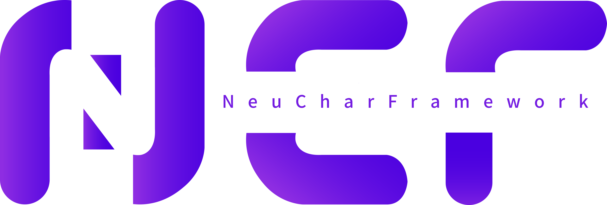

# NCF - NeuCharFramework

NeuCharFramework (hereinafter referred to as NCF) is a complete DDD framework for building foundational projects. It includes basic caching, database, models, validation, and a supporting management backend. It supports multiple databases, is highly modular, and has high extensibility.

## Source Code

|                   | GitHub                                                                     | Gitee                                                                     | Description                                                                                                                                                                                                                                                   |
| ----------------- | -------------------------------------------------------------------------- | ------------------------------------------------------------------------- | ------------------------------------------------------------------------------------------------------------------------------------------------------------------------------------------------------------------------------------------------------------- |
| NCF Template      | [NCF](https://github.com/NeuCharFramework/NCF)                             | [NCF](https://gitee.com/NeuCharFramework/NCF)                             | A foundational code framework that can be directly used for development. For regular development, simply download this project or [use the template to create a project](/start/start-develop/get-ncf-template.html#从命令行安装-推荐).                       |
| NcfPackageSources | [NcfPackageSources](https://github.com/NeuCharFramework/NcfPackageSources) | [NcfPackageSources](https://gitee.com/NeuCharFramework/NcfPackageSources) | The foundational library code referenced by the `NCF Template` project, released as Nuget packages and referenced by the `NCF Template`. It is also 100% open source. For deep development or research into the foundational principles, you can download it. |

Note: The main branch of the above projects is the GitHub project. The Gitee project is a mirror and updates may be delayed.

<b>Current fast update branch: [Developer](https://github.com/NeuCharFramework/NCF/tree/Developer)</b>

> NCF is derived from the SenparcCore, an internal system framework optimized and iterated over many years by the Senparc team. It has been tested in numerous systems on .NET Framework 3.5/4.5 and was eventually ported to .NET Core (supporting .NET 5.0/6.0/7.0/8.0). It is highly modular. NCF is currently running stably in many medium and large applications. Thank you for your continuous support. We welcome your feedback and suggestions, or join the community of contributors!

## QQ Technical Discussion Group

## Learn More

[Get Started](/start/instruction/about-ncf.html)
