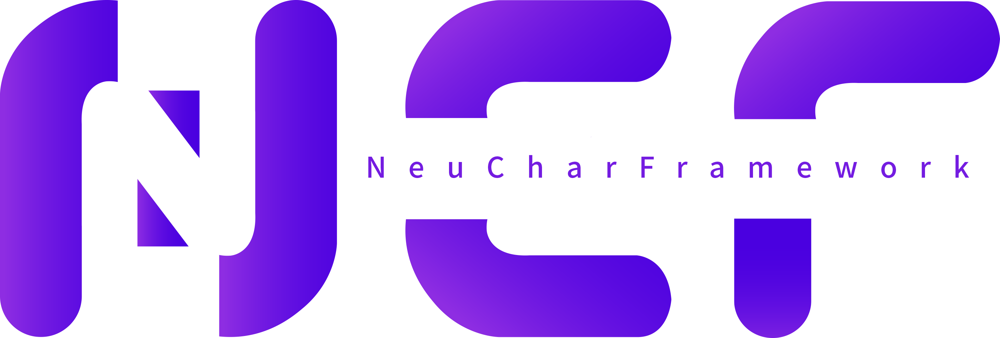

# NCF - NeuCharFramework

NeuCharFramework (hereinafter referred to as NCF) is a complete DDD framework for building foundational projects. It includes basic caching, database, models, validation, and supporting management backend. It supports multiple databases, is highly modular, and has high extensibility.

## Source Code Address

|                   | GitHub                                                                     | Gitee                                                                     | Description                                                                                                                                                                                                                                  |
| ----------------- | -------------------------------------------------------------------------- | ------------------------------------------------------------------------- | -------------------------------------------------------------------------------------------------------------------------------------------------------------------------------------------------------------------------------------------- |
| NCF Template      | [NCF](https://github.com/NeuCharFramework/NCF)                             | [NCF](https://gitee.com/NeuCharFramework/NCF)                             | A basic code framework for direct development; download the project or [create one from the template](/start/start-develop/get-ncf-template.html#method-1-install-from-command-line-recommended).                                            |
| NcfPackageSources | [NcfPackageSources](https://github.com/NeuCharFramework/NcfPackageSources) | [NcfPackageSources](https://gitee.com/NeuCharFramework/NcfPackageSources) | The basic library code referenced by the `NCF Template` project, released in the form of Nuget packages, referenced by the `NCF Template`, also 100% open source. Download if you need in-depth development or research on basic principles. |

Note: The main branch of the above projects is the GitHub project. The Gitee project is a mirror, and updates may be delayed.

<b>Current fast update branch: [Developer](https://github.com/NeuCharFramework/NCF/tree/Developer)</b>

> NCF evolved from SenparcCore, which the Senparc team has iterated for many years. The current development baseline targets .NET 10 and is continuously validated in a range of medium and large applications. Feedback, documentation, and code contributions are welcome.

## QQ Technical Exchange Group

## Learn More

[Start](/start/instruction/about-ncf.html)
