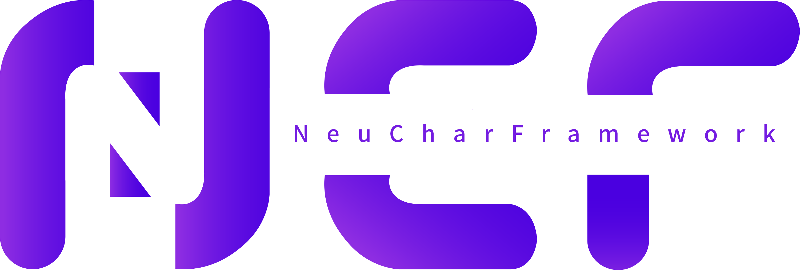

# NCF - NeuCharFramework

NeuCharFramework (hereinafter referred to as NCF) is a complete DDD framework for building foundational projects. It includes basic caching, database, models, validation, and a supporting management backend. It supports multiple databases, is highly modular, and has a high degree of scalability.

## Source Code

|                   | GitHub                                                                     | Gitee                                                                     | Description                                                                                                                                                                                                                                          |
| ----------------- | -------------------------------------------------------------------------- | ------------------------------------------------------------------------- | ---------------------------------------------------------------------------------------------------------------------------------------------------------------------------------------------------------------------------------------------------- |
| NCF Template      | [NCF](https://github.com/NeuCharFramework/NCF)                             | [NCF](https://gitee.com/NeuCharFramework/NCF)                             | A basic code framework that can be directly used for development. For regular development, just download this project or [use the template to create a project](/start/start-develop/get-ncf-template.html#从命令行安装-推荐).                       |
| NcfPackageSources | [NcfPackageSources](https://github.com/NeuCharFramework/NcfPackageSources) | [NcfPackageSources](https://gitee.com/NeuCharFramework/NcfPackageSources) | The foundational library code referenced by the `NCF Template` project, released as Nuget packages, and referenced by the `NCF Template`. It is also 100% open source. You can download it for in-depth development or research of basic principles. |

Note: The main branch of the above projects is the GitHub project. The Gitee project is a mirror and updates may be delayed.

<b>Current fast update branch: [Developer](https://github.com/NeuCharFramework/NCF/tree/Developer)</b>

> NCF is derived from the SenparcCore, an internal system framework optimized and iterated by the Senparc team over many years. It has been tested in numerous systems on .NET Framework 3.5/4.5 and has finally been ported to .NET Core (also supporting .NET 5.0/6.0/7.0/8.0). It is highly modular. NCF is currently running stably in many large and medium-sized applications. Thank you all for your continuous support. We welcome your feedback and suggestions, or join the ranks of community contributors!

## QQ Technical Exchange Group

## Learn More

[Start](/start/instruction/about-ncf.html)
