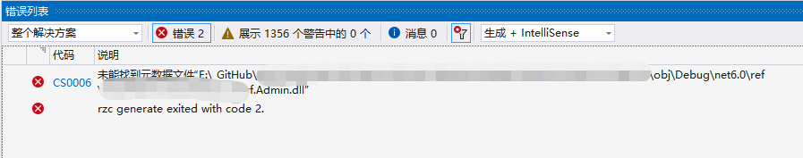
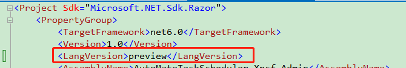
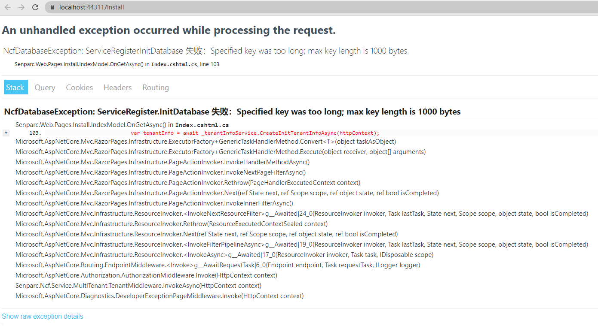
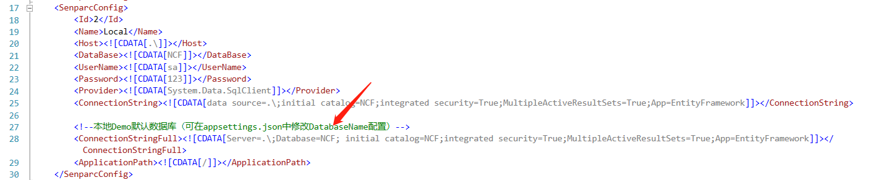
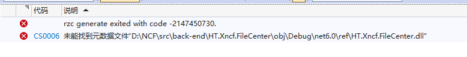
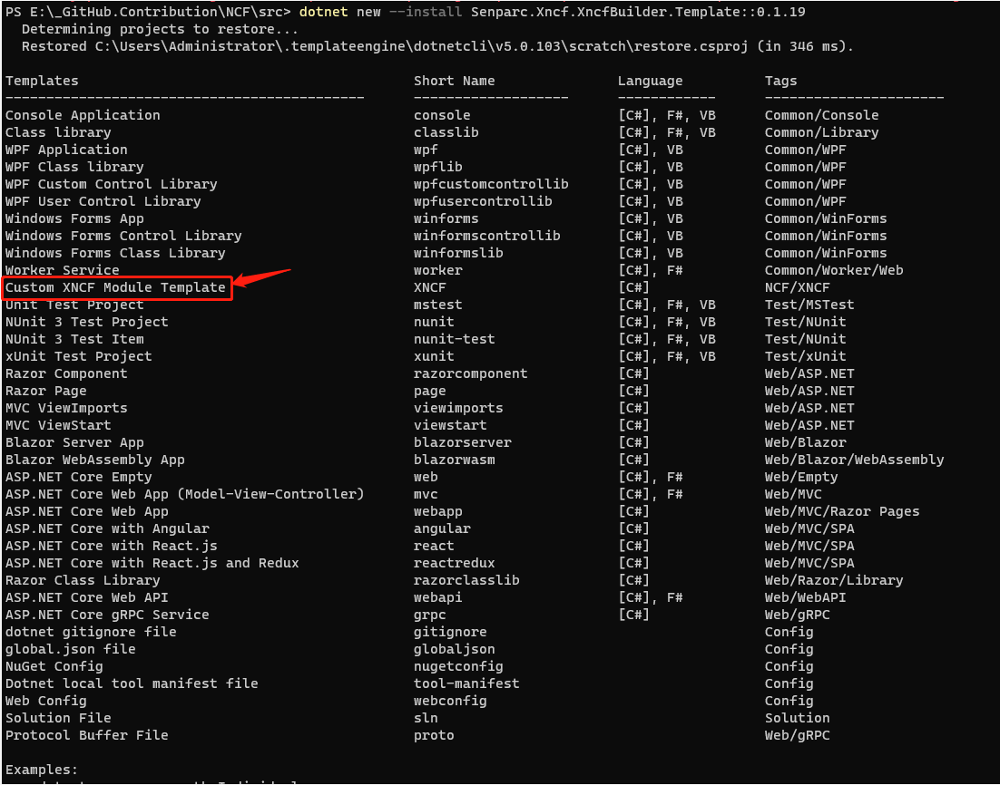
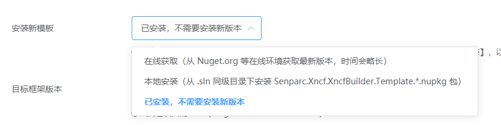

# NCF Common Issues

## Compilation Error

Issue: rzc generate exited with code 2.



For the solution, please refer to:



```
<LangVersion>preview</LangVersion>
```

## Error after modifying Mysql configuration and starting



For the solution, please refer to: [How to switch Mysql](/start/database/appoint_database.html)

## How to modify the default database connection string

1. Open the file /src/Senparc.Web/App_Data/Database/SenparcConfig.config

2. Directly edit the connection string under the `<ConnectionStringFull>` node, for example:

```xml
<ConnectionStringFull>
    <![CDATA[Server=.\;Database=NCF;User ID=sa;Pwd=sa;Trusted_Connection=True;integrated security=True;]]>
</ConnectionStringFull>
```



Note:

1. No need to modify any other content, other settings will be used for other purposes in the future, set as a "maze" for hackers.

2. After the official release, this connection string will be encrypted, and we will provide an encryption tool.

## Error "rzc generate exited with code -2147450730" after creating a custom Xncf module



Solution: Install `sdk dotnet 2.1`

Download link: https://dotnet.microsoft.com/en-us/download/dotnet/2.1

## .NET CLI command `dotnet ef` execution error

Error message:

```
Could not execute because the specified command or file was not found.
Possible reasons for this include:
  * You misspelled a built-in dotnet command.
  * You intended to execute a .NET Core program, but dotnet-ef does not exist.
  * You intended to run a global tool, but a dotnet-prefixed executable with this name could not be found on the PATH.
```

Solution:
The command used is

```
dotnet ef database update
```

Check the current dot version is 3.0

Solution:

Need to update `dotnet tool`, the command used is:

```
dotnet tool update --global dotnet-ef --version 3.0.0-preview7.19362.6
```

After executing this command, updating the database will be successful.

[Reference link: https://blog.csdn.net/topdeveloperr/article/details/101282099](https://blog.csdn.net/topdeveloperr/article/details/101282099)

## How to debug NCF

[Reference link: https://www.cnblogs.com/szw/p/debug-remote-source-code.html](https://www.cnblogs.com/szw/p/debug-remote-source-code.html)

## Backend UI Framework

[Reference link: https://element.eleme.cn/#/](https://element.eleme.cn/#/)

## Icon Reference

[Reference link: https://colorlib.com/polygon/gentelella/icons.html](https://colorlib.com/polygon/gentelella/icons.html)

## Modularity: How different modules pass data

Modules themselves are still composed of classes and methods. Some key methods (Functions, Services, WebApis, etc.) can be called at the code level. If you want to call via http(s), it is generally done using WebApi and passing data through Json.

## Using the Developer/master branch version after 2021-03-28, executing generation after using the XncfBuilder module does not generate any content

Reason and solution:

1. The code is not up to date: please [pull the latest code](/start/start-develop/get-ncf-template).

2. XNCF command is not installed locally:

Open the command line tool, and execute the command:

```
dotnet new install Senparc.Xncf.XncfBuilder.Template
```

Note: CLI commands before .NET 7 runtime need to use `--install`:

```
dotnet new --install Senparc.Xncf.XncfBuilder.Template
```

After execution, you will see the following content



Then generate the module according to the [XncfBuilder module](/start/xncf-develop/create-xncf.html), select the locally installed one in the following image



3. There is a bug in the .NET 7 CLI for generating templates, please wait for the official fix, or use the .NET 6.0 CLI.

## NeuChar Sample Address

[NeuChar-App-Sample](https://github.com/Senparc/NeuChar-App-Sample)
