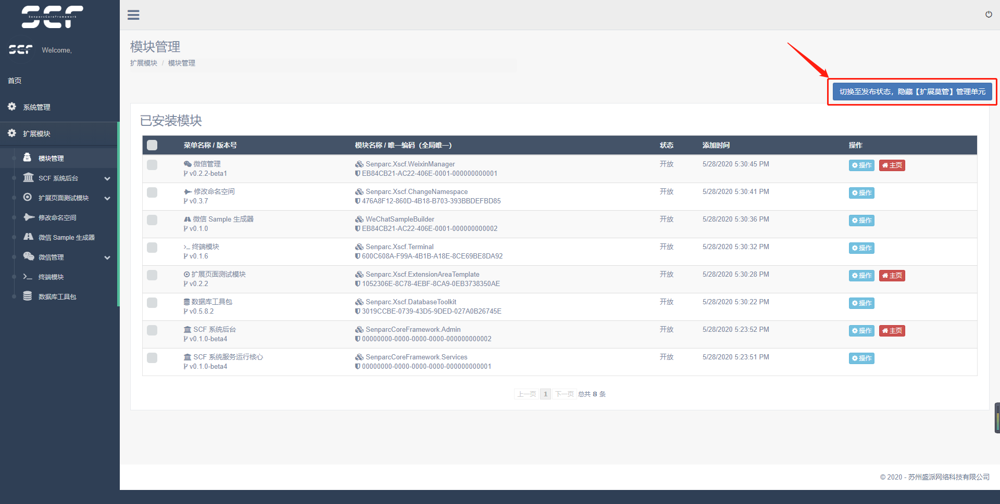
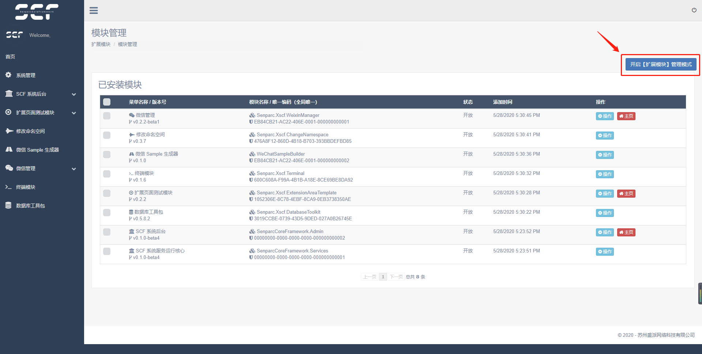

# New Features

## Module Installation Status

Pending Review Status:


Installed Status:


Deleted Status:


## One-Click Generate Xncf Module

Enter `NCF` module management, you can see newly discovered modules


Click to execute


Display execution form


```
Solution file (.sln) path: `C:\Code\NCF\ncf.sln`
Configure solution file (.sln): `Default is fine`
Organization name: `ML`
Module name: `Demo`
Version number: `1.0`
Menu name: `Demo Module`
Icon: `fa fa-star`
Description: `This is a demo module`
Function configuration: `Select as needed`
Install Sample: `Select as needed`
```

Generated project directory structure


Installed module display


## One-Click Hide Extension Module Menu Items

For developers with OCD, an extra layer of menu can be quite annoying. Now, a new powerful feature has been released to make the interface beautiful with one click



The effect is as follows:


This effect is perfect for customers!

## One-Click Restore (Enable) Extension Module Menu Items

For developers, it is inevitable to install other modules again for debugging and tracking. So how to restore?

Revisit: http://yourdomain/Admin/XncfModule/Index



Click to enable, isn't it So Easy.

(More features coming soon...)
