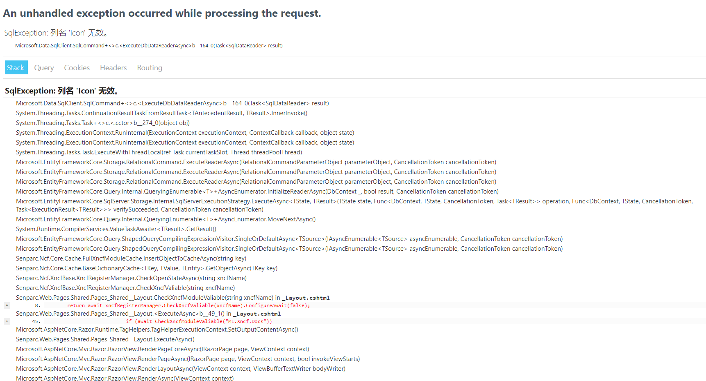
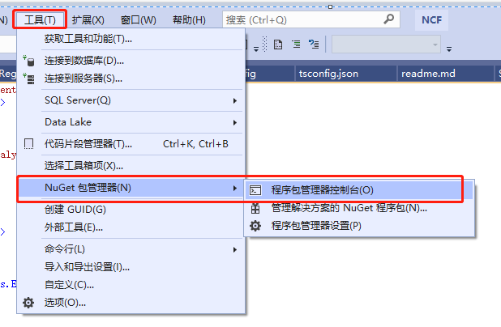
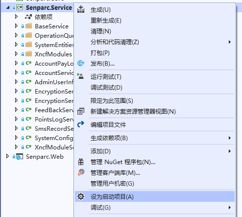
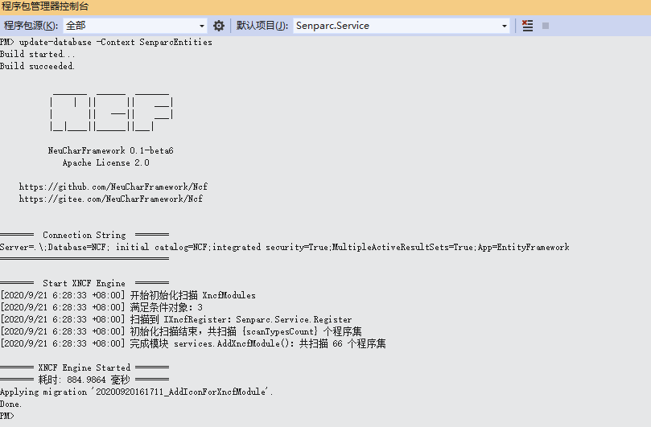
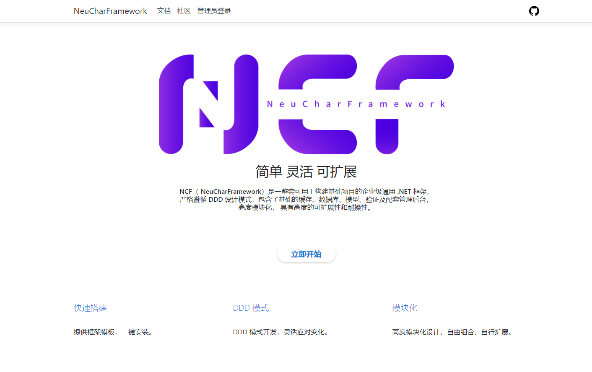

# Upgrade Guide

NCF has released a new beta5, this update includes an underlying database update, a refactoring of the database synchronization method, and an update to the documentation module. For new projects, it is recommended to use the new template, while old projects can manually update the database.

## `v0.3.5**-beta1` upgrade to `v0.3.600-beta1`

Possible errors when directly running the NCF site

1. Update the latest NCF project code

2. Set the `Senparc.Service` project as the startup project

3. In the [Package Manager Console], select `Senparc.Service`, then enter: `update-database -Context SenparcEntities` and press Enter

4. Done, no further action is required, rerun, and you will return to the familiar screen

