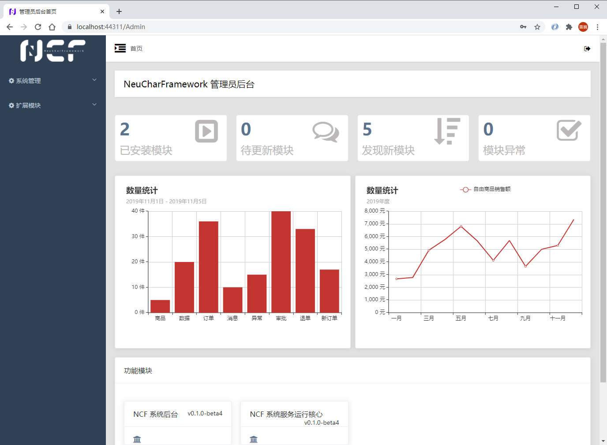
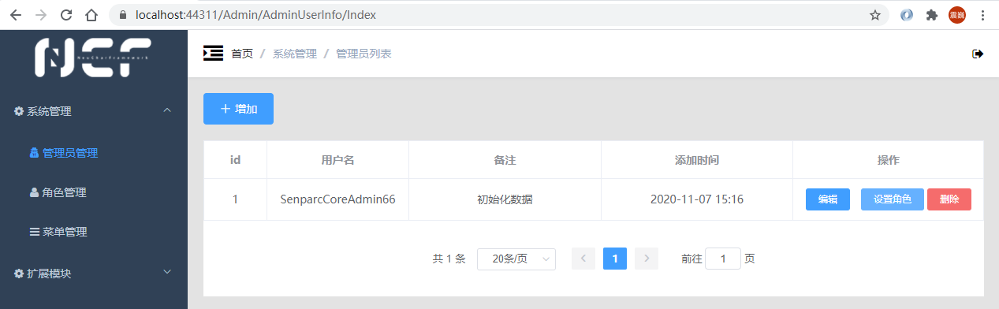
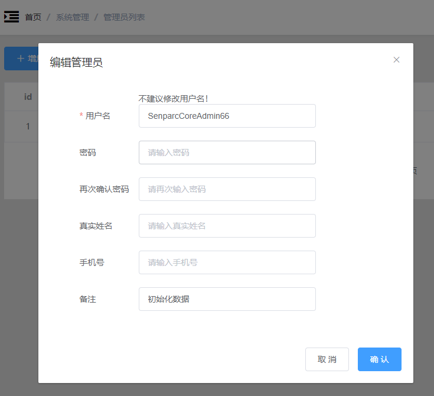
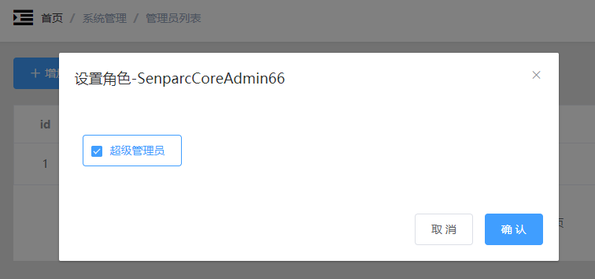
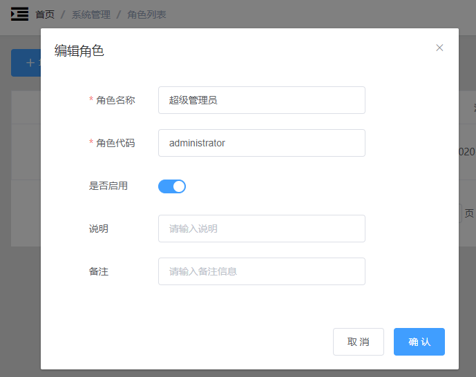
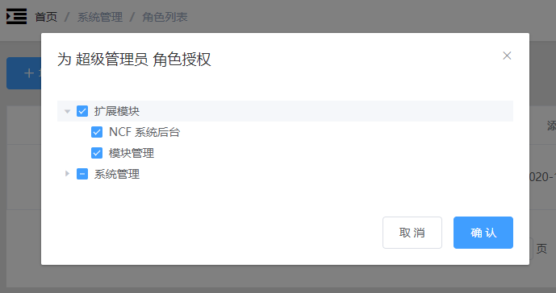
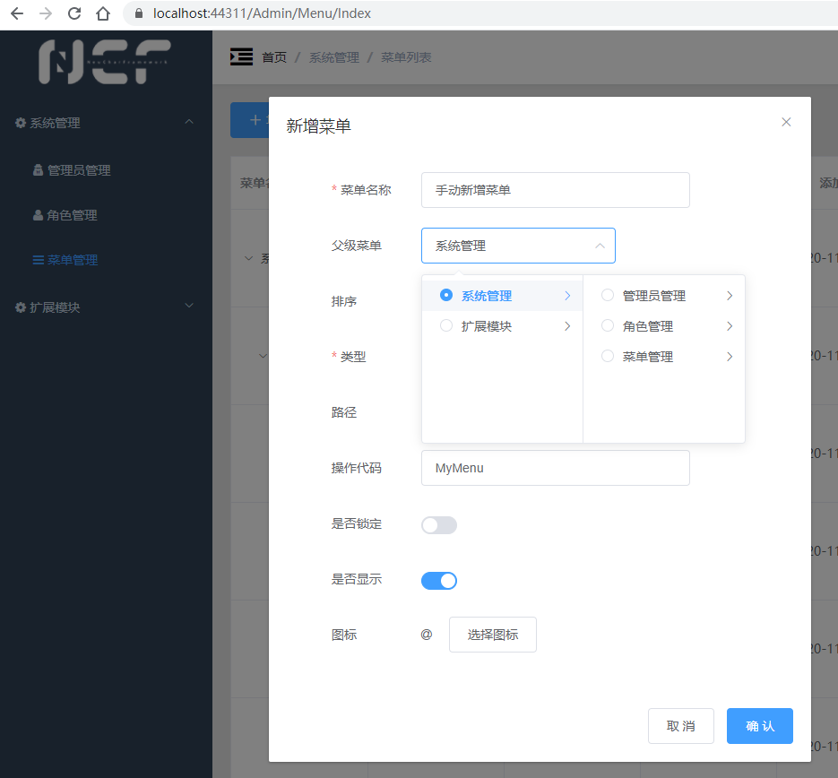
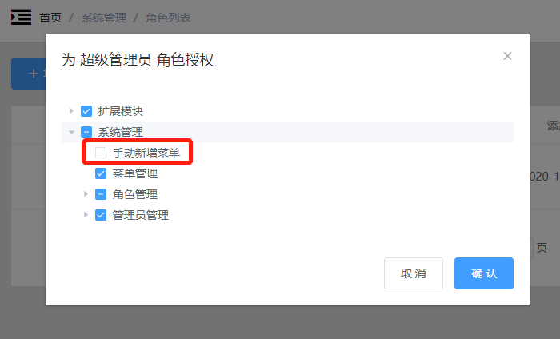
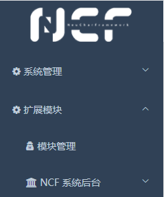

# Admin Backend

After logging in successfully, you can enter the admin backend.

## Home

The admin backend homepage contains statistical information for various modules, including `Installed Modules`, `Modules to be Updated`, `Newly Discovered Modules`, `Abnormal Modules`, etc.

## Module Status

The meanings of the various module statuses are as follows:

| Status           | Description                                                                                     |
| ---------------- | ----------------------------------------------------------------------------------------------- |
| Installed        | XNCF modules that have been successfully installed                                              |
| To be Updated    | XNCF modules that have been installed and have a new version available                          |
| Newly Discovered | XNCF modules whose dll files have been scanned but not installed in the system                  |
| Abnormal         | XNCF modules that have encountered an issue, such as being installed but the dll file not found |

## System Management Menu

In the left menu, expand [System Management], and you will see the default 3 menus: Admin Management, Role Management, Menu Management. Among them:

- `Admin Management` is used to assign admin accounts, passwords, and roles that can log in to the admin backend

- `Role Management` is used to set roles with different permission combinations, and different roles can be assigned to different admins

- `Menu Management` can be used to manually manage the entries in the left menu, and also includes control over page and button permissions, supporting multi-level menus.
  > Tip: The function of "Menu Management" not only covers the control of the left menu but also allows defining pages and buttons. These pages and buttons can be precisely controlled by roles in "Role Management".

For example, we can manually add a new menu, defining the name, parent menu, page path, and other information:

After saving, we are surprised to find: the left menu has not changed? Don't rush to say WTF, let's switch to "Role Management", open the permissions of the "Super Admin", and the truth is here:

For security reasons, all manually added elements will not be automatically added to the permissions. When we select the new menu and confirm the save, we can see the newly added [Manually Added Menu]:

## Extension Module Menu

The `Extension Module` menu is used to manage all modules (XNCF).

Among them, `Module Management` is a system page. Apart from this, all other menus appear automatically in the menu after the modules are installed, such as the already installed module: `NCF System Backend`, which is the backend currently running (the backend is also a module).

> Tip: Due to the highly modular architecture of NCF, most of the site's functions run on modules, using module management modules, running modules based on modules, and generating modules with modules.
