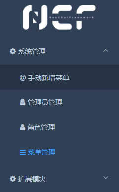

# Admin Backend

After successfully logging in, you can enter the admin backend.

## Home

The admin backend homepage contains statistical information for various modules, including `Installed Modules`, `Modules Pending Update`, `Newly Discovered Modules`, `Abnormal Modules`, etc.

## Module Status

The meanings of the various module statuses are as follows:

| Status           | Description                                                                       |
| ---------------- | --------------------------------------------------------------------------------- |
| Installed        | XNCF modules that have been successfully installed                                |
| Pending Update   | XNCF modules that have been installed and have a new version available            |
| Newly Discovered | XNCF modules whose dll files have been scanned but not installed in the system    |
| Abnormal         | XNCF modules with issues, such as installed modules whose dll files are not found |

## System Management Menu

In the left menu, expand [System Management] to see the default 3 menus: Admin Management, Role Management, Menu Management. Among them:

- `Admin Management` is used to assign admin accounts, passwords, and roles that can log into the admin backend

- `Role Management` is used to set roles with different combinations of permissions, which can be assigned to different admins

- `Menu Management` can be used to manually manage the entries in the left menu, including control over page and button permissions, supporting multi-level menus.
  > Note: The functionality of "Menu Management" not only covers control over the left menu but also allows defining pages and buttons. These pages and buttons can be precisely controlled in "Role Management".

For example, we can manually add a new menu, defining the name, parent menu, page path, and other information:

After saving, we are surprised to find: the left menu hasn't changed? Don't rush to say WTF, let's switch to "Role Management", open the permissions of the "Super Admin", and the truth is here:

For security reasons, all manually added elements will not be automatically added to the permissions. Once we select the new menu and confirm the save, we can see the newly added [Manually Added Menu]:

## Extension Module Menu

The `Extension Module` menu is used to manage all modules (XNCF).

Among them, `Module Management` is a system page. Other than that, the menus appear automatically after the modules are installed, such as the already installed module: `NCF System Backend`, which is the backend currently running (the backend is also a module).

> Note: Due to the highly modular architecture of NCF, the vast majority of the site's functionalities run on modules, using module management modules, running modules based on modules, and generating modules with modules.
