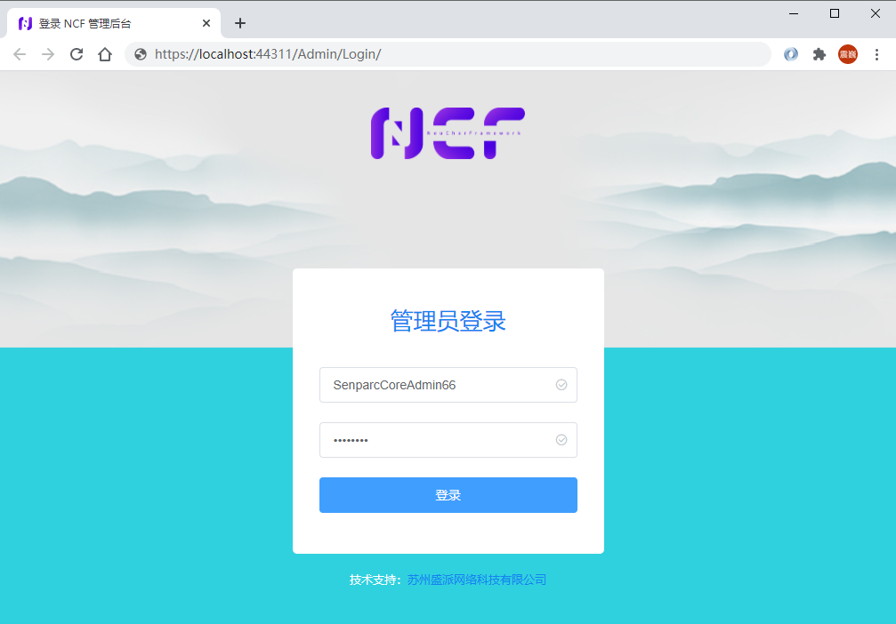

# Admin Login

The default admin login address is: `/Admin/Login`:

Enter the correct username and password to log in to the [Admin Backend](/start/start-develop/admin-background.html).

## Password Protection

> Note: All passwords in NCF are stored using irreversible encryption and cannot be retrieved in plain text. Please store the password in a secure place after system initialization or password modification. 

Here are some suggestions for password storage:

1. Do not use simple passwords; try to use complex passwords, such as more than 12 characters, including numbers, uppercase and lowercase letters, and special symbols.
2. Do not store passwords directly in the code or transmit plain text passwords over the network.
3. Do not store passwords in insecure places, such as unencrypted text files, databases, etc.
4. Do not store passwords in untrusted third-party services.
5. Do not send passwords directly to anyone, including system administrators.
6. Do not send passwords directly to any third-party services, including NCF official technical support.
