# Module Management

Open 【Extension Modules】>【Module Management】 to see the management page for all modules:

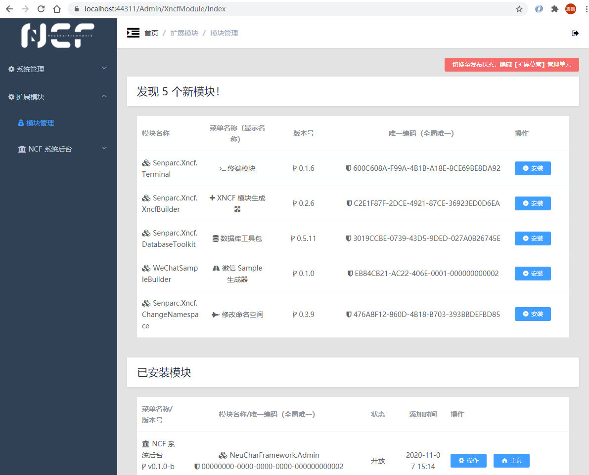

In the 【Module Management】 page, you can see new modules and installed modules, and their numbers will also be reflected on the backend `Home` page.

Under the "Installed" modules, you can see two modules that are already installed by the system by default:

| Name                    | Description                                                                                     |
| ----------------------- | ----------------------------------------------------------------------------------------------- |
| NCF System Backend      | The currently running administrator backend module                                              |
| NCF System Service Core | The core logic (Service) layer module, which also includes some special handling of data models |

> Note: These two modules are core system modules, similar to core files of an operating system. If you do not have better modules to replace them, please do not delete them (although to provide a highly customizable system, we have given operators this permission).

## Example: Database Management Module Installation and Usage

Due to the modularity of NCF, all system functions and auxiliary functions appear in the form of "modules" and are seamlessly integrated into the system for service.

### Install Database Toolkit

In the "Newly Discovered" modules, we can select the modules we need to use for installation. Here, we take the commonly used database tool "Database Toolkit" as an example:

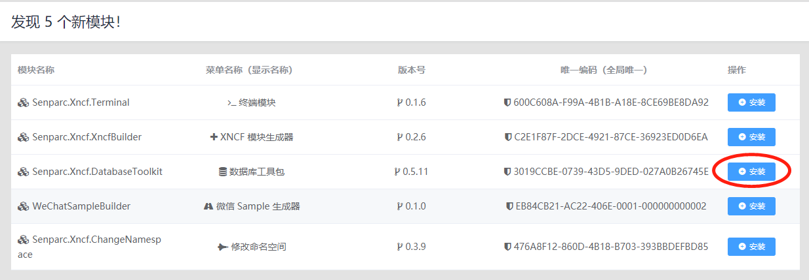

This module provides common database backup, scheduled backup, SQL export, and other functions.

Click the 【Install】 button on the right to complete the installation:

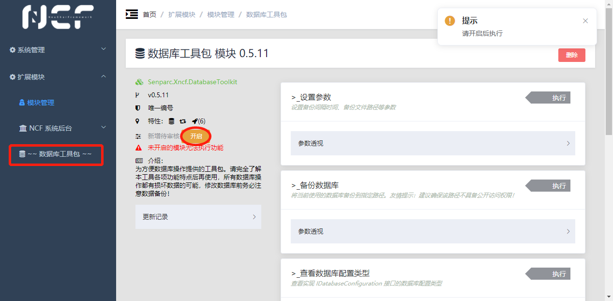

You can see: the "Database Toolkit" menu has been automatically added to the left menu, and currently, no methods (functions) can be executed. This is because, for security and practicality considerations, we have added a "lock" to all modules. Once you confirm that this module has no issues, click the 【Enable】 button to officially enable this module.

> Tip: The "Database Toolkit" on the left menu is surrounded by `~~` symbols, indicating that this module is not enabled and will not appear in the menu in the `official running state`.

### Enable Database Toolkit

After enabling, all functions can be used:

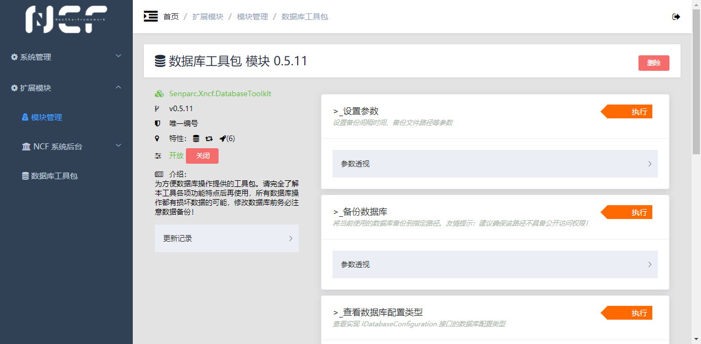

### Backup Database

For example, when we need to back up data, click the 【Execute】 button on the right side of 【Backup Database】, and then fill in the physical path where the backup file needs to be stored:

Click the 【Execute】 button to complete the backup:

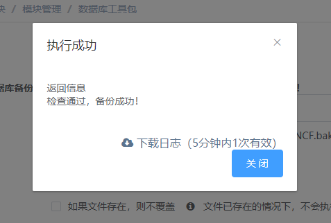

At the same time, you can see that the file has been stored in the specified directory:

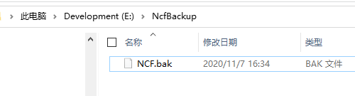

### Scheduled Backup Database

In addition to manual backup, a more practical function is to schedule backups for the database. Click the 【Execute】 button of the 【Set Parameters】 function and set the automatic backup cycle (minutes) and backup path:

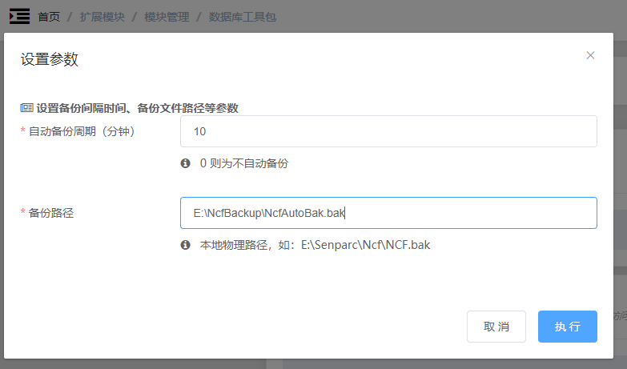

Click the 【Execute】 button to complete the parameter setting. This parameter will be automatically saved and can be modified at any time. The backup path will also be automatically displayed in the input box under the "Backup Database" function.

At this point, you can see the file of the first backup has been completed:

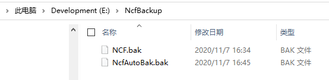

After waiting for 15 minutes, you can see the latest backup file, and the previous backup file is automatically renamed to `*.last.bak`:

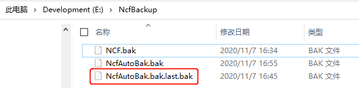

> Tip: The purpose of making a backup of the previous backup is that sometimes errors in the development process are not immediately discovered. If the backup is already erroneous data or data structure when discovered, it is too late. At this time, you can use `.last.bak` to quickly restore to the previous database state.

## Delete Module

After opening the management page of a module, there is a "Delete" button in the upper right corner to delete the module.

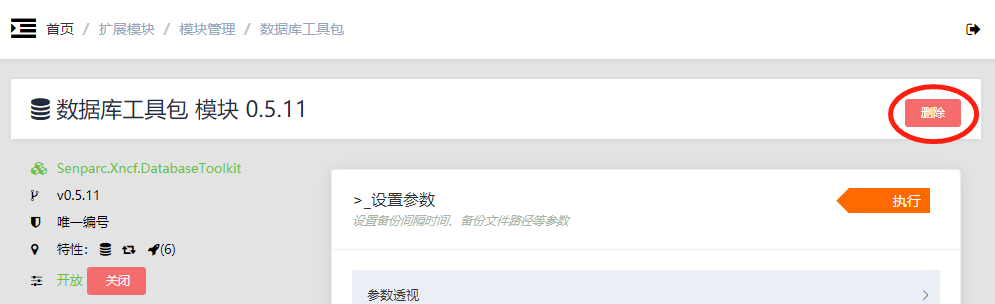

> Tip: After the module is deleted, it will reappear in the "Newly Discovered" module list and can be reinstalled, but the update records of the module will disappear. Whether the previous database records of the module are retained depends on the settings of each module.

## Switch to "Release" State

NCF defaults to separating "Extension Modules" into a primary menu, making it convenient to manage extension modules (XNCF). However, for a system that is ultimately to be released to a production environment and delivered to customers, having an extra level of menu and mixing configuration menus with function menus is obviously not a beautiful thing.

Therefore, NCF is also equipped with a "one-click takeoff" function: quickly switch the menu and module configuration from the setup state ("runway" state) to the release state ("flight" state). To do this, we only need to click the 【Extension Modules】>【Module Management】 on the left menu and see the 【Switch to Release State, Hide 【Extension Modules】 Management Unit】 button in the upper right corner:

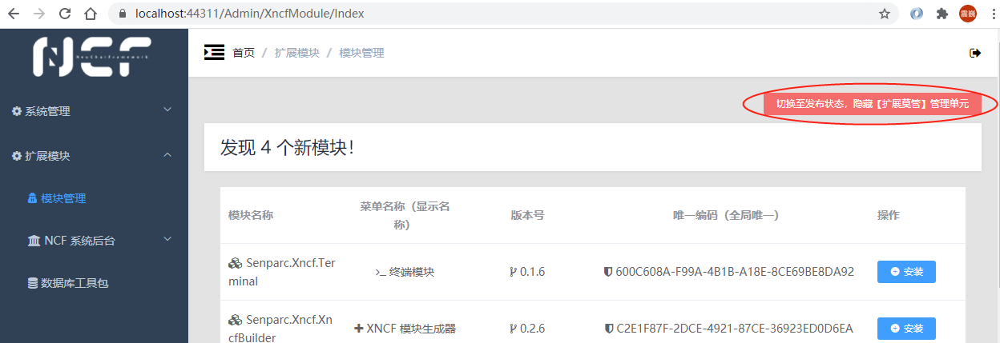

Click the button and pay attention to the prompt:

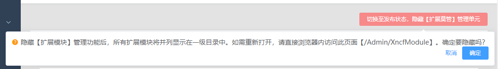

Click OK to organize all extension module directories into a primary directory and hide the 【Module Management】 entry:

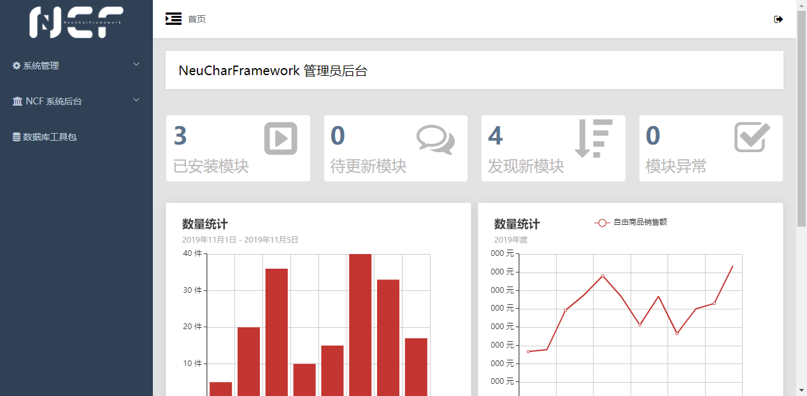

## Restore to Module Management Mode

Since 【Module Management】 is currently hidden, you need to manually enter the URL to enter the management module `/Admin/XncfModule/`, such as:

> https://localhost:44311/Admin/XncfModule/

At this time, in 【Module Management】, you can see a 【Enable 【Extension Modules】 Management Mode】 button in the upper right corner:

Click the button and confirm to restore to the module editing state.
