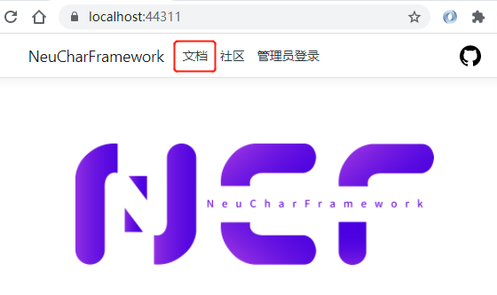
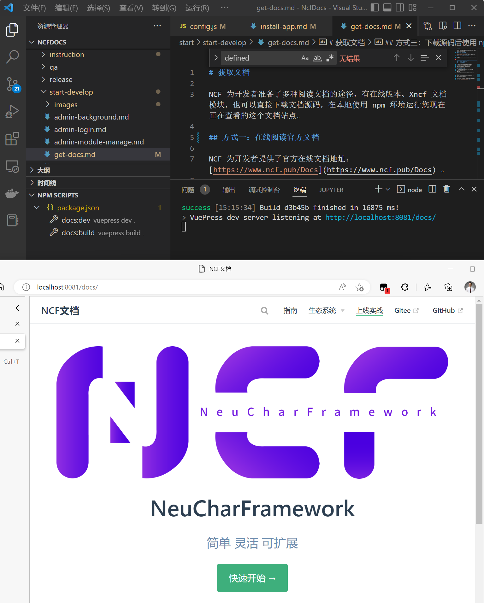

# Accessing Documentation

NCF provides developers with multiple ways to read the documentation, including an online version, the Xncf documentation module, or by directly downloading the documentation source code and running this documentation site locally using the npm environment.

## Method 1: Read the Official Documentation Online

NCF provides developers with the official online documentation address: [https://doc.ncf.pub](https://doc.ncf.pub).

## Method 2: Access the Official Documentation on the NCF Site

Run the NCF site, go to the root directory, and click the "Documentation" button at the top to access the official documentation:



## Method 3: Download the Source Code and Run Locally with npm

### Step 1: Install the node/npm Environment

### Step 2: Download the Documentation Source Code

Source code address:

1. [https://github.com/NeuCharFramework/NcfDocs](https://github.com/NeuCharFramework/NcfDocs) (latest)
2. [https://gitee.com/NeuCharFramework/NcfDocs](https://gitee.com/NeuCharFramework/NcfDocs) (synchronized from GitHub, may be delayed)

Assume the local physical path of this directory is: E:\Senparc项目\NeuCharFramework\NcfDocs

### Step 3: Run the npm Command

Using a command line tool (or PowerShell), go to E:\Senparc项目\NeuCharFramework\NcfDocs\

Run the command:

```
E:\Senparc项目\NeuCharFramework\NcfDocs> npm doc:dev
```

Run result

```
success [15:10:56] Build c5b69b finished in 9376 ms!
> VuePress dev server listening at http://localhost:8081/docs/
```

Open the displayed URL in a browser to view or debug the documentation locally:

<br>
