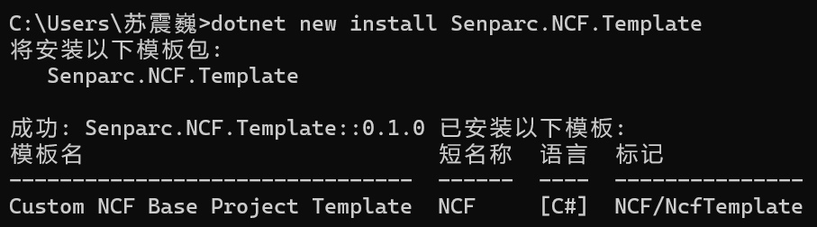
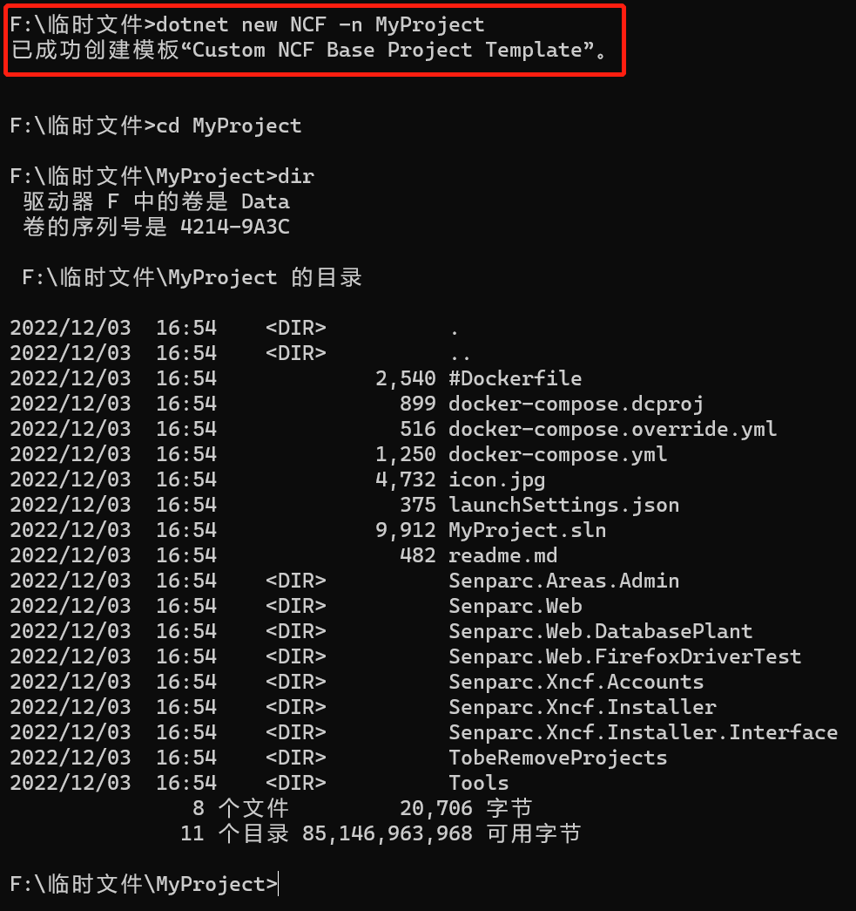
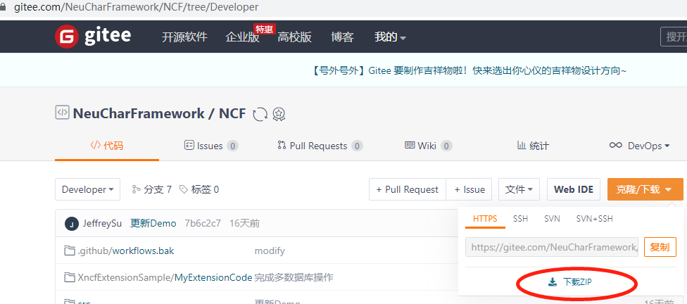
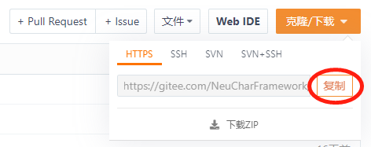
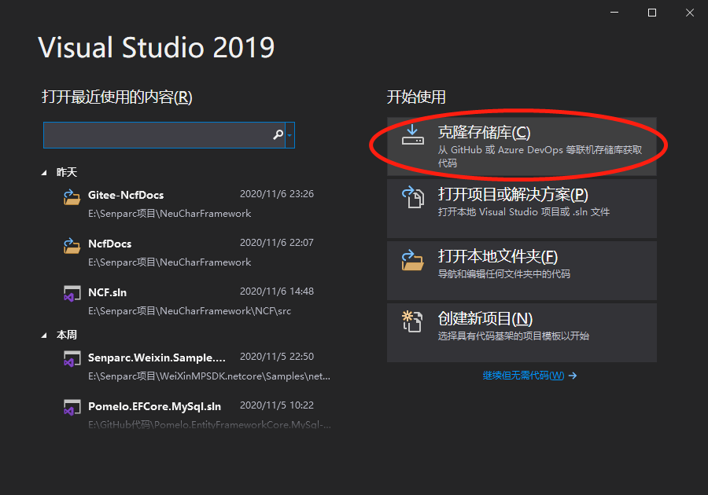
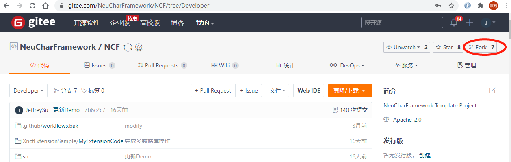

# Get NCF Template Source Code

## Install from Command Line (Recommended)

Open the command line in a development environment where the .NET runtime is installed, and enter:

```shell
dotnet new install Senparc.NCF.Template
```

After successful installation, the client will prompt:



Navigate to the folder where you want to create the project, and enter the command:

```shell
dotnet new NCF -n MyProject
```



> Here, `MyProject` is the project name and can be modified as needed. If the `-n` parameter is not provided, the default name will be used.

## Get Source Code from Source Address

Taking Gitee as an example, there are several ways to get the source code from the open-source project repository:

The following two code hosting addresses are the official code release channels for NCF:

- GitHub: [https://github.com/NeuCharFramework/NCF](https://github.com/NeuCharFramework/NCF)

- Gitee: [https://gitee.com/NeuCharFramework/NCF](https://gitee.com/NeuCharFramework/NCF)

### Method 1: Directly Download the .zip Package

Open the project source address, click the [Clone/Download] button, and click the [Download ZIP] button to complete the NCF source code download.



After the download is complete, unzip it to the specified location.

### Method 2: Use Git to Sync Locally

Open the project source address, click the [Clone/Download] button, and click the [Copy] button to get the git address, such as:

> https://gitee.com/NeuCharFramework/NCF.git



Open Visual Studio, click [Clone Repository]:



Paste the git address into [Repository Location], set the [Local Path] for storing the source code, and then click the [Clone] button:


### Method 3: Fork First, Then Sync Git (Recommended)

Open the project source address, click the [Fork] button in the upper right corner to make a copy of the official source code under your own account, and then repeat the above "Method 2" in your own forked project:


> Note: The forked repository will not automatically sync with the official source code. To get the latest source code, you need to manually sync again.
