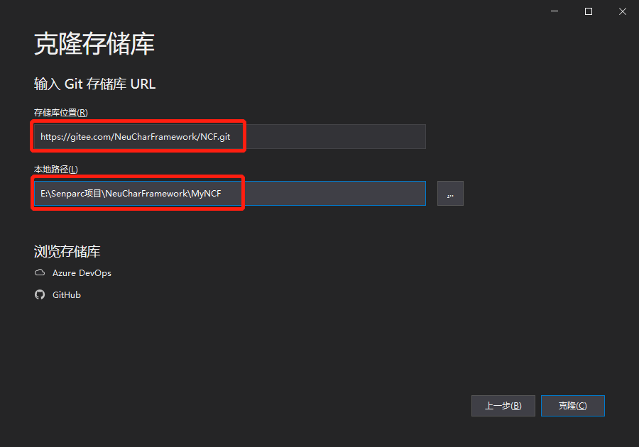

# Get NCF Template Source Code

## Method 1: Install from Command Line (Recommended)

Open the command line in a development environment where the .NET runtime is installed, and enter:

```shell
dotnet new install Senparc.NCF.Template
```

After successful installation, the client prompts:


Enter the folder where you need to create the project, and enter the command:

```shell
dotnet new NCF -n MyProject
```


> Among them, `MyProject` is the project name, which can be modified as needed. If the `-n` parameter is not provided, the default name will be used to create.

## Method 2: Get Source Code from Source Address

The following two code hosting addresses are the official code release channels for NCF:

- GitHub: [https://github.com/NeuCharFramework/NCF](https://github.com/NeuCharFramework/NCF)

- Gitee: [https://gitee.com/NeuCharFramework/NCF](https://gitee.com/NeuCharFramework/NCF)

> 💡 Note: The code on Gitee is mirrored from GitHub and may have delays. Therefore, if you want to get the latest version of the code, you can get it from the GitHub site. The operation method is similar.

Below is an example using Gitee, the operation on the GitHub site is similar.

### Method 1: Directly Download .zip Package

Open the project source address, click the [Clone/Download] button, and click the [Download ZIP] button to complete the NCF source code download.


After the download is complete, unzip it to the specified address.

### Method 2: Use Git to Sync to Local

Open the project source address, click the [Clone/Download] button, and click the [Copy] button to get the git address, such as:

> https://gitee.com/NeuCharFramework/NCF.git


Open Visual Studio, click [Clone Repository]:


Paste the git address into [Repository Location], set the [Local Path] for storing the source code, and then click the [Clone] button:



### Method 3: Fork First, Then Sync Git (Recommended)

Open the project source address, click the [Fork] button in the upper right corner to make a copy of the official source code under your own account, and then repeat the above "Method 2" under your own copy project:


> Note: The Forked repository will not automatically sync the official source code. To get the latest source code, you need to manually sync again.
