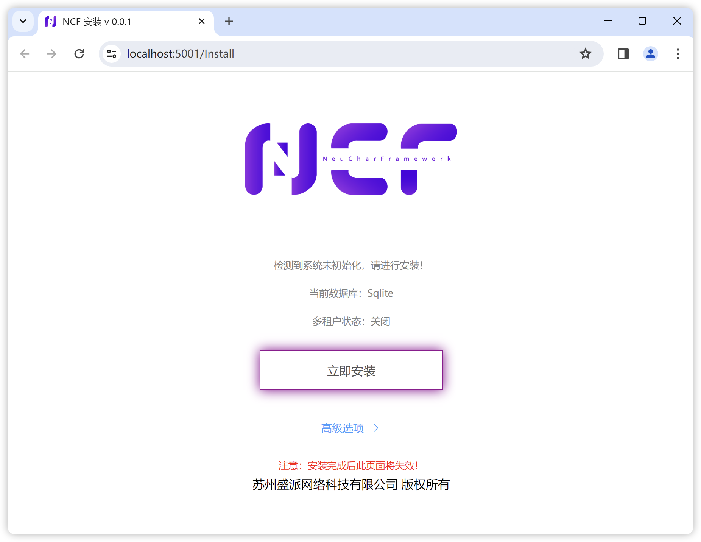
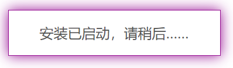
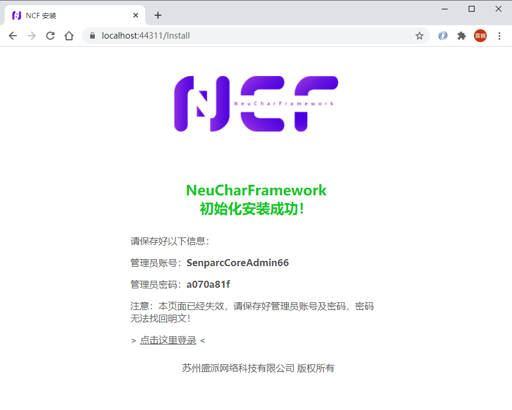
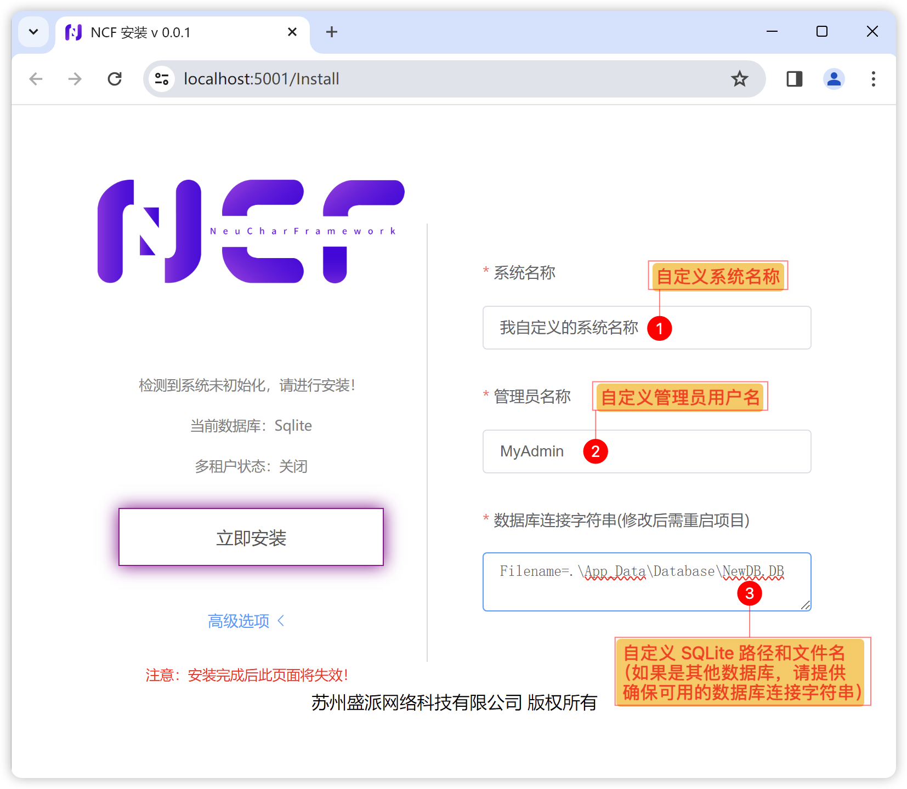
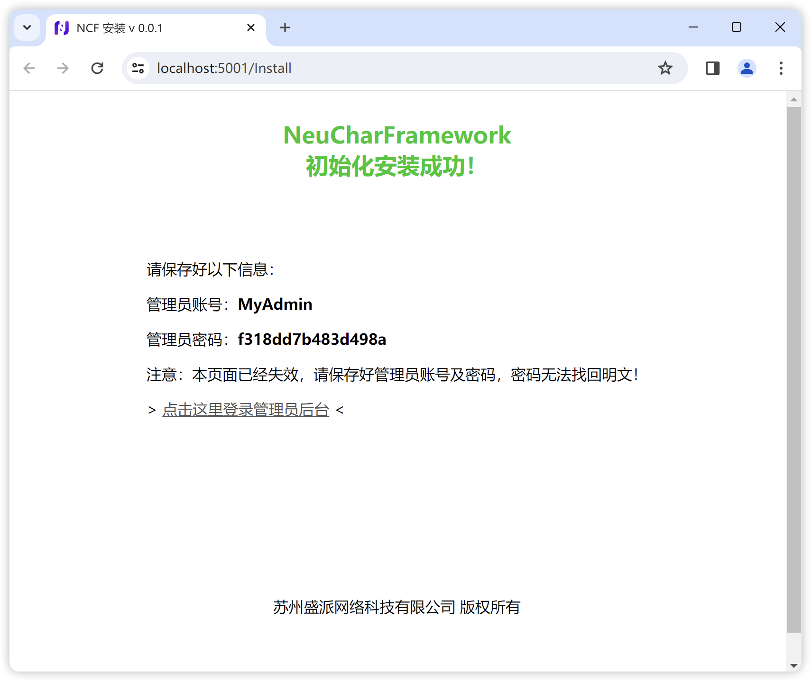

# Installation

## Start Installation

When you first start the NCF Web project, the system will prompt for installation:

> Note: The default running database is SQLite. If you need to switch to another database, please refer to [Using Multiple Databases](../database/mutil_database_support.html).

Click the "Install Now" button:

During the waiting process, the button will change to

Read the prompt and click confirm. Then, you will see the installation success screen:

On the success screen, you can see the randomly generated admin account, password, and admin login entry.

> Note: At this point, you must immediately copy or record the "admin account" and "admin password". The password is stored using irreversible encryption and cannot be retrieved in plain text.

### Advanced: Modify Admin Account and Database Connection String

You can also click the "Advanced Options>" button on the first installation screen to modify the admin account and database connection string:

Then you will see that the installed system uses a custom admin account:

## Login to Admin Backend

Click the "Click here to login" button link on the installation completion screen to enter the [Admin Backend Login](./admin-login.html) page.
