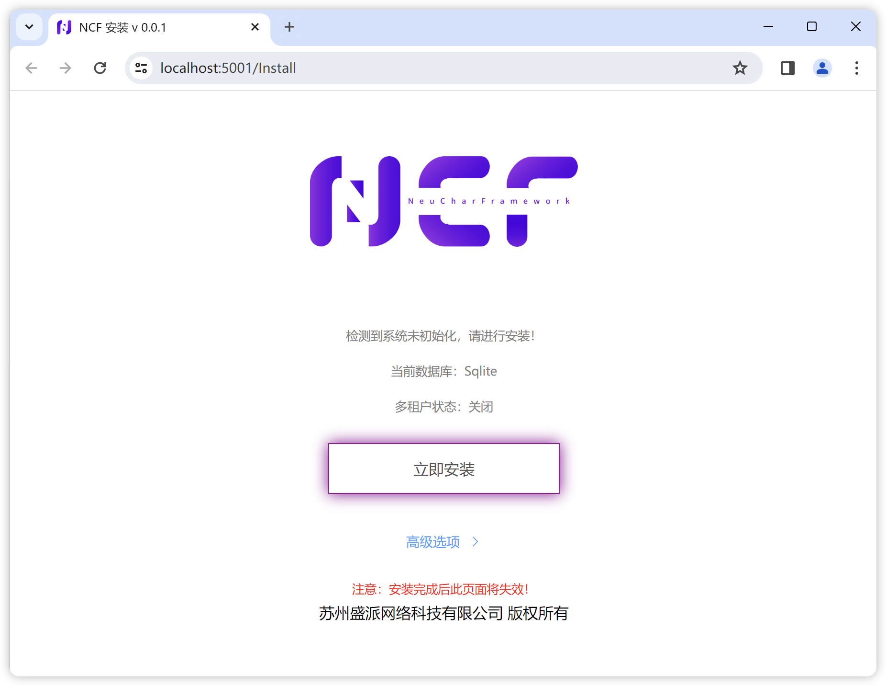
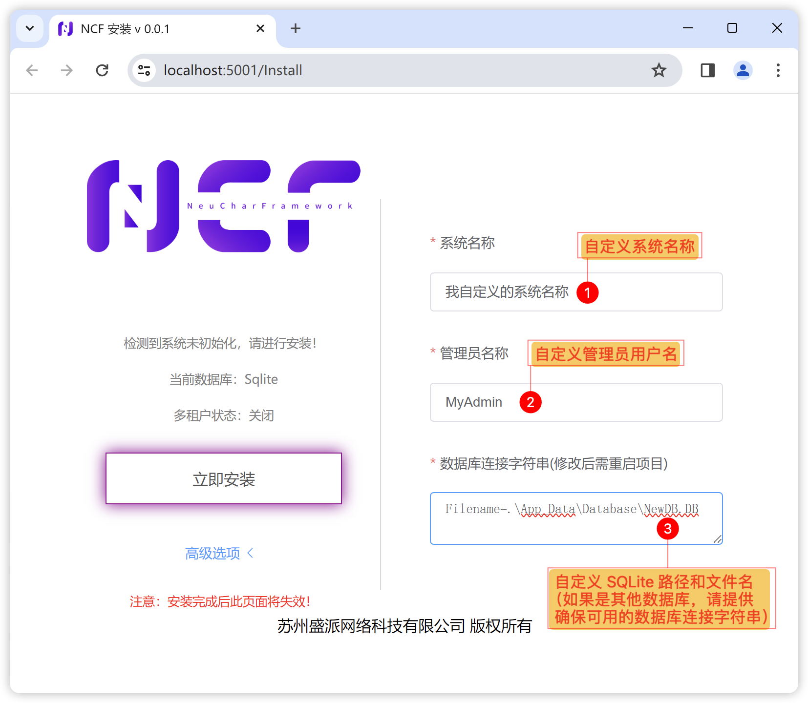
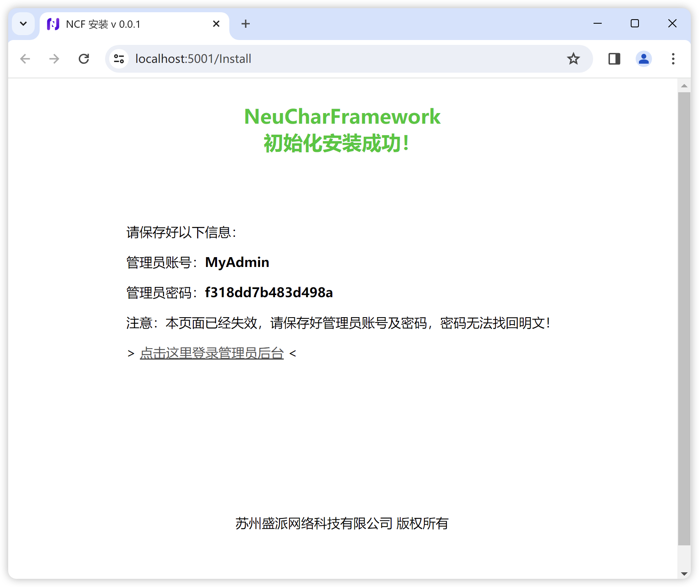

# Installation

## Start Installation

When you first start the NCF Web project, the system will prompt for installation:

> Note: The default running database is SQLite. If you need to switch to another database, please refer to [Using Multiple Databases](../database/mutil_database_support.html).

Before clicking "Install Now", expand **Advanced Options** to review the modules
submitted with the first installation. The current simulated site selects these
six items by default:

- Admin area module (required by the system)
- `Senparc.Xncf.PromptRange`
- `Senparc.Xncf.XncfBuilder`
- `Senparc.Xncf.MCP`
- `Senparc.Xncf.AIKernel`
- `Senparc.Xncf.AgentsManager`

The selection uses fixed module UIDs and does not depend on localized display
names. Adjust it if needed, then click "Install Now":

During the waiting process, the button will change to

The installer displays a confirmation dialog. Review the administrator,
database, and module choices before confirming. Cancelling the dialog does not
submit an installation request. After installation completes, the success page
is displayed:

On the success screen, you can see the randomly generated admin account, password, and admin login entry.

> Note: At this point, you must immediately copy or record the "admin account" and "admin password". The password is stored using irreversible encryption and cannot be retrieved in plain text.

### Advanced: Modify Admin Account and Database Connection String

You can also click "Advanced Options>" on the first installation screen to
modify the administrator account, database connection string, and optional
modules:

Then you will see that the installed system uses a custom admin account:

## Login to Admin Backend

Click the "Click here to login" button link on the installation completion screen to enter the [Admin Backend Login](./admin-login.html) page.
