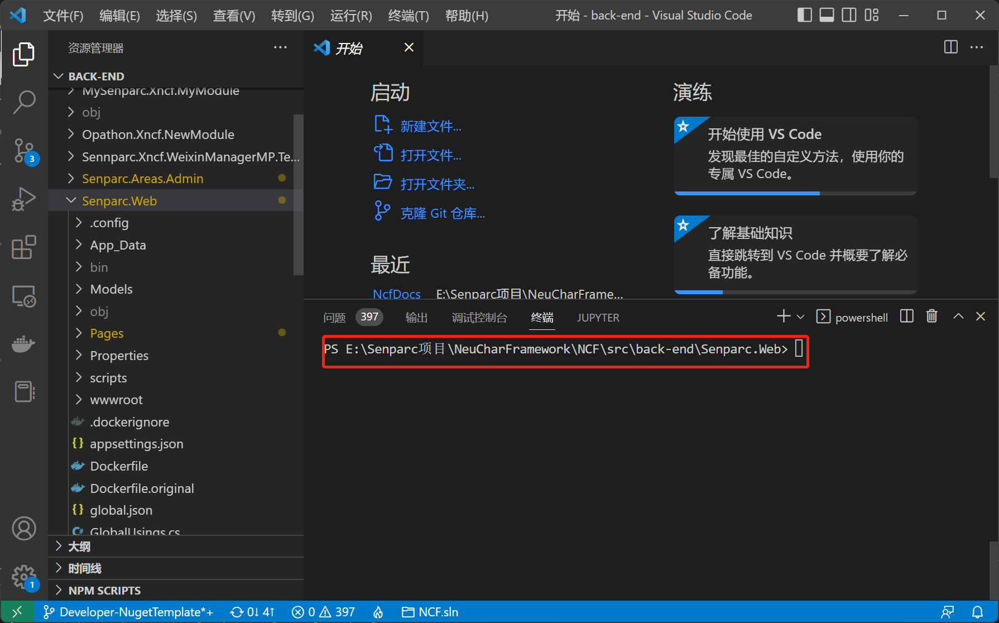
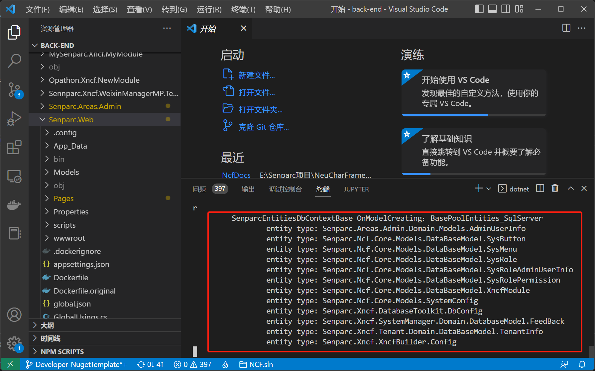
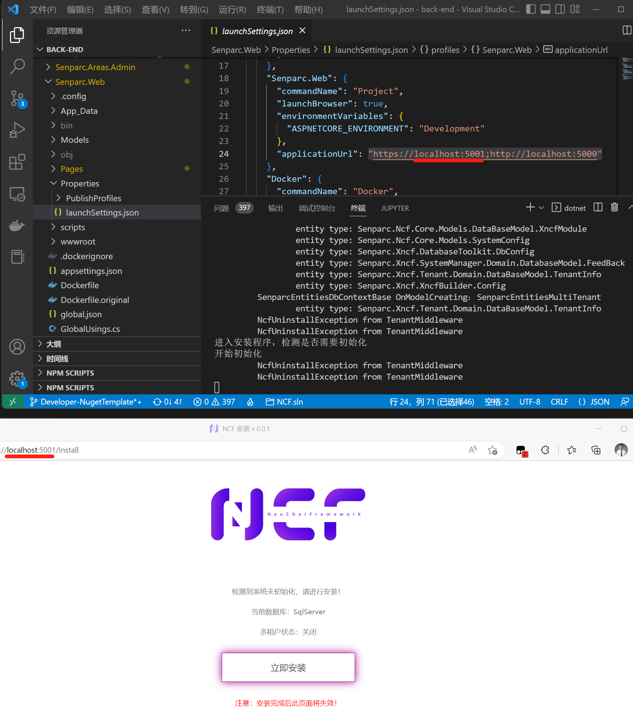

# Using CLI to Run NCF

## Step 1: Open Command Line Tool or Visual Studio Code

Navigate to the directory path where the Senparc.Web project (startup project) of NCF is located:



> Tip: In Visual Studio Code, press <kbd>Ctrl + ~</kbd> to open the command line tool.

## Step 2: Enter .NET Project Startup Command

```
E:\...\Senparc.Web > dotnet run
```

> Note: The default database is SQL Server. If you need to switch to another database, please refer to [Using Multiple Databases](/start/database/mutil_database_support.html).

## Complete Startup

After a few seconds, the NCF Web project will be successfully started.

Due to some behavior characteristics of the CLI command line, you may see a site address prompt at the end, or it may stay on the system startup log. This is normal:



You just need to open `https://localhost:5001` in your browser to see the startup page:



> Tip: You can also change the startup port by modifying the configuration in the `launchSettings.json` file (default is `"https://localhost:5001;http://localhost:5000"`), or specify it through command line parameters.

## First Time Startup Installation

When starting for the first time, the system will automatically prompt [installation](/start/start-develop/install-app.html). After the installation is complete, the installation interface will no longer appear.
