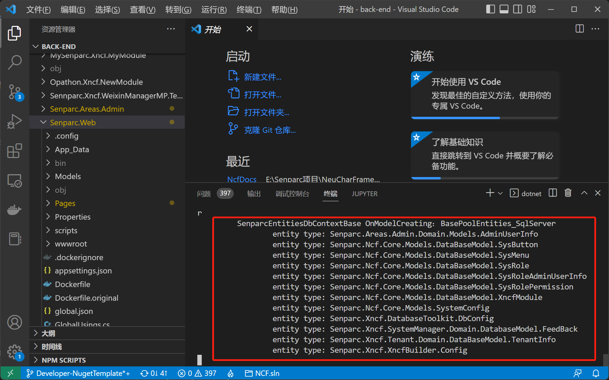
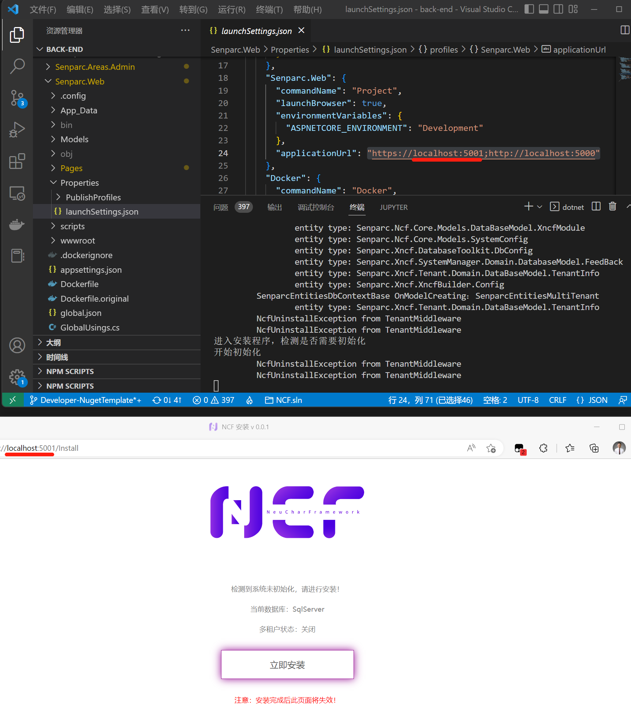

# Running NCF Using CLI

## Step 1: Open Command Line Tool or Visual Studio Code

Navigate to the directory path where the Senparc.Web project (startup project) of NCF is located:


> Tip: In Visual Studio Code, press <kbd>Ctrl + ~</kbd> to open the command line tool.

## Step 2: Enter .NET Project Startup Command

```
E:\...\Senparc.Web > dotnet run --launch-profile http
```

> Note: The default database used is SQLite. If you need to switch to another database, please refer to [Using Multiple Databases](../database/mutil_database_support.html).

## Complete Startup

After waiting for a few seconds, the NCF Web project will be successfully started.

Due to some behavior characteristics of the CLI command line, you may see a site address prompt at the end, or it may stay on the system startup log, which is normal:



With the command above, open `http://localhost:5000` in the browser:



> Tip: the local HTTPS profile uses `https://localhost:5111`; the Docker profile
> uses `http://localhost:5000` and `https://localhost:5001`. Select a profile
> explicitly with `--launch-profile`, or edit `launchSettings.json`.

## First Time Startup Installation

When starting for the first time, the system will automatically prompt for [installation](./install-app.html). After the installation is complete, the installation interface will no longer appear.
