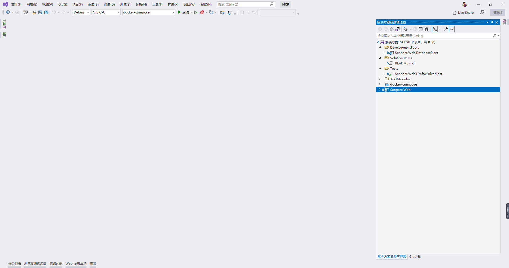
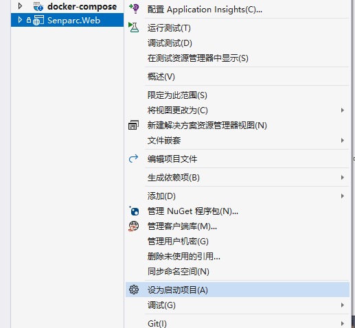

# Using Visual Studio to Run NCF

## Step 1: Open the Solution

After [synchronizing/extracting the source code or directly installing from the template](./get-ncf-template.html), open the `/src/NCF.sln` solution file to see the complete NCF template project:

## Step 2: Confirm Senparc.Web as the Startup Project

The `Senparc.Web` project is used to start the web site. Confirm that it is set as the startup project (bold). If not, right-click and select "Set as Startup Project".

## Step 3: Run

Click the top menu "Build" > "Start Without Debugging", or use the shortcut <kbd>Ctrl/Command</kbd> + <kbd>F5</kbd>

> Note: The default database is SQLite, so you do not need to configure the database at this stage. To switch to another database, see [Using Multiple Databases](../database/mutil_database_support.html).

## Complete Startup

After a few seconds, the NCF Web project will start. The system will automatically prompt [installation](./install-app.html) the first time it starts. After installation is complete, the installation interface will no longer appear.
