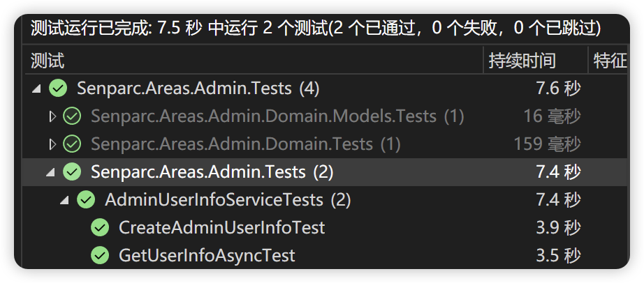

# Advanced

## Advanced: Generating Seed Data

During regular system testing and integration testing, testers usually need to insert a large amount of data into the database. This process is time-consuming and labor-intensive. In actual operations, a large number of unit tests (or developer tests) also repeat similar processes. NCF provides developers with a friendly Seed Data loading function, which allows all loading and testing to be completed directly in memory without using a database.

The source of seed data can be directly creating new objects in memory, or it can come from persistent storage containers such as files, databases, caches, etc. Here is one way to implement it.

In the unit test class, create a static method:

```csharp
private static Action<Dictionary<Type, List<object>>> InitSeedData = seedData =>
{
    var list = new List<object>();
    Random rand = new Random();
    for (int i = 0; i < 1000000; i++)
    {
        var username = $"Admin-{i}";
        var password = $"pWd-{i}";
        var realName = $"Admin{rand.Next(10000)}";
        var adminUserInfo = new AdminUserInfo(ref username, ref password, realName, "", "");
        list.Add(adminUserInfo);
    }
    seedData.Add(typeof(AdminUserInfo), list);
};
```

In the above code, `seedData` is a container for all the mock data that NCF has already processed for you. You can quickly get or set mock data for a particular entity through `seedData[<Type>]`. We created 1 million pieces of data through a for loop.

How to make this seed data configuration process effective?

Very simple! We can directly add a base class constructor call `base(null, InitSeedData)` to the constructor of the already created unit test:

```csharp
public AdminUserInfoServiceTests() : base(null, InitSeedData)
{
    // No modification needed
}
```

Then we create a unit test to test it:

```csharp
[TestMethod]
public async Task MyTestMethod()
{
    var obj = await adminUserInfoService.GetUserInfoAsync("Admin-600");
    Assert.IsNotNull(obj);

    var dataset = base.dataLists[typeof(AdminUserInfo)];
    Assert.AreEqual(dataset.Skip(600).Take(1).First() as AdminUserInfo, obj);
}
```

Run the test results:



Through the test, we can see that the initialization time of 1 million pieces of data plus the entire unit test class only took about 0.2 seconds. The simulated query process uses Linq's lambda query by default, which took 4.3 seconds. This depends on the performance of the CPU. If it is just to test business logic, you can also reduce the number of seed data. Usually, 1000 pieces are enough.
