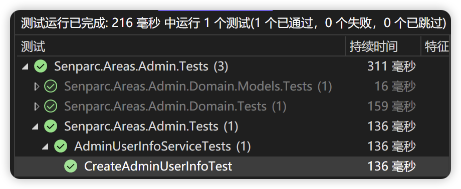

# Start Development

## Preparation

NCF unit testing is based on the official .NET unit testing framework (MsTest), so you do not need to acquire any additional skills. Therefore, you only need to install the .NET regular development environment (.NET SDK) to develop and run unit tests.

## Create Unit Test Project

You can create a unit test project using the regular command line method or the unit test project template in Visual Studio.

Taking the Admin module of the NCF project as an example, you can create a unit test project using the following command line:

```shell
dotnet new mstest -n Senparc.Areas.Admin.Tests
```

## Add References to the Project

The unit test project needs to reference the project being tested, such as the Senparc.Areas.Admin project in the current example:

```xml
<ItemGroup>
<ProjectReference Include="..\..\Senparc.Areas.Admin\Senparc.Areas.Admin.csproj" />
</ItemGroup>
```

Secondly, we need to reference the NCF unit test base support library:

```shell
dotnet add package Senparc.Ncf.UnitTestExtension
```

After completion, you can see that the relevant code has been added to `Senparc.Areas.Admin.Tests.csproj` (you can also add it manually), such as:

```xml
<PackageReference Include="Senparc.Ncf.UnitTestExtension" Version="0.1.1.2-preview1" />
```

## Create Unit Test File

You can create a unit test file according to the regular unit test rules, such as:

```csharp
[TestClass]
public class AdminUserInfoServiceTests : BaseNcfUnitTest
{
}
```

> `BaseNcfUnitTest` is the unit test base class provided by NCF, from the `Senparc.Ncf.UnitTestExtension` package installed in the previous step.

To provide common objects for the entire Service, we can add a constructor and private variables:

```csharp
AdminUserInfoService adminUserInfoService;
public AdminUserInfoServiceTests()
{
    // Create a Mock object for the Repository base class
    var mockBaseRepo = base.GetRespository<AdminUserInfo>().MockRepository;
    // Since AdminUserInfoService creates a dedicated interface, the relevant extended interface is automatically mapped from the base class. If you directly use IClientRepositoryBase<AdminUserInfo> to operate data, this line can be omitted
    var mockAdminUserInfoRepo = base.CreateMockForExtendedInterface<IAdminUserInfoRepository, IClientRepositoryBase<AdminUserInfo>>(mockBaseRepo);
    // Generate AdminUserInfoService class
    adminUserInfoService = new AdminUserInfoService(mockAdminUserInfoRepo.Object, null, base._serviceProvider);
}
```

> The above method is general and can be used for almost all Services and entity classes.

Next, we can test all the methods in `AdminUserInfoService`, for example:

```csharp
[TestMethod]
public async Task CreateAdminUserInfoTest()
{
    var adminUserInfoDto = new CreateOrUpdate_AdminUserInfoDto()
    {
        UserName = "NCF_Admin",
        Password = "abcd",
    };

    var obj = await adminUserInfoService.CreateAdminUserInfoAsync(adminUserInfoDto);

    Assert.IsNotNull(obj);
    Assert.AreEqual(adminUserInfoDto.UserName, obj.UserName);

    var storedPassword = obj.GetSHA512Password(adminUserInfoDto.Password, obj.PasswordSalt);
    Assert.AreEqual(storedPassword, obj.Password);
}
```

The above code is relatively easy to understand:

- `adminUserInfoDto` creates a DTO object for creating an admin
- The `adminUserInfoService.CreateAdminUserInfoAsync()` method is the target of this unit test, used to implement admin addition
- The `Assert` method verifies the expected results

Running the unit test shows that the test passed:


