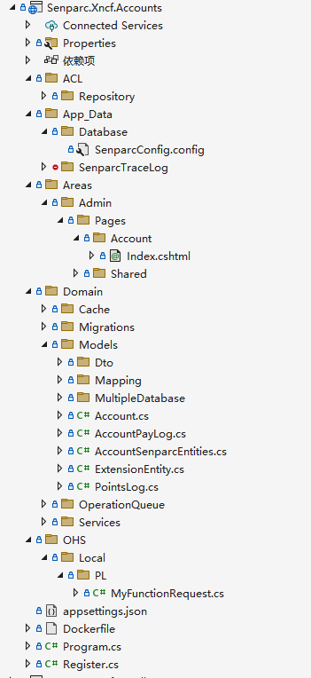
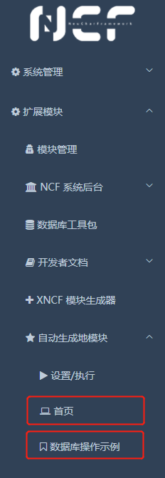

# Xncf Module Sample Detailed Explanation

After completing the [Create the First Xncf Module](/start/xncf-develop/create-xncf.html) operation, we get a custom Xncf project. If you selected the option to provide a Sample before generation, the Xncf module will automatically include Sample example code. It demonstrates most of the commonly used features, and you can complete the development by referring to the relevant practices.

Next, we will introduce the functionality of this project at the code level and try to modify it to demonstrate how to implement your own business logic on the basic code.

## File Structure

The project file structure supporting the `Senparc.Xncf.Accounts` functionality is as follows:



The roles of important folders and files are as follows:

| Folder | File | Description |
| ------ | ---- | ----------- |

```
Senparc.Xncf.Accounts        (Project root directory)
    ACL        (Anti-Corruption Layer)
        Repository
            AccountRepository.cs
    App_Data        (System folder, the contents of this folder are protected from access and cannot be accessed directly from the URL)
        Database
            SenparcConfig.config
        SenparcTraceLog
            SenparcTrace-20220522.log
    Areas        (Folder for storing Area pages (.NET system convention))
        Admin        (Folder for storing Admin backend pages, the file structure below it is no different from a regular RazorPage website)
            Pages
                Account
                    Index.cshtml
                Shared
                    _ViewStart.cshtml
    Domain        (Domain directory)
        Cache        (Cache directory)
            FullAccountCache.cs
        Migrations        (Project for storing database migration code (automatically generated))
            MySql        (MySQL database migration files (automatically generated))
            Oracle        (Oracle database migration files (automatically generated))
            PostgreSQL        (PostgreSQL database migration files (automatically generated))
            Sqlite        (Sqlite database migration files (automatically generated))
            SqlServer        (SqlServer database migration files (automatically generated))
        Models        (Folder for storing database entity classes)
            Dto        (Folder for storing Dto classes)
            Mapping        (Folder for storing Auto Mapping classes)
            MultipleDatabase        (Folder for storing Multi-Database Factory classes)
            Account.cs
        OperationQueue
            OperationQueue.cs
        Services        (Folder for storing business classes)
            AccountService.cs        (Business class for Account)
    OHS        (Open Host Service)
        Local        (Local)
            PL        (Public Language)
        Remote        (Remote)
    Programs.cs
    Register.cs        (Xncf module registration class (partial class - implements IXncfRegister interface), provides basic capabilities for the Xncf module)
    Register.Area.cs        (Xncf module registration class (partial class - implements IAreaRegister and IXncfRazorRuntimeCompilation interfaces), provides web capabilities)
    Register.Database.cs        (Xncf module registration class (partial class - implements IXncfDatabase interface), provides database capabilities)

```

> Tip: All the above files are automatically generated using the XncfBuilder module, no manual writing is required!

## Register.cs Registration File

In [The Composition of Xncf](/start/xncf-develop/about-xncf.html), we have introduced: Each Xncf module must have a class that implements the `IXncfRegister` interface. In this project, it is implemented by the Register class in Register.cs.

To make the logic clearer, we set the Register class as a partial class, respectively implementing different interfaces such as IXncfRegister, IAreaRegister, and IXncfDatabase, to make the code clearer.

### Register.cs

The `Register.cs` file defines the Register class and inherits the abstract class `XncfRegisterBase` which implements the system default `IXncfRegister` interface. The code is as follows:

```csharp
using Microsoft.Extensions.DependencyInjection;
using MySenparc.Xncf.MyApp.Functions;
using MySenparc.Xncf.MyApp.Models.DatabaseModel;
using MySenparc.Xncf.MyApp.Models.DatabaseModel.Dto;
using MySenparc.Xncf.MyApp.Services;
using Senparc.Ncf.Core.Enums;
using Senparc.Ncf.Core.Models;
using Senparc.Ncf.XncfBase;
using System;
using System.Collections.Generic;
using System.Linq;
using System.Threading.Tasks;

namespace MySenparc.Xncf.MyApp
{
    [XncfRegister]
    public partial class Register : XncfRegisterBase, IXncfRegister
    {
        #region IXncfRegister Interface

        public override string Name => "MySenparc.Xncf.MyApp";

        public override string Uid => "DD4E1973-7291-4E76-892F-E32A5CA57139"; // Must ensure global uniqueness, must be fixed after generation, automatically generated, can also be modified manually

        public override string Version => "0.1"; // Must fill in the version number

        public override string MenuName => "Auto-generated Module";

        public override string Icon => "fa fa-star";

        public override string Description => "This is a module automatically generated using XncfBuilder";

        public override IList<Type> Functions => new Type[] { typeof(MyFunction) };


        public override async Task InstallOrUpdateAsync(IServiceProvider serviceProvider, InstallOrUpdate installOrUpdate)
        {
            // Update the database when installing or upgrading the version
            await base.MigrateDatabaseAsync(serviceProvider);

            // Execute logic based on different conditions of installation or update
            switch (installOrUpdate)
            {
                case InstallOrUpdate.Install:
                    // New installation
                    #region Initialize database data
                    var colorService = serviceProvider.GetService<ColorService>();
                    var color = colorService.GetObject(z => true);
                    if (color == null) // If it is a pure first installation, theoretically there will be no residual data
                    {
                        ColorDto colorDto = await colorService.CreateNewColor().ConfigureAwait(false); // Create default color
                    }
                    #endregion
                    break;
                case InstallOrUpdate.Update:
                    // Update
                    break;
                default:
                    throw new ArgumentOutOfRangeException();
            }
        }

        public override async Task UninstallAsync(IServiceProvider serviceProvider, Func<Task> unsinstallFunc)
        {
            #region Delete database (demonstration)

            var mySenparcEntitiesType = this.TryGetXncfDatabaseDbContextType;
            MyAppSenparcEntities mySenparcEntities = serviceProvider.GetService(mySenparcEntitiesType) as MyAppSenparcEntities;

            // Specify the data entities that need to be deleted

            // Note: Here as a demonstration, all tables created by this module are deleted when uninstalling the module. In actual operation, please operate with caution and sort the entities in the order of deletion!
            var dropTableKeys = EntitySetKeys.GetEntitySetInfo(this.TryGetXncfDatabaseDbContextType).Keys.ToArray();
            await base.DropTablesAsync(serviceProvider, mySenparcEntities, dropTableKeys);

            #endregion

            await unsinstallFunc().ConfigureAwait(false);
        }

        #endregion
    }
}
```

### Metadata Information

In the code implementing the IXncfRegister interface, the metadata information of the Xncf package is defined:

```csharp
public override string Name => "MySenparc.Xncf.MyApp";

public override string Uid => "DD4E1973-7291-4E76-892F-E32A5CA57139"; // Must ensure global uniqueness, must be fixed after generation, automatically generated, can also be modified manually

public override string Version => "0.1"; // Must fill in the version number

public override string MenuName => "Auto-generated Module";

public override string Icon => "fa fa-star";

public override string Description => "This is a module automatically generated using XncfBuilder";
```

Except for the Uid which is randomly generated, other parameters are automatically generated according to the information filled in when creating the module.

### Installation and Update Methods

The `InstallOrUpdateAsync()` method is used to define the code that needs to be executed during the installation or update of the module. Among them:

```csharp
// Update the database when installing or upgrading the version
await base.MigrateDatabaseAsync(serviceProvider);
```

The `base.MigrateDatabaseAsync()` method can automatically match the database migration files (Migration) according to the currently set database type and automatically install them into the database.

The following code judges the "installation" or "update" status. If it is a new installation of the module, it tries to get the first instance object of Color from the database. If it does not exist, it creates a new one. This ensures that there is always a Color record in the system.

For more introduction about Service, please see [here]().

### Uninstallation Method

The `UninstallAsync()` method is used to define the code that needs to be executed when the module is uninstalled.

Among them, the code to get the database context entity is very critical:

```csharp
var mySenparcEntitiesType = this.TryGetXncfDatabaseDbContextType;
MyAppSenparcEntities mySenparcEntities = serviceProvider.GetService(mySenparcEntitiesType) as MyAppSenparcEntities;
```

> Line 1: Get the type of the current `database configuration class` (e.g., determine whether it is MySQL or SQLServer)<br>
> Line 2: According to the type obtained in line 1, get MyAppSenparcEntities. Note: Although the type is defined as MyAppSenparcEntities here, what is actually obtained may be MyAppSenparcEntities_MySql (currently configured as MySQL database) or MyAppSenparcEntities_SqlServer (currently configured as SQL Server database).

Except in such special cases, where we need to use MyAppSenparcEntities_MySql or MyAppSenparcEntities_SqlServer and other subclasses, in the regular system development process, we only need to remember **`SenparcEntities`** as the database context type, because NCF has merged all Xncf database contexts. This is taken out separately here for security reasons, so that the program cannot "harm" other parts of the database.

### Register.Area.cs

`Register.Area.cs` is an extension of the `Register.cs` partial class, implementing the web functionality interfaces (IAreaRegister and IXncfRazorRuntimeCompilation).
Among them, IAreaRegister provides web integration functionality, and IXncfRazorRuntimeCompilation provides additional capabilities for runtime compilation of Razor Pages. These two interfaces are optional and can be selected according to actual needs.

The configuration of these two interfaces is also very simple, and they are all for web services, so they are written in the same file. The code is as follows:

```csharp
using Microsoft.AspNetCore.Hosting;
using Microsoft.Extensions.DependencyInjection;
using Senparc.CO2NET.Trace;
using Senparc.Ncf.Core.Areas;
using Senparc.Ncf.Core.Config;
using System.Collections.Generic;
using System.IO;

namespace MySenparc.Xncf.MyApp
{
    public partial class Register : IAreaRegister, // Register XNCF page interface (optional)
                                    IXncfRazorRuntimeCompilation  // Enable RazorPage runtime compilation
    {
        #region IAreaRegister Interface

        public string HomeUrl => "/Admin/MyApp/Index";

        public List<AreaPageMenuItem> AareaPageMenuItems => new List<AreaPageMenuItem>() {
             new AreaPageMenuItem(GetAreaHomeUrl(),"Home","fa fa-laptop"),
             new AreaPageMenuItem(GetAreaUrl($"/Admin/MyApp/DatabaseSample"),"Database Operation Example","fa fa-bookmark-o"),
            };

        public IMvcBuilder AuthorizeConfig(IMvcBuilder builder, IWebHostEnvironment env)
        {
            builder.AddRazorPagesOptions(options => {
                // Page permissions can be configured here
            });
            SenparcTrace.SendCustomLog("MyApp Startup", "Completed Area:MySenparc.Xncf.MyApp Registration");
            return builder;
        }

        #endregion

        #region IXncfRazorRuntimeCompilation Interface
        public string LibraryPath => Path.GetFullPath(Path.Combine(SiteConfig.WebRootPath, "..", "..", "MySenparc.Xncf.MyApp"));
        #endregion
    }
}

```

#### IAreaRegister Interface

The `HomeUrl` property must provide the address of the homepage (usually the homepage of the backend management, or it can be a front-end page).

The `AareaPageMenuItems` property defines the pages that need to be displayed in the left menu. The above configuration has 2 pages, namely "Home" and "Database Operation Example", as shown below:



> Tip: This menu can set the current backend page or any link such as an external link. The `GetAreaHomeUrl()` method can automatically get the system address of the defined homepage (HomeUrl).

The `AuthorizeConfig()` method can define a series of page permissions and other configurations.

#### IXncfRazorRuntimeCompilation Interface

The `IXncfRazorRuntimeCompilation` interface has only one property: `LibraryPath`, which defines the physical path of the current project, making it easy for the system to automatically detect file changes and automatically compile.

### Register.Database.cs

`Register.Database.cs` is also an extension of the `Register.cs` partial class, implementing the configuration of database-related functions. Its code is also very simple:

```csharp
using Microsoft.EntityFrameworkCore;
using Microsoft.Extensions.DependencyInjection;
using System;
using Senparc.Ncf.Database;
using Senparc.Ncf.Core.Models;

namespace MySenparc.Xncf.MyApp
{
    public partial class Register : IXncfDatabase  // Register XNCF module database (optional)
    {
        #region IXncfDatabase Interface

        /// <summary>
        /// Database prefix
        /// </summary>
        public const string DATABASE_PREFIX = "MySenparc_MyApp_";

        /// <summary>
        /// Database prefix
        /// </summary>
        public string DatabaseUniquePrefix => DATABASE_PREFIX;

        /// <summary>
        /// Database prefix
        /// </summary>
        public Type TryGetXncfDatabaseDbContextType => MultipleDatabasePool.Instance.GetXncfDbContextType(this);

        public void OnModelCreating(ModelBuilder modelBuilder)
        {
            // After implementing the [XncfAutoConfigurationMapping] attribute, it can be executed automatically without manual addition
            // modelBuilder.ApplyConfiguration(new AreaTemplate_ColorConfigurationMapping());
        }

        public void AddXncfDatabaseModule(IServiceCollection services)
        {
            // DO NOT REMOVE OR MODIFY THIS LINE
            // ex. services.AddScoped(typeof(Color));
        }

        #endregion
    }
}
```

The `DATABASE_PREFIX` constant defines the prefix of the database table and assigns it to the `DatabaseUniquePrefix` property, which ensures that the database generated by the module does not conflict with other modules.

The `TryGetXncfDatabaseDbContextType` property's assignment can be seen as a fixed usage, its role is to get the type of the current "database configuration class".

The `OnModelCreating()` method can operate the mapping of the model when the database is initialized. This is a common method of EntityFrameworkCore. But in NCF, we have optimized it. As long as a class uses the `[XncfAutoConfigurationMapping]` attribute, it can automatically complete the mapping without writing code. In the current Sample, you can see such usage in `MyApp_ColorConfigurationMapping.cs`.

The `AddXncfDatabaseModule()` method is used for settings similar to those in startup.cs. The code in it will be executed when the module is loaded (started with the startup). For example, in this method, we can use the `services.AddScoped()` method to set dependency injection.

## Function

## Web Page

## Database
