# Create the First Xncf Module

## Introduction

There are two ways to create an Xncf module:

1. The manual way is to create a `Register` class and implement a series of interfaces as required in [Xncf's composition](/start/xncf-develop/about-xncf.html).
   > For manual creation, refer to [here](/start/developer/xncf_module.html).
2. [Recommended] Use the UI visual configuration method to automatically create the module. It is worth mentioning that the function used to create the Xncf module is also provided by an Xncf module named Senparc.Xncf.XncfBuilder.

The following introduces the method of creating an Xncf module with "0 code" using the visual automatic creation method.

## Install Senparc.Xncf.XncfBuilder

Run the NCF project, go to the [Module Management] menu, find the `XNCF Module Generator` (Senparc.Xncf.XncfBuilder) in the "Newly Discovered Modules" list, and click the [Install] button:

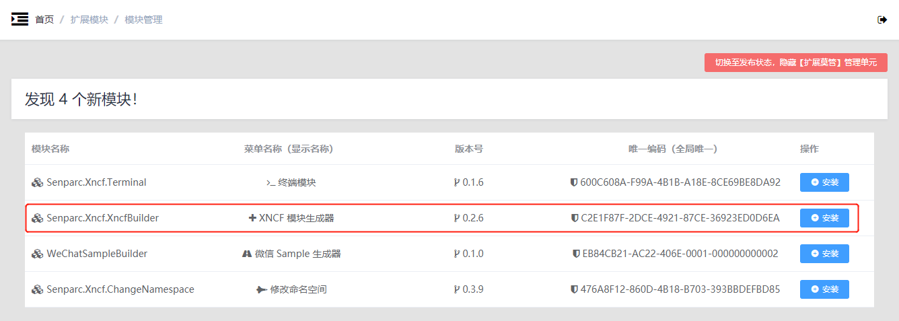

After installation:

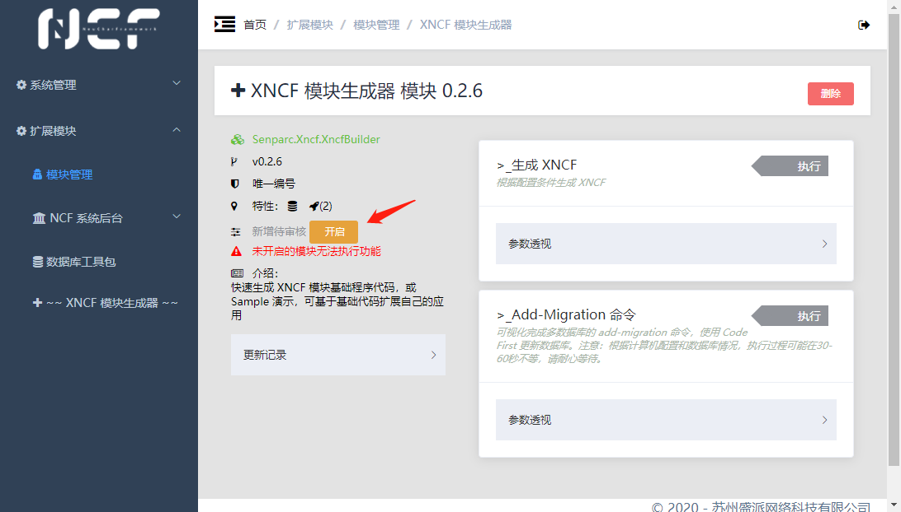

## Enable Senparc.Xncf.XncfBuilder

Click the [Enable] button to activate this module:

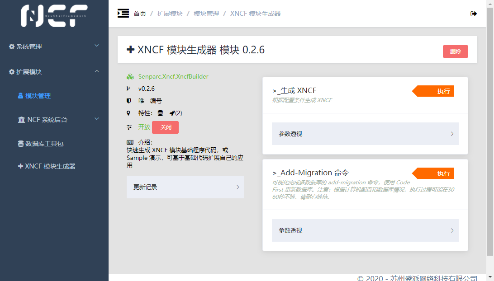

## Set Xncf Module Information

Click the [Execute] button on the right side of [Generate XNCF] to set the information for the Xncf to be generated:

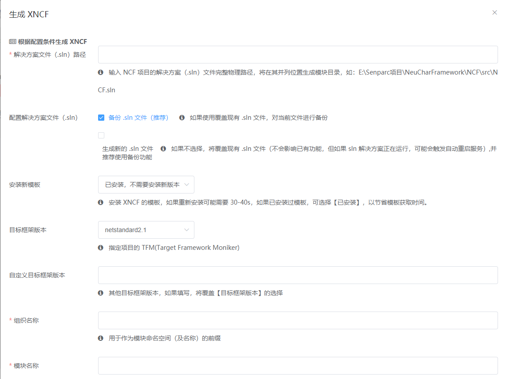

> **Tip**<br>
>
> 1. All parameters are explained, no need to elaborate here. It is worth mentioning:<br>
>    The [Solution File (.sln) Path] parameter can be the path of the solution file of the currently running NCF project or any other NCF project solution file path (for example, sometimes we develop multiple projects simultaneously using multiple solutions). The new Xncf module project will be automatically added to the specified solution. Therefore, if the specified solution is running a web site (such as IISExpress), the site will automatically restart because the solution file will be modified.<br>
> 2. The organization name entered above is `MySenparc`, and the module name is `MyApp`, so it can be inferred that the full name of the final module is: `MySenparc.Xncf.MyApp`.<br><br>
>    (This article uses the currently running NCF.sln as an example.)

In addition to the basic information above, scroll down to see the [Function Configuration] option. If you need the module to configure the basic code for the corresponding function (implement the corresponding function interface), you can check it.

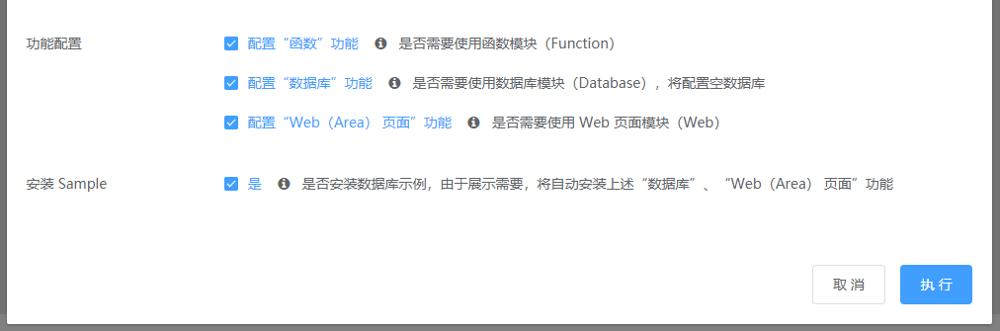

At the bottom is the [Install Sample] option. If you are new to NCF, it is strongly recommended that you check this option. The installed Sample will show you a multifunctional Xncf module that includes a database, functions, and web pages, making it easier for you to understand the composition of Xncf and the implementation of corresponding functions. Additionally, the code in the Sample can also provide a reference for creating your own business code.

## Install Xncf Module Template

First, check if the Xncf Module template is installed locally

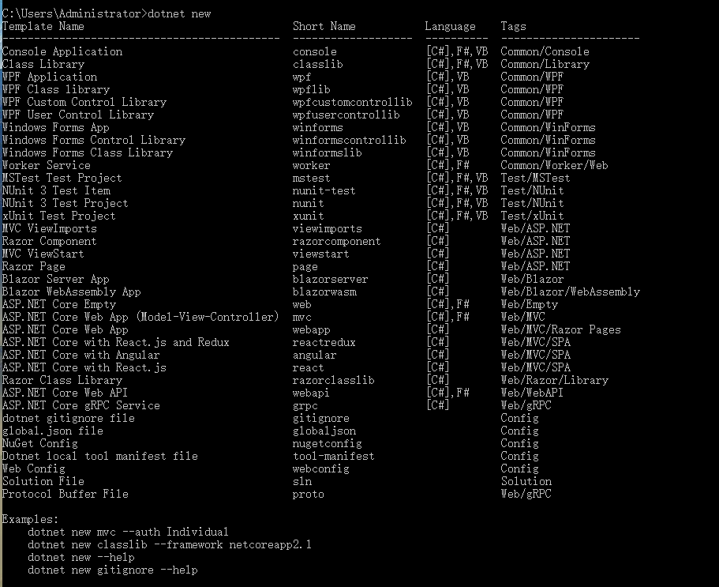

If not, you need to execute the following command to install it

```
dotnet new --install Senparc.Xncf.XncfBuilder.Template
```

After installation, execute `dotnet new` again to display the content as follows

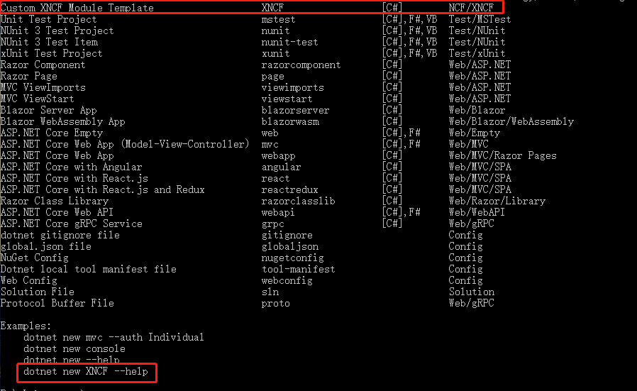

> Nuget address: [https://www.nuget.org/packages/Senparc.Xncf.XncfBuilder.Template](https://www.nuget.org/packages/Senparc.Xncf.XncfBuilder.Template)

## Generate Xncf

Check the information, confirm it is correct, and click the [Execute] button. In about 0.5 seconds, the customized Xncf project creation will be completed:

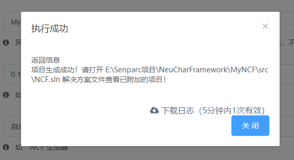

> **Tip:** Since the currently set .sln file is the solution of the currently running site, the [Download Log] button in the success prompt will be invalid.

## Load Xncf Module

Return to Visual Studio. When the new Xncf module code is automatically created, it will be automatically added to the NCF.sln solution, so you can see this prompt:

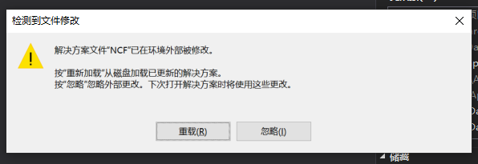

Click the [Reload] button to reload the solution.

In the [Solution Explorer], you can see that the new project `MySenparc.Xncf.MyApp` has been automatically created, and it is still "0 code":

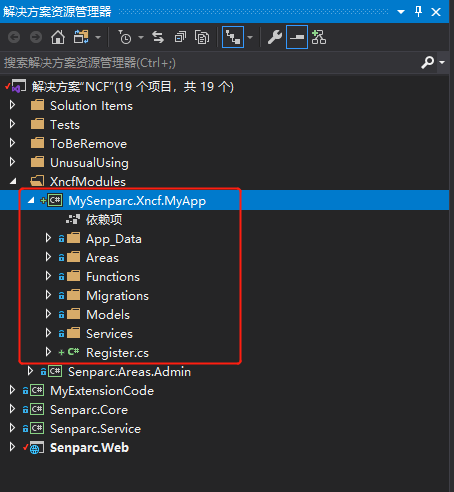

## Install and Enable MySenparc.Xncf.MyApp Module

Continue with "0 code", directly press <kbd>Ctrl</kbd> + <kbd>F5</kbd> to run the Senparc.Web project and enter the backend:

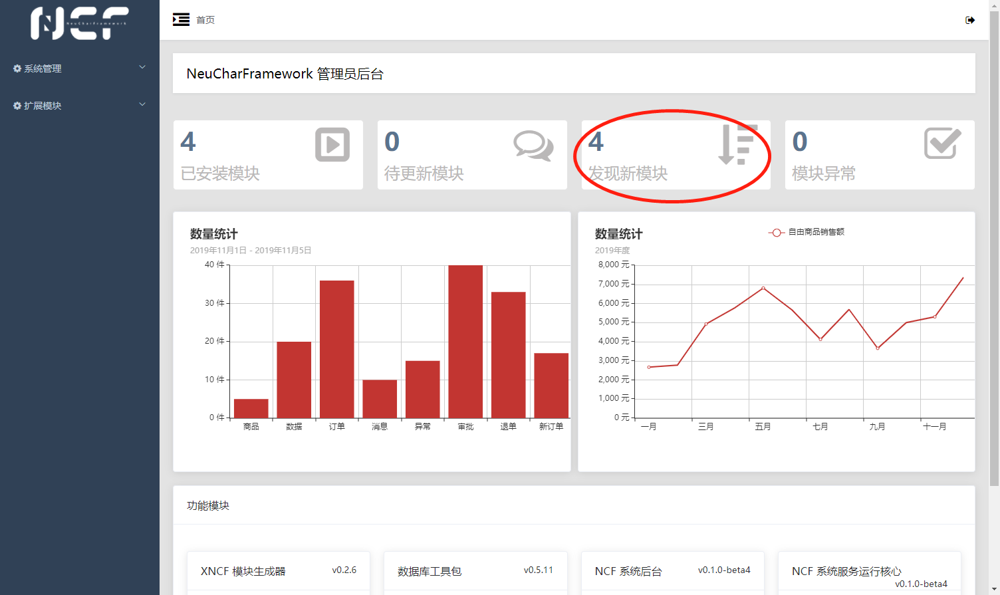

At this point, you can see that the number of "Newly Discovered Modules" has changed from 3 to 4. Click this tab to enter the [Module Management] page, and you can see the `MySenparc.Xncf.MyApp` module automatically generated by the above operation in the "Newly Discovered Modules" list. The menu display name is `Automatically Generated Module`, consistent with the settings:

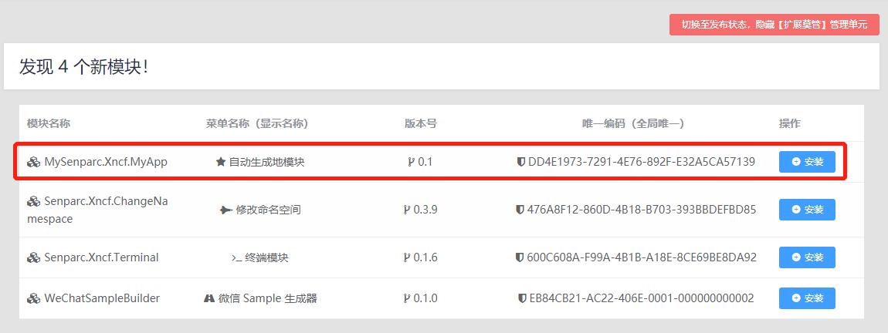

When we click the [Install] button on the right, we can complete the installation of this custom module. However, before that, to understand the changes in the database, let's first look at the current database tables (using SQL Server as an example):

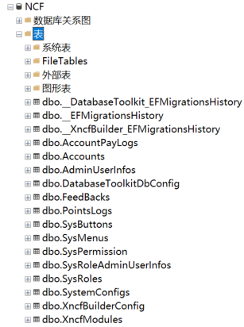

Return to the webpage, click the [Install] button on the right side of `MySenparc.Xncf.MyApp` to complete the module installation, and click the [Enable] button to activate the module.

Before "Enable", you can already see the changes in the database tables:

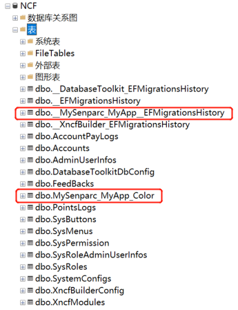

The installation process automatically added 2 tables to the database:

| Table Name                             | Description                                                                                                                                  |
| -------------------------------------- | -------------------------------------------------------------------------------------------------------------------------------------------- |
| **MySenparc_MyApp**EFMigrationsHistory | EFCore's history version record for database migration and upgrade, automatically modified by EFCore during migration operations (Migration) |
| MySenparc_MyApp_Color                  | Since the [Install Sample] option was checked, this database is used to demonstrate the sample database operations                           |

> **Tip:** In the automatically generated table names, you can see the prefix `MySenparc_MyApp`. The advantage of this is that even if different organizations release modules with the same name (such as `MySenparc.Xncf.MyApp` and `YourSenparc.Xncf.MyApp`), they can be well compatible and will not conflict.

Return to the webpage, and you can see the module information in the enabled state:

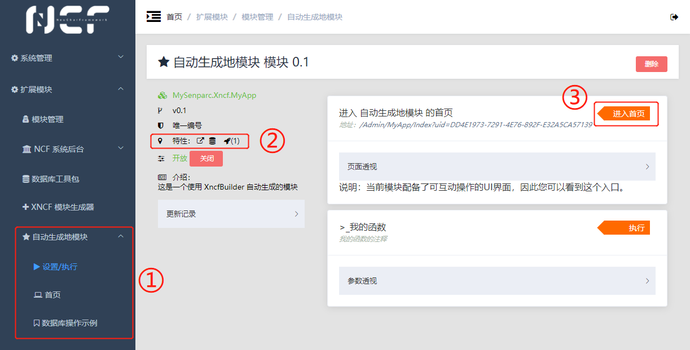

> **Tip**<br>
> ①: You can see that the module menu supporting web pages has an additional directory compared to the menu without web pages (such as `Database Toolkit`). In addition to the `Settings/Execute` page that everyone has, there is also a custom web page.<br>
> ②: In the "Features" column, you can see the features supported by the current module: web pages, database, execution methods (Function).<br>
> ③: Xncf modules with web page functionality are required to define a "home page", which can be quickly accessed on this page.

## Function Demonstration

Before understanding the internal files and principles, let's first look at what functions this Sample demonstrates.

### Function

> The function feature is used to complete a simple, small-granularity operation, supporting visual operations in the NCF backend and can be executed using code.

Open the default page of the module settings (i.e., the [Settings/Execute] menu), and you can see the [Execute] button on the right. Each [Execute] button represents a function:

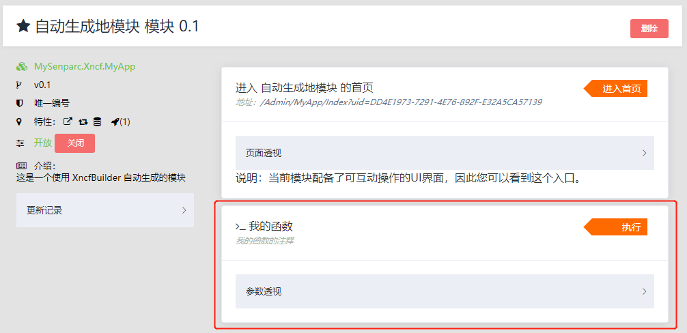

> Tip: This function will automatically perform addition, subtraction, multiplication, division, and square calculations based on the parameters entered by the user.

Click the [Execute] button on the right side of "My Function" to pop up the visual operation interface of this function, which defines all the variables required for this function. These variables can be freely set through code. The example includes name, number 1, number 2, operator, and the option to calculate the square.

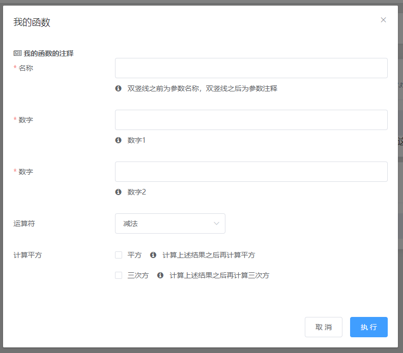

Fill in the information and set the options. The following configuration will perform the calculation of `(2 × 3)²`

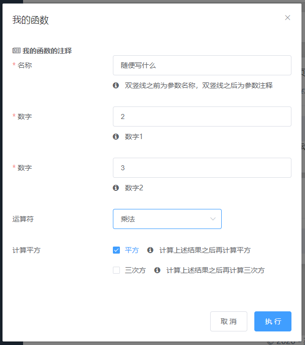

Click [Execute] to output the calculation result:

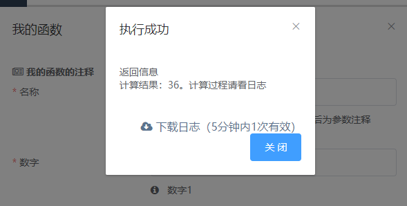

On the result page, we can also see a "Download Log" link. This log will only be temporarily stored in the server cache for 5 minutes. Download and open it to see the complete calculation process recorded in the log:

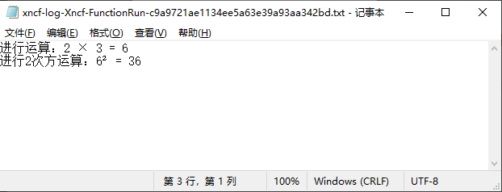

### Web Page

> The web page feature uses the ASP.NET page Area capability. Each Xncf module can define one or more Areas, and of course, pages can also be created directly in the root directory. The development process is no different from ordinary projects.

### Database

> NCF provides multi-database support for all modules and supports migration between multiple databases. At the same time, NCF also provides a complete set of basic methods for database access.
