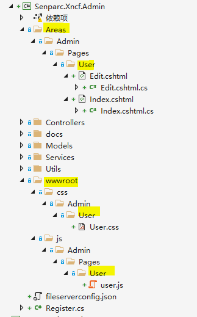

# Implement Your Own Business Logic

## Establish Requirements

Below we will demonstrate how to implement the User functionality.

## Database

First, let's determine the fields needed for the table.

### Database Design

| Table Name           | Table Comment |
| -------------------- | ------------- |
| `Senparc_Admin_User` | User          |

### Senparc_Admin_User (User Table)

| Field Name       | Data Type | Comment                   | Length | Detailed Comment |
| ---------------- | --------- | ------------------------- | ------ | ---------------- |
| `Id`             | int       | Primary Key Id            | -      |
| `Flag`           | bool      | Flag                      | -      |
| `AddTime`        | DateTime  | Added Time                | -      |
| `LastUpdateTime` | DateTime  | Last Update Time          | -      |
| `AdminRemark`    | string    | Admin Remark              | 50     |
| `Remark`         | string    | Remark                    | 50     |
| `UnionId`        | string    | WeChat UnionId            | 50     |
| `WxOpenId`       | string    | WeChat OpenId             | 50     |
| `WxNickName`     | string    | WeChat Nickname           | 100    |
| `Thumb`          | string    | Avatar                    | 200    |
| `Gender`         | int       | Gender (1-Male;2-Female;) | -      |
| `Country`        | string    | Country                   | 100    |
| `Province`       | string    | Province                  | 100    |
| `City`           | string    | City                      | 100    |

## Create Model

In the custom path of the Xncf Module

Create \Models\DatabaseModel\User.cs

Source code as follows:

```csharp
using Senparc.Ncf.Core.Models;
using System;
using System.Collections.Generic;
using System.ComponentModel.DataAnnotations;
using System.ComponentModel.DataAnnotations.Schema;
using System.Text;

using Senparc.Xncf.Admin.Models.DatabaseModel.Dto;

namespace Senparc.Xncf.Admin.Models.DatabaseModel
{
    /// <summary>
    /// User entity class
    /// </summary>
    [Table(Register.DATABASE_PREFIX + nameof(User))] // Must add prefix to prevent conflicts in the entire system
    [Serializable]
    public class User : EntityBase<string>
    {
        public User()
        {
            Id = Guid.NewGuid().ToString();
            AddTime = DateTime.Now;
            this.LastUpdateTime = AddTime;
        }

        public User(UserDto userDto) : this()
        {
            LastUpdateTime = userDto.LastUpdateTime;
            UnionId = userDto.UnionId;
            WxOpenId = userDto.WxOpenId;
            WxNickName = userDto.WxNickName;
            Thumb = userDto.Thumb;
            Gender = userDto.Gender;
            Country = userDto.Country;
            Province = userDto.Province;
            City = userDto.City;
        }

        public void Update(UserDto userDto)
        {
            LastUpdateTime = userDto.LastUpdateTime;
            UnionId = userDto.UnionId;
            WxOpenId = userDto.WxOpenId;
            WxNickName = userDto.WxNickName;
            Thumb = userDto.Thumb;
            Gender = userDto.Gender;
            Country = userDto.Country;
            Province = userDto.Province;
            City = userDto.City;
        }

        /// <summary>
        /// WeChat UnionId
        /// </summary>
        [MaxLength(50)]
        public string UnionId { get; set; }

        /// <summary>
        /// WeChat OpenId
        /// </summary>
        [MaxLength(50)]
        public string WxOpenId { get; set; }

        /// <summary>
        /// WeChat Nickname
        /// </summary>
        [MaxLength(100)]
        public string WxNickName { get; set; }

        /// <summary>
        /// Avatar
        /// </summary>
        [MaxLength(200)]
        public string Thumb { get; set; }

        /// <summary>
        /// Gender (1-Male;2-Female;)
        /// </summary>
        public int Gender { get; set; }

        /// <summary>
        /// Country
        /// </summary>
        [MaxLength(100)]
        public string Country { get; set; }

        /// <summary>
        /// Province
        /// </summary>
        [MaxLength(100)]
        public string Province { get; set; }

        /// <summary>
        /// City
        /// </summary>
        [MaxLength(100)]
        public string City { get; set; }

    }
}
```

Create \Models\DatabaseModel\Dto\UserDto.cs

Source code as follows:

```csharp
using Senparc.Ncf.Core.Models;
using System;
using System.Collections.Generic;
using System.ComponentModel.DataAnnotations;
using System.ComponentModel.DataAnnotations.Schema;
using System.Text;

namespace Senparc.Xncf.Admin.Models.DatabaseModel.Dto
{
    public class UserDto : DtoBase
    {
        public UserDto()
        {
        }

        public UserDto(string id, string unionId, string wxOpenId, string wxNickName, string thumb, int gender, string country, string province, string city)
        {
            Id = id;
            UnionId = unionId;
            WxOpenId = wxOpenId;
            WxNickName = wxNickName;
            Thumb = thumb;
            Gender = gender;
            Country = country;
            Province = province;
            City = city;
        }

        public string Id { get; set; }

        /// <summary>
        /// WeChat UnionId
        /// </summary>
        [MaxLength(50)]
        public string UnionId { get; set; }

        /// <summary>
        /// WeChat OpenId
        /// </summary>
        [MaxLength(50)]
        public string WxOpenId { get; set; }

        /// <summary>
        /// WeChat Nickname
        /// </summary>
        [MaxLength(100)]
        public string WxNickName { get; set; }

        /// <summary>
        /// Avatar
        /// </summary>
        [MaxLength(200)]
        public string Thumb { get; set; }

        /// <summary>
        /// Gender (1-Male;2-Female;)
        /// </summary>
        public int Gender { get; set; }

        /// <summary>
        /// Country
        /// </summary>
        [MaxLength(100)]
        public string Country { get; set; }

        /// <summary>
        /// Province
        /// </summary>
        [MaxLength(100)]
        public string Province { get; set; }

        /// <summary>
        /// City
        /// </summary>
        [MaxLength(100)]
        public string City { get; set; }

    }
}
```

Create \Models\DatabaseModel\Mapping\Admin_UserConfigurationMapping.cs

Source code as follows:

```csharp
using Microsoft.EntityFrameworkCore.Metadata.Builders;
using Senparc.Ncf.Core.Models.DataBaseModel;
using Senparc.Ncf.XncfBase.Attributes;
using Senparc.Xncf.Admin.Models.DatabaseModel;

namespace Senparc.Xncf.Admin.Models
{
    [XncfAutoConfigurationMapping]
    public class Admin_UserConfigurationMapping : ConfigurationMappingWithIdBase<User, string>
    {
        public override void Configure(EntityTypeBuilder<User> builder)
        {
            // do something
        }
    }
}
```

Modify \Models\DatabaseModel\AdminSenparcEntities.cs

```csharp
using Microsoft.EntityFrameworkCore;
using Senparc.Ncf.Database;
using Senparc.Ncf.Core.Models;
using Senparc.Ncf.XncfBase.Database;

namespace Senparc.Xncf.Admin.Models.DatabaseModel
{
    public class AdminSenparcEntities : XncfDatabaseDbContext
    {
        public AdminSenparcEntities(DbContextOptions dbContextOptions) : base(dbContextOptions)
        {
        }


        //DOT REMOVE OR MODIFY THIS LINE 请勿移除或修改本行 - Entities Point
        //ex. public DbSet<Color> Colors { get; set; }

        public DbSet<User> Users { get; set; }

        //If there are no special needs, the OnModelCreating method does not need to be written, it has already been required to register in Register
        //protected override void OnModelCreating(ModelBuilder modelBuilder)
        //{
        //}
    }
}
```

## Web Page Part

The web page part of the module is in



The page can be laid out according to your actual needs.

### html

index.cshtml source code:

```razor
@page
@model Senparc.Xncf.Admin.Areas.Admin.Pages.User.IndexModel
@{
    ViewData["Title"] = "User Page";
    Layout = "_Layout_Vue";
}

@section Style{
    <link href="~/css/Admin/User/User.css" rel="stylesheet" />
}

@section breadcrumbs {
    <el-breadcrumb-item>Extension Module</el-breadcrumb-item>
    <el-breadcrumb-item>User Management</el-breadcrumb-item>
    <el-breadcrumb-item>User List</el-breadcrumb-item>
}

<div>
    <div class="admin-role">
        <el-row class="filter-condition" :gutter="18">
            <el-col :span="4"><el-input v-model="keyword" placeholder="Please enter a keyword"></el-input></el-col>
            <el-col :span="6">
                <el-button type="primary" @@click="handleSearch()">Search</el-button>
                <el-button type="primary" @@click="resetCondition()">Reset</el-button>
            </el-col>
        </el-row>
        <div class="filter-container">
            <el-button class="filter-item" size="mini" type="primary" icon="el-icon-plus" @@click="handleEdit('','','add')">Add</el-button>
        </div>
        <el-table :data="tableData"
                  style="width: 100%;margin-bottom: 20px;"
                  row-key="id"
                  border
                  ref="multipleTable"
                  @@selection-change="handleSelectionChange">
            <el-table-column label="No." width="65">
                <template scope="scope">
                    <el-radio :label="scope.$index" v-model="radio" @@change.native="getCurrentRow(scope.row)"></el-radio>
                </template>
            </el-table-column>

            <el-table-column prop="unionId" align="left" label="WeChat UnionId"></el-table-column>
            <el-table-column prop="wxOpenId" align="left" label="WeChat OpenId"></el-table-column>
            <el-table-column prop="wxNickName" align="left" label="WeChat Nickname"></el-table-column>
            <el-table-column prop="thumb" align="center" label="Avatar">
                <template slot-scope="scope">
                    <a :href="scope.row.thumb ? scope.row.thumb : 'demo.png'" target="_blank">
                        
                    </a>
                </template>
            </el-table-column>
            <el-table-column prop="gender" align="left" label="Gender"></el-table-column>
            <el-table-column prop="country" align="left" label="Country"></el-table-column>
            <el-table-column prop="province" align="left" label="Province"></el-table-column>
            <el-table-column prop="city" align="left" label="City"></el-table-column>
            <el-table-column align="center"
                             label="Added Time">
                <template slot-scope="scope">
                    {{formaTableTime(scope.row.addTime)}}
                </template>
            </el-table-column>
            <el-table-column label="Actions" align="center" fixed="right" width="150">
                <template slot-scope="scope">
                    <el-button size="mini"
                               type="primary"
                               @@click="handleEdit(scope.$index, scope.row,'edit')">Edit</el-button>
                    <el-popconfirm placement="top" title="Are you sure you want to delete this user?" @@on-confirm="handleDelete(scope.$index, scope.row)">
                        <el-button size="mini" type="danger" slot="reference">Delete</el-button>
                    </el-popconfirm>
                </template>
            </el-table-column>
        </el-table>

        <pagination :total="paginationQuery.total"
                    :page.sync="listQuery.pageIndex"
                    :limit.sync="listQuery.pageSize"
                    @@pagination="getList"></pagination>
        <!-- Edit, Add -->
        <el-dialog :title="dialog.title"
                   :visible.sync="dialog.visible"
                   :close-on-click-modal="false"
                   width="700px">
            <el-form ref="dataForm"
                     :rules="dialog.rules"
                     :model="dialog.data"
                     :disabled="dialog.disabled"
                     label-position="left"
                     label-width="100px"
                     style="max-width: 200px; margin-left:50px;">
                <el-form-item label="WeChat UnionId" prop="unionId">
                    <el-input v-model="dialog.data.unionId" clearable placeholder="Please enter WeChat UnionId" />
                </el-form-item>

                <el-form-item label="WeChat OpenId" prop="wxOpenId">
                    <el-input v-model="dialog.data.wxOpenId" clearable placeholder="Please enter WeChat OpenId" />
                </el-form-item>

                <el-form-item label="WeChat Nickname" prop="wxNickName">
                    <el-input v-model="dialog.data.wxNickName" clearable placeholder="Please enter WeChat Nickname" />
                </el-form-item>

                <el-form-item label="Avatar">
                    <el-upload action="@Model.UpFileUrl"
                               list-type="picture-card"
                               show-file-list="true"
                               accept="image/png, image/jpeg"
                               :on-success="uploadSuccess"
                               :on-error="uploadError"
                               :on-preview="handlePictureCardPreview"
                               :on-remove="handleRemove">
                        <i class="el-icon-plus"></i>
                        <div class="el-upload__tip" slot="tip">Cannot exceed 100MB</div>
                    </el-upload>
                    
                    <el-input class="hidden" v-model="dialog.data.thumb" clearable placeholder="Avatar" />
                </el-form-item>
                <el-form-item label="Gender">
                    <el-input v-model="dialog.data.gender" clearable placeholder="Please enter gender" />
                </el-form-item>

                <el-form-item label="Country" prop="country">
                    <el-input v-model="dialog.data.country" clearable placeholder="Please enter country" />
                </el-form-item>

                <el-form-item label="Province" prop="province">
                    <el-input v-model="dialog.data.province" clearable placeholder="Please enter province" />
                </el-form-item>

                <el-form-item label="City" prop="city">
                    <el-input v-model="dialog.data.city" clearable placeholder="Please enter city" />
                </el-form-item>
            </el-form>
            <div slot="footer" class="dialog-footer">
                <el-button @@click="dialog.visible=false">Cancel</el-button>
                <el-button :loading="dialog.updateLoading" :disabled="dialog.disabled" type="primary" @@click="updateData">Confirm</el-button>
            </div>
        </el-dialog>
    </div>
</div>
@section scripts
{
    <script src="~/js/Admin/Pages/User/user.js"></script>
}
```

index.cshtml.cs source code

```csharp
using System;
using System.Collections.Generic;
using System.Linq;
using System.Threading.Tasks;
using Microsoft.AspNetCore.Mvc;
using Microsoft.AspNetCore.Mvc.RazorPages;
using Senparc.Ncf.Service;
using Microsoft.Extensions.DependencyInjection;
using Senparc.Ncf.Core.Models;
using Senparc.CO2NET.Trace;
using Senparc.Ncf.Utility;
using Senparc.Xncf.Admin.Models.DatabaseModel.Dto;
using Senparc.Xncf.Admin.Services;

namespace Senparc.Xncf.Admin.Areas.Admin.Pages.User
{
    public class IndexModel : Senparc.Ncf.AreaBase.Admin.Admin
```
