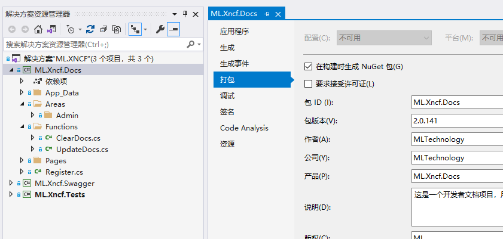
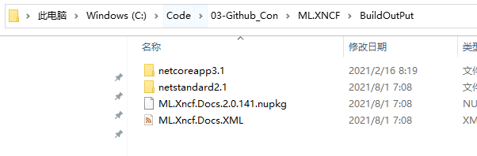
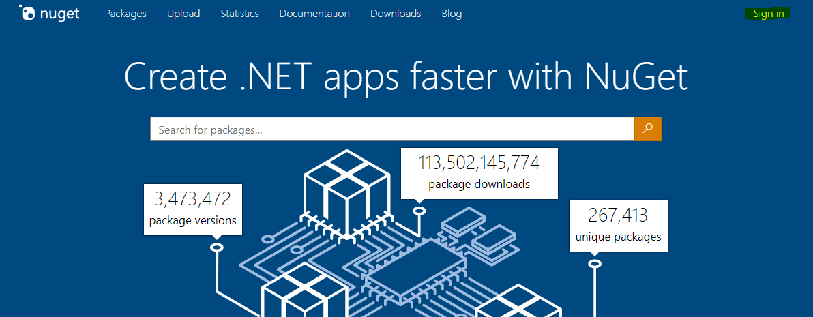
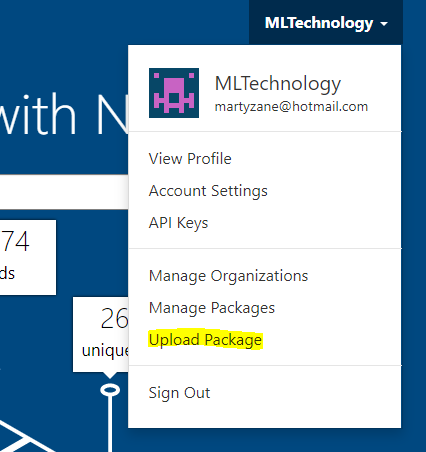
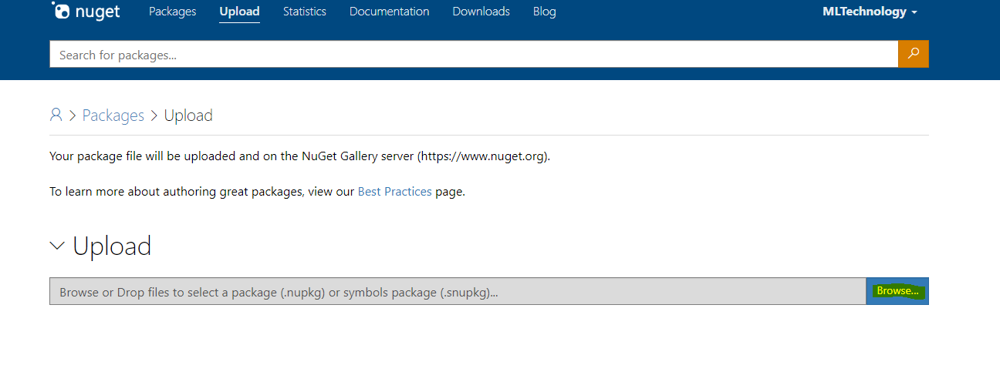

# Publish Xncf Module to nuget.org

First step: Select the project, right-click on Properties, and open the packaging options

Check the option to generate a nuget package on build

Second step: Rebuild the project, the generated nuget package will be compiled into the folder you set

Third step: Log in to the [nuget.org](https://www.nuget.org/) official website

Fourth step: Choose to upload the nuget package

Wait for the upload result

Fifth step: Click Submit, after submission, leave it to nuget, wait for a moment, and the nuget package will be online
