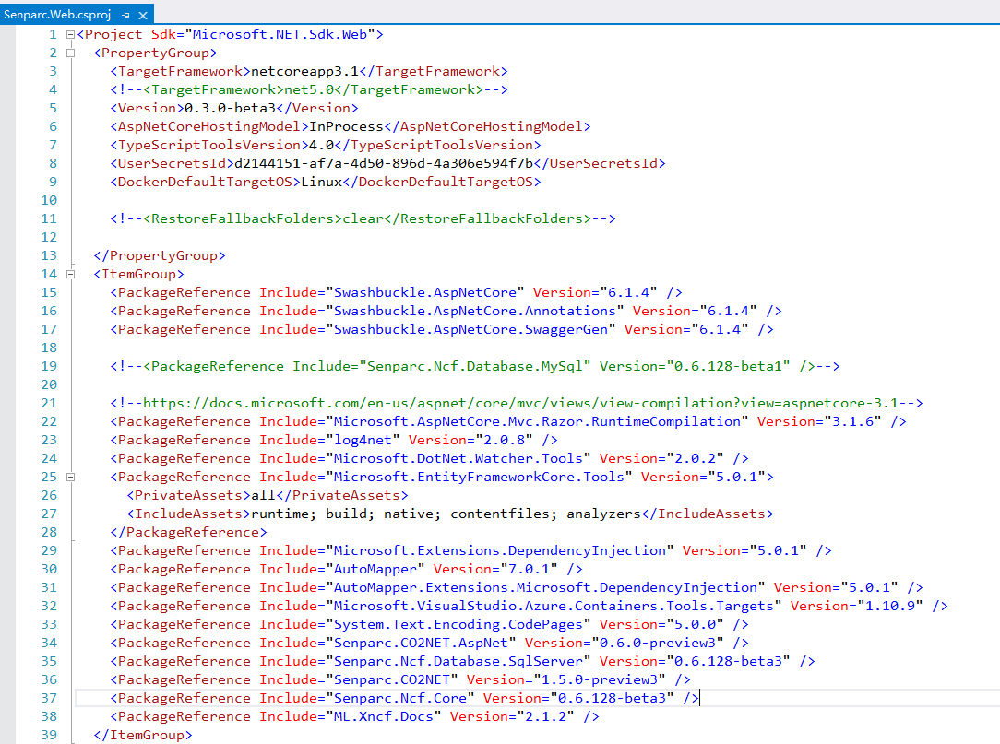

# Update Base Library

## What is updating the base library?

Updating the base library means updating the Nuget version of the underlying core libraries referenced in NCF. These base libraries are mostly NCF's foundational libraries (such as XNCF modules), and also include some third-party libraries.

## How to update the base library

### Method 1: Using IDE

> Using Visual Studio as an example

Step 1: Open the solution (e.g., NCF.sln)


Step 2: Open Nuget Package Manager


Step 3: Search for all `Senparc` packages and update


> For local Nuget package updates, see [How to use locally compiled base libraries](#how-to-use-locally-compiled-base-libraries)

Step 4: Update packages


Done.

### Method 2: Using Command Line

Step 1: Open command line tool

Windows: Open CMD or PowerShell command line

MacOS: Open "Terminal" application

Step 2: Install tool

```shell
dotnet tool install --global dotnet-outdated-tool
```

The system will automatically install the Nuget upgrade tool for you. After completion, there will be a prompt, such as:

```text
You can invoke the tool using the following command: dotnet-outdated
Tool 'dotnet-outdated-tool' (version '4.6.8') was successfully installed.
```

> Note: The tool only needs to be installed once. Unless an upgrade is needed, there is no need to install it repeatedly.

If you are on MacOS, you may be asked to run an additional command to add the tool to the environment variables:


Copy and execute `export PATH="$PATH:/Users/jeffreysu/.dotnet/tools"` in the command line (Note: each user's path is different).

Step 3: Navigate to the NCF solution directory

Navigate to the NCF directory in the command line (the directory with \*.sln files, i.e., the parent directory of the Senparc.Web folder)

Step 4: Check for updates (optional, you can go directly to the next step)

Enter:

```shell
dotnet outdated -inc Senparc
```


> Note: If it shows no updates, you don't need to continue to the next step.

Step 5: Execute update

Execute command:

```bash
dotnet outdated -inc Senparc --upgrade
```


Done.

### Method 3: Manual Update (Not Recommended)

Step 1: Double-click the project name to open the project file for editing


It will open



Step 2: Find the name of the base library you want to update


Step 3: Open Nuget, enter the name of the base library, and check the latest version number of the library


Click to open


You can see many versions, here you can choose the latest one


Step 4: Modify the version number of the referenced base library in the project file


Done.

## How to use locally compiled base libraries

You can refer to the steps on how to generate a local nuget package [Issue Local Nuget](/start/developer/issue_local_nuget.html)

After generating the local nuget package, you can put the local nuget package that needs to be referenced into a unified folder for easy management.

Use the method above `How to update the base library` to update.

[Base Library](/NcfPackageSources)
