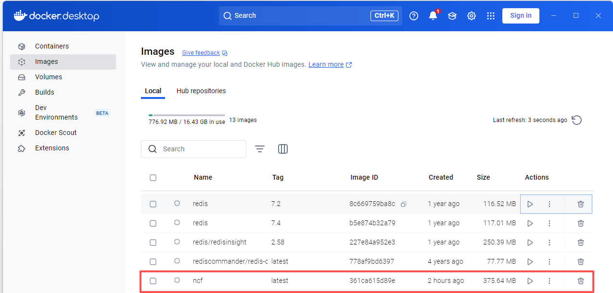
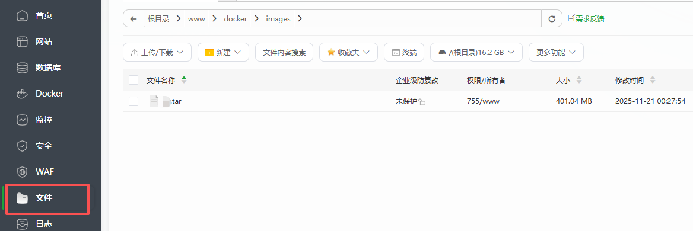
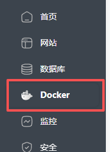
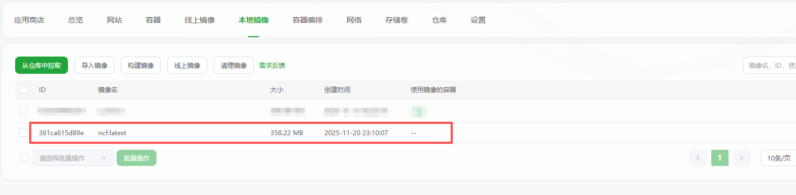
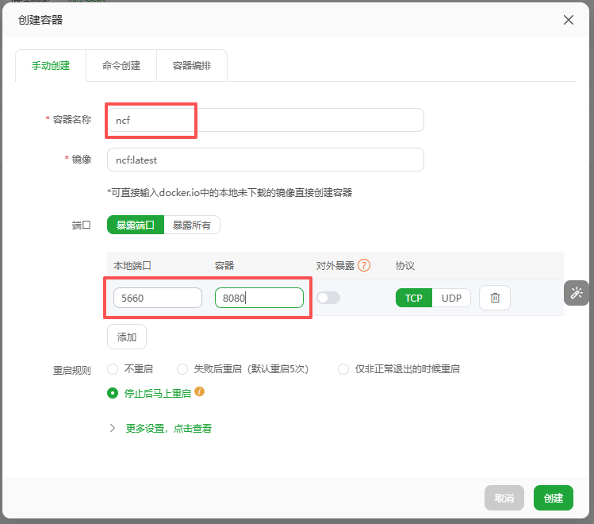
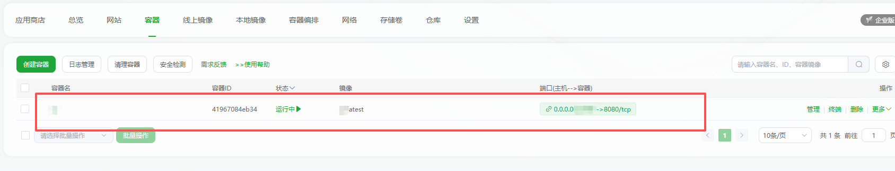

# Docker部署NCF站点

可以参考 `NCF` 中的 `Developer` 的分支

如果项目的目录为：`C:\NCF\src\back-end`

先使用 `cmd` 进入根目录：`C:\NCF` ,然后执行生成镜像的命令

则生成镜像的命令为：`docker build -f ./src/back-end/Senparc.Web/Dockerfile -t ncf:latest ./src/back-end`

使用导出镜像的命令: `docker save -o ncf.tar ncf:latest`

镜像文件则会导出到：`C:\NCF\ncf.tar`

将镜像上传到宝塔：

选择 `Docker`

导入本地镜像

创建容器

配置容器参数

运行容器

到此在宝塔中配置运行结束
