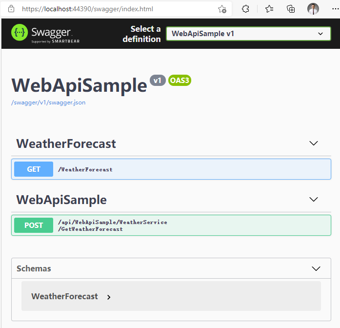

# 动态WebApiEngine

WebApiEngine 是一个可用于动态 WebApi 生成的引擎，基于 .NET Core（包括 .NET 5、 .NET 6），用于解决前后端分离、微服务、异步 Web 请求场景下的 WebApi 的动态生成和管理，并全面兼容 Swagger。

## 开源地址

WebApiEngine 完全开源，可商用。承载于 Senparc.CO2NET.WebApi 库，同属于 CO2NET 开源项目：

[https://github.com/Senparc/Senparc.CO2NET](https://github.com/Senparc/Senparc.CO2NET)

## 使用方法

以下是 WebApiEngine 的使用方法，将以最原始的默认 .NET Core WebApi 模板项目作为基础进行构建，以便大家学习和亲手实践。

首先，使用 Visual Stduio 或命令行创建原始项目。

<!-- C:\Code\10-Gitee_Con\NcfDocs\cn\docs\doc\DynamicWebApi\home\images -->


选择 ASP.NET Core Web API 项目

或使用命令行，免去创建项目的其他步骤：

```
dotnet new webapi
```


命令行创建项目模板

项目创建完成后，已经默认包含了一个模拟气象数据查询的接口：


原始项目

> 小贴士：您可以使用 NET Core 3.1 或 .NET 5、.NET 6 进行开发，代码没有任何差别。

运行后默认已经加载了 Swagger：


原始运行页面，为 Swagger 首页

使用 Swagger 我们已经可以测试 API：


使用 Swagger 测试接口运行

此处的 API 还是需要手写 API 才能完成，打开 WeatherForecastController.cs 可以看到初始化内容：

```csharp
using Microsoft.AspNetCore.Mvc;
using Microsoft.Extensions.Logging;
using System;
using System.Collections.Generic;
using System.Linq;
using System.Threading.Tasks;

namespace WebApiSample.Controllers
{
    [ApiController]
    [Route("[controller]")]
    public class WeatherForecastController : ControllerBase
    {
        private static readonly string[] Summaries = new[]
        {
            "Freezing", "Bracing", "Chilly", "Cool", "Mild", "Warm", "Balmy", "Hot", "Sweltering", "Scorching"
        };

        private readonly ILogger<WeatherForecastController> _logger;

        public WeatherForecastController(ILogger<WeatherForecastController> logger)
        {
            _logger = logger;
        }

        [HttpGet]
        public IEnumerable<WeatherForecast> Get()
        {
            var rng = new Random();
            return Enumerable.Range(1, 5).Select(index => new WeatherForecast
            {
                Date = DateTime.Now.AddDays(index),
                TemperatureC = rng.Next(-20, 55),
                Summary = Summaries[rng.Next(Summaries.Length)]
            }).ToArray();
        }
    }
}
```

上述代码是在 Controller 里面直接演示了逻辑代码（包括数据查询），更多的情况，我们会把这些逻辑封装在 Service 中，并由 Controller 调用。如，创建 WeatherService.cs：

```csharp
using System;
using System.Collections.Generic;
using System.Linq;

namespace WebApiSample
{
    public class WeatherService
    {
        private static readonly string[] Summaries = new[]
        {
            "Freezing", "Bracing", "Chilly", "Cool", "Mild", "Warm", "Balmy", "Hot", "Sweltering", "Scorching"
        };

        public IEnumerable<WeatherForecast> GetWeatherForecasts()
        {
            var rng = new Random();
            return Enumerable.Range(1, 5).Select(index => new WeatherForecast
            {
                Date = DateTime.Now.AddDays(index),
                TemperatureC = rng.Next(-20, 55),
                Summary = Summaries[rng.Next(Summaries.Length)]
            })
            .ToArray();
        }
    }
}
```

修改 WeatherForecastController.cs：

```csharp
using Microsoft.AspNetCore.Mvc;
using System.Collections.Generic;

namespace WebApiSample.Controllers
{
    [ApiController]
    [Route("[controller]")]
    public class WeatherForecastController : ControllerBase
    {
        private readonly WeatherService _weatherService;

        public WeatherForecastController(WeatherService weatherService)
        {
            this._weatherService = weatherService;
        }

        [HttpGet]
        public IEnumerable<WeatherForecast> Get()
        {
            return _weatherService.GetWeatherForecasts();
        }
    }
}
```

注意：如果像上述代码 12 行中那样，使用构造函数注入 WeatherService，需要在 Startup.cs 中添加：

```csharp
services.AddScoped<WeatherService>();
```

当我们在粒度越来越小的微服务、前后端分离的场景下进行开发和迭代，会发现 API 的数量会几何级数地上升。

此时为了能让 Service 中的逻辑方法毫无变化地传递给客户端，需要做大量 API 创建的重复劳动，维护也会越来越混乱。


越来越复杂、混乱的 API 导致了大量低效、低价值的重复劳动

为了解决这样的问题，WebApiEngine 登场了！ 让我们来看看 WebApiEngine 能做什么？

### 使用[ApiBind]标签让任何方法变成WebApi

我们在 WeatherService 下再创建一个名为 GetWeatherForecast 的新方法，并附加一个 int 类型参数，用于演示新的接口：

    public WeatherForecast GetWeatherForecast(int index)
    {
        var rng = new Random();
        return new WeatherForecast
        {
            Date = DateTime.Now.AddDays(index),
            TemperatureC = rng.Next(-20, 55),
            Summary = Summaries[rng.Next(Summaries.Length)]
        };
    }

然后，通过简单的 3 步，完成动态 API 的实现：

第一步：安装 Senparc.CO2NET.WebApi 包：


安装 Senparc.CO2NET.WebApi 包

也可以在项目目录下，使用命令行添加：

    dotnet add package Senarc.CO2NET.WebApi

第二步：在 ConfigureServices() 方法中添加两行代码：

    var builder = services.AddMvcCore().AddApiExplorer();
    services.AddAndInitDynamicApi(builder, null);

第三步：添加 [ApiBind] 标签

在任意方法上添加 [ApiBind] 标签，如之前创建的 GetWeatherForecast(int index) 方法：

    [ApiBind]
    public WeatherForecast GetWeatherForecast(int index)
    {
        var rng = new Random();
        return new WeatherForecast
        {
            Date = DateTime.Now.AddDays(index),
            TemperatureC = rng.Next(-20, 55),
            Summary = Summaries[rng.Next(Summaries.Length)]
        };
    }

完成！

重新启动项目，即可看到新的 GetWeatherForecast 接口：

| Swagger 首页，显示新接口                              | 测试执行                                           |
| ----------------------------------------------------- | -------------------------------------------------- |
|  |  |

上述我们只添加了 3 行代码（如果项目本身就需要 services.AddMvcCore()，则只需要 2 行），我们便完成了让任何一个方法开放为接口的能力！

> 小贴士：

> 1、您可以试一下静态方法，同样有效！

> 2、细心的开发者已经发现，自动生成的默认请求动作为 Post，我们可以通过修改全局配置修改默认动作，如：

> `services.AddAndInitDynamicApi(builder, null, ApiRequestMethod.Get);`

### 对Api进行分类

有时候，为了方便 API 的管理，我们会对 API 的路径进行分类，甚至在模块化、插件化的框架下，同一个功能模块可能会由不同的程序集（或 dll）来支持，这时候怎么让不同“产地”的 API 进行充分“重组”呢？

我们只需要对 API 进行分类（Category）参数的设置，例如，在上述 ApiBind 特性中添加参数：

| 特性标签添加 Category 参数                                  | 成功合并到 WeatherForecast 分类                   |
| ----------------------------------------------------------- | ------------------------------------------------- |
|  |  |

### 自定义API名称

上述路径默认包含（暴露）了 GetWeatherForecast 方法所属的类，有时我们甚至需要将多个不同类下面的方法，整合到同一个路径前缀下，这种情况下，可以继续定义 ApiBind 的 Name 参数，使其拥有自定义的路径前缀：

| 特性标签设置 Name 参数                                 | 配置完全可控的路径前缀                                    |
| ------------------------------------------------------ | --------------------------------------------------------- |
|  |  |

> 小贴士：

> 为了防止接口名称重合和便于直观定位，接口路径最后一段命名（WeatherForecast\*MyApi）目前不可设置，规则为：<类名>\*<方法名>。

> 当然如果真的出现重名，WebApiEngine 也会自动修改。

> 测试：我们添加一个新的类 WeatherService2，并且标记一个具有相同 Category 和 Name 值的方法：

    public class WeatherService2
    {
        [ApiBind("WeatherForecast", "MyApi")]
        public string GetWeatherForecast(string str)
        {
            return "the parameter value is :" + str;
        }
    }

运行结果：


WebApiEngine 会自动处理重名的 API

### 复制特性

动态 API 的另外一个难点是，正常的 WebAPI 通常都需要定义自己的特性，如访问鉴权、行为过滤，等等。WebApiEngine可以将原始方法上的特性标签直接复制到动态 API 上。

我们在 GetWeatherForecast 方法上添加权限验证特性：

    [ApiBind("WeatherForecast", "MyApi")]
    [Authorize]
    public WeatherForecast GetWeatherForecast(int index)
    {
        var rng = new Random();
        return new WeatherForecast
        {
            Date = DateTime.Now.AddDays(index),
            TemperatureC = rng.Next(-20, 55),
            Summary = Summaries[rng.Next(Summaries.Length)]
        };
    }

然后运行接口：


### 为整个类配置WebApi

除了在某个具体的方法上添加 [ApiBind] 特性标签，您还可以在类（class）上使用此特性，使下属所有的方法（包括静态方法）都拥有相同的配置。

class 上的特性标签同样会自动配置，其规则如下：

1.如果 class 设置了特性标签（如 [Authorize]），则下属所有的方法也将继承对应特性；

2.如果下属方法具有和 class 一样的特性标签，将完全覆盖 class 的特性设置；

3.集成特性标签的顺序，为先按顺序添加 class 的标签，后按顺序添加方法的标签（注此顺序为 CustomAttributeData.GetCustomAttributes() 获得到的顺序）；

测试：

将之前的 WeatherService2 类进行重写：

    [ApiBind("ClassCoverAttribute", "MyApi")]
    public class WeatherService2
    {
        public string GetWeatherForecast(string str)
        {
            return "the parameter value is :" + str;
        }

        [ApiBind(ApiRequestMethod = ApiRequestMethod.Get)]
        public string GetWeatherForecastCopy(string str)
        {
            return "the parameter value is :" + str;
        }

        public static string GetWeatherForecastCopyStatic(string str)
        {
            return "[static method]the parameter value is :" + str;
        }
    }

第 1 行代码在 class 上进行添加，使其中 2 个方法都生效。

第 9 行代码改写了 ApiBind 标签，使默认的 Post 方法，改为了 Get 方法。

第 10 行代码是一个静态方法，同样能“享受”整个 class 的配置（当然也支持使用自定义 [ApiBind]，然后覆盖 class 的配置）。

运行结果：


运行结果中：

- ① 是 GetWeatherForecast() 方法

- ② 是 GetWeatherForecastCopyStatic() 静态方法（因为使用了 class继承，因此默认为相同的名称，后续版本将升级为当前方法名称）

- ③ 是 WeatherService 类中的演示方法，和当前类无关

- ④ 是 GetWeatherForecastCopy() 方法，该方法的 [ApiBind] 特性覆盖了 class 上的特性，因此没有指定 Category，使用了默认的分类名称，即当前程序集名称

### 忽略某些特定的方法

有时，虽然我们偷懒将某个 class 一次性标记为 [ApiBind]，但也会有个别的方法，我们并不希望开放为 API，这时候，可以使用 WebApiEngine 提供的忽略方法。

有两种方式可以做到。

方式一：使用 IgnoreApiBind 特性，如：

    [IgnoreApiBind]
    public static string GetWeatherForecastCopyStatic(string str)
    {
        return "[static method]the parameter value is :" + str;
    }

方式二：设置 ApiBind 特性中的 Ignore 属性，如：

    [ApiBind(Ignore = true)]
    public static string GetWeatherForecastCopyStatic(string str)
    {
        return "[static method]the parameter value is :" + str;
    }

### 忽略某些特定的分类

通过配置，我们也可以忽略部分特定的分类（Category），在运行引擎之前，在 startup.cs 中进行定义：

    Senparc.CO2NET.WebApi.Register.AddOmitCategory("WeatherForecast");

    var builder = services.AddMvcCore().AddApiExplorer();
    services.AddAndInitDynamicApi(builder, null);

只需添加上述第 1 行代码，即可忽略整个 WeatherForecast 分类的接口（当然不能忽略通过原始方法编写的 Controller 内的 API）：

| 忽略前                                   | 忽略后                                  |
| ---------------------------------------- | --------------------------------------- |
|  |  |

## 本文示例源码下载

[https://github.com/JeffreySu/WebApiEngineSample](https://github.com/JeffreySu/WebApiEngineSample)
