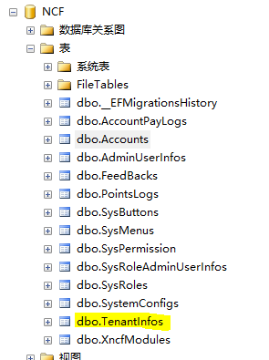
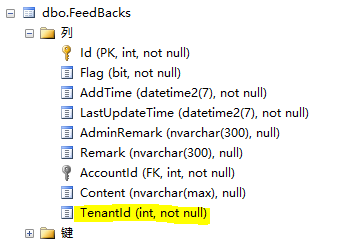

# 配置多租户

## 多租户概述

多租户（Multiple Tenant）意味着可以由多个不同的租户同时使用一套系统，而各租户看到的系统数据是完全隔离的。

- **默认状态**：多租户默认**关闭**（`Senparc.Web/appsettings.json` 中 `SenparcCoreSetting:EnableMultiTenant: false`）。开启后，所有数据表（继承 `EntityBase` 的实体）都会携带 `TenantId` 字段并自动按租户过滤。
- **租户识别规则**：`SenparcCoreSetting:TenantRule` 支持三种规则（`DomainName` / `RequestHeader` / `LoginInput`），见下文。

## 如何修改多租户配置

首先找到 `Senparc.Web` 项目下的 appsettings.json 文件


```json
{
  "SenparcCoreSetting": {
    "EnableMultiTenant": true,
    "TenantRule": "DomainName" // DomainName | RequestHeader | LoginInput
  }
}
```

## 租户识别规则（TenantRule）

| 规则 | 取值来源 | 适用场景 |
| --- | --- | --- |
| `DomainName` | 请求 Host 主机名（大写匹配 `TenantKey`） | 每个租户一个独立域名 |
| `RequestHeader` | 请求头 `TenantKey` | 网关/前端显式传租户 |
| `LoginInput` | 登录账号 Cookie / JWT 中的 `TenantKey` Claim | 同一域名下多租户，登录时选择租户 |

匹配逻辑由 `TenantMiddleware` 在每个请求开始时执行（`TenantInfoService.SetScopedRequestTenantInfoAsync`），匹配结果写入当前请求的 `RequestTenantInfo`（租户 Id / Name / TenantKey / 匹配时间）。租户列表缓存在 `FullTenantInfoCache`（CO2NET 缓存策略），任何租户的新增/编辑/删除都会立即清缓存。

## 系统模块的多租户数据表对应

数据库生成后，会自动生成一个多租户的表，如下



## 数据库中其他的表的变化

数据库生成后，会在每个表中都生成一个字段，如下



## 对应关系

TenantInfos 表中管理着所有租户的Id

每个表中的TenantId 都来源于 TenantInfos 表

大家从对应关系即可看出多租户的实现原理

## 数据隔离机制（2026-09 升级）

XNCF 各模块数据库上下文（`XncfDatabaseDbContext`，所有 XNCF 模块的 DbContext 基类）已与 `SenparcEntitiesDbContextBase` 的多租户行为对齐：

1. **全局查询过滤器**：开启多租户时，对实现 `IMultiTenancy` 且未实现 `IIgnoreMulitTenant` 的实体，自动追加 `TenantId == 当前请求租户Id` 过滤（与软删除过滤 `!Flag` 叠加）。即所有常规业务查询都只能看到本租户数据，无需在业务代码中手工过滤。
2. **自动写入 TenantId**：`SaveChanges` / `SaveChangesAsync` 时自动为新增实体写入当前请求的 `TenantId`，业务代码无需手工赋值。
3. **全局表豁免**：实现 `IIgnoreMulitTenant` 的实体不参与租户过滤与自动赋值——租户注册表 `TenantInfo`（`TenantInfos` 表本身不存储 `TenantId` 列）、XncfBuilder 的预览/开发任务等全局实体即属此类。
4. **单租户模式零影响**：`EnableMultiTenant: false` 时仅保留软删除过滤，行为与旧版本完全一致。

## 登录与租户解析

- **Web（Cookie）登录**：登录页支持可选的租户输入框（多租户开启时显示）。登录流程先按输入的 `TenantKey` 解析租户并设置当前请求的租户上下文，再查询管理员账号，成功后将 `TenantKey` 写入认证 Cookie（`LoginInput` 规则下后续请求即凭此 Claim 解析租户）。
- **JWT（桌面端 / 后端 API）登录**：`LoginAsync` 同样支持 `TenantKey` 入参——先解析租户并设置租户上下文再查询账号（否则全局租户过滤器会拦截该租户的账号），并将 `TenantKey` 写入 JWT Claim，保证 `LoginInput` 规则在 JWT 认证场景下同样生效。
- 租户不存在/已停用时，登录返回与“账号或密码错误”一致的提示，避免泄露租户信息。

## 管理员账号的租户归属

- 租户初始化（租户管理页「初始化」）创建的账号、以及租户上下文内新建的账号，会自动归属该租户（`TenantId` 自动写入）。
- 系统初始化时创建的首个管理员（`TenantId = 0`）属于系统公共账号，在未匹配到租户的请求上下文（如 `LoginInput` 规则下的匿名请求）中可见。
- 租户管理页（`/Admin/TenantInfo`）新增**管理员数**列，展示每个租户下的管理员账号数量，辅助停用/删除决策。

## 租户删除保护

租户删除（`OnPostDeleteAsync`）内置三级保护，删除前自动校验：

1. **不能删除当前正在使用的租户**；
2. **系统必须至少保留一个启用的租户**（删除最后一个启用租户被拒绝）；
3. **租户下仍存在管理员账号时不允许删除**（避免账号成为孤儿数据，需先转移或删除相关账号）。

校验失败时返回具体原因（已本地化中英文），租户数据保持不变。

## AdminChat 按账号隔离与用量统计

管理后台 AI 助手（AdminChat）按**管理员账号**隔离：

- 每个账号只能看到/操作自己创建的会话与消息（会话列表、详情、发消息、归档、删除、消息反馈、Harness Trajectory 等全部接口均做归属校验，跨账号访问返回“会话不存在或无权限”）。
- **超级管理员**（`administrator` 角色）在 AdminChat 页面可打开「用量统计」面板：展示各账号的会话总数/活跃/已归档/已删除数量、消息数与最后活跃时间——**仅数量统计，不展示任何会话或消息内容**，满足多租户场景下管理员审计需求。
- 多租户开启时，用量统计同样受租户过滤器约束（超级管理员仅看到本租户内账号的统计）。

## 升级注意事项（已有数据）

- 开启多租户前，请确认各业务表已有 `TenantId` 列（XNCF 模块迁移已包含该列；`TenantInfos` 表按设计不含该列）。
- 开启多租户后，`TenantId` 与当前租户不匹配的**存量数据对当前租户不可见**。如需将存量数据划归某租户，请在数据库层面将对应表的 `TenantId` 更新为目标租户 Id（`TenantId = 0` 表示系统公共数据）。
- `TenantInfos` 表通过 `[NotMapped]` 遮蔽基类 `TenantId`，不参与多租户映射；请勿移除该特性，否则 EF 会尝试映射不存在的列导致租户查询失败。
