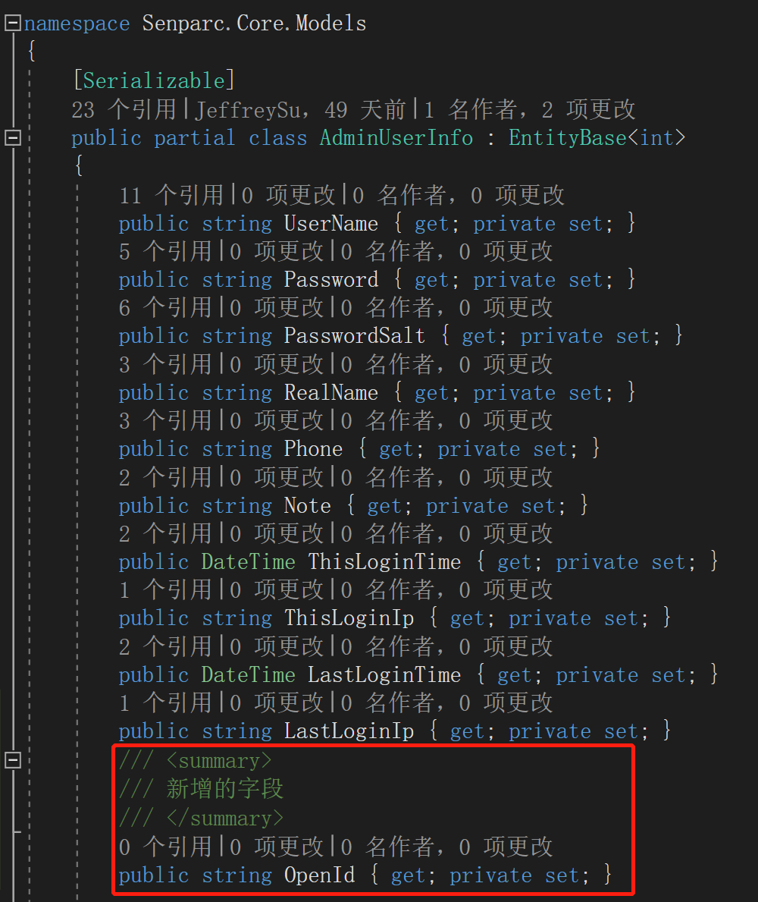
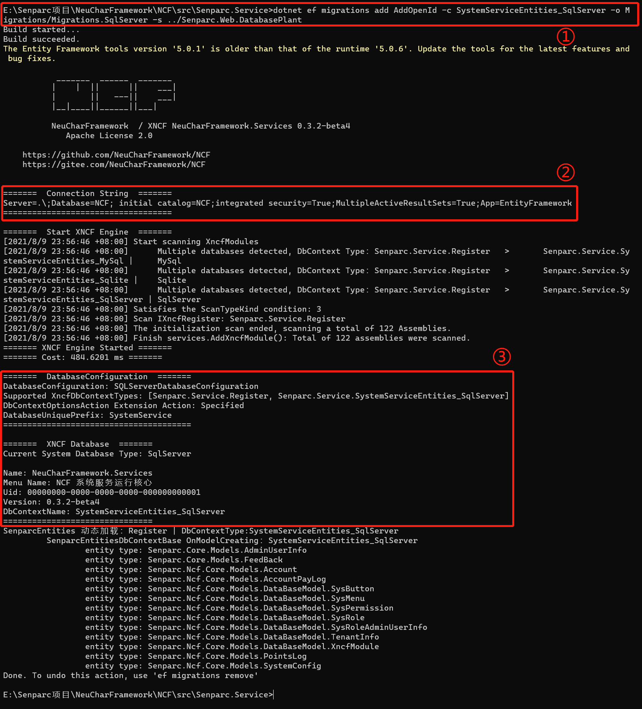
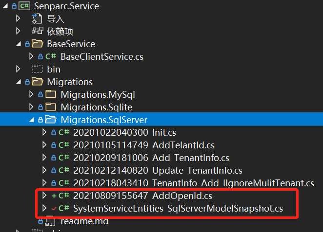
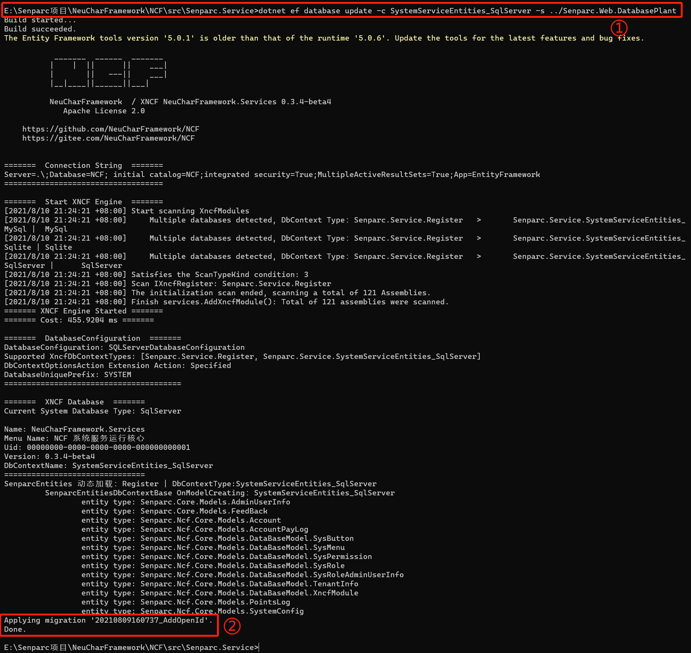
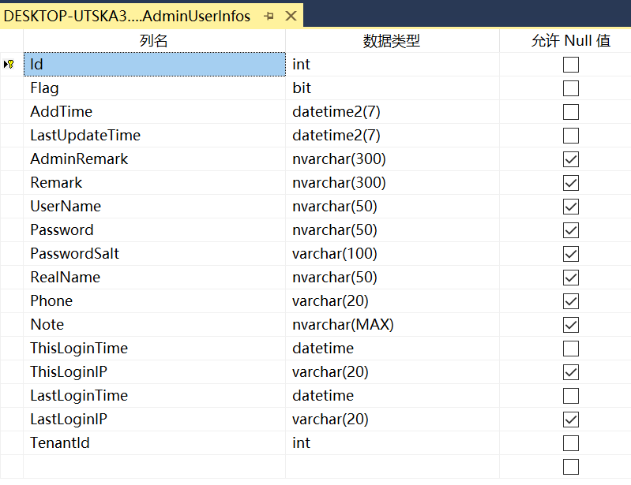
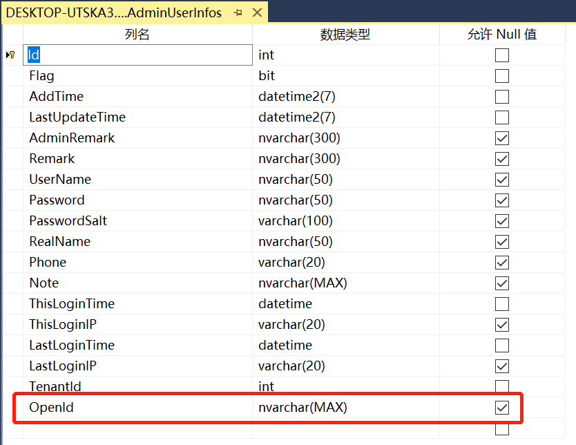

# 更新 Senparc.Service 项目的数据库迁移文件（Migrations）

> 以更新 Senparc.Service 项目为例，进行手动更新。

通常，更新 Senparc.Service 的数据库迁移文件，是因为在 NCF 模板项目中添加/修改/删除了某些数据库对应的实体信息。

## 使用 Code-First 修改数据库

例如，我们在 `AdminUserInfo` 类中添加了一个属性：



## 使用 EF Core 的 Add-Migration 命令生成迁移文件

由于 Senparc.Service 项目不是标准的 XNCF 模块（本质上是 XNCF 模块，但文件结构比较特殊），因此不能在 Admin 后台使用 Senparc.Xncf.XncfBuilder 模块直接进行操作，否则系统会按照 XNCF 的目录结构生成文件（当然这也不影响编译）。

我们可以使用命令行，以 CMD 命令行为例，进入 Senparc.Service 目录：

```
E:\Senparc项目\NeuCharFramework\NCF\src\Senparc.Service>
```

输入命令：

```
dotnet ef migrations add AddOpenId -c SystemServiceEntities_SqlServer -o Migrations/Migrations.SqlServer -s ../Senparc.Web.DatabasePlant
```

> 上述命令中 `AddOpenId` 是本次更新的名称，可以自由填写，`SystemServiceEntities_SqlServer` 是指向 SQL Server 的数据库上下文（DbContext）实现。当我们需要同时更新 MySQL 数据库时，就可以替换成 `SystemServiceEntities_MySQL`（注意对应实际的类名，类名也可能完全不体现数据库类型）。

执行命令即可完成 SQL Server 的迁移文件更新：



上图中：

①：在 Senparc.Service 目录下，输入的命令

②：显示了当前正在使用的数据库连接字符串

③：显示了更新的 SQL Server 数据库类型、DbContext 上下文类名等信息

在 VS 中可以看到新建了 `20210809155647_AddOpenId.cs` 文件，以及更新了快照文件 `SystemServiceEntities_SqlServerModelSnapshot.cs`：



通过 `20210809155647_AddOpenId.cs` 文件可以看到 OpenId 这个属性（对应数据库表的列已经被添加）


## 更新 Senparc.Service 版本号

我们建议您在更新了内容之后，同步更新 Senparc.Service 的版本号，此时把它和普通的 XNCF 一样来对待。

> /Senparc.Service/XncfModules/Register.cs

设置新的 Version 参数，如：

```csharp
public override string Version => "0.3.4-beta4";
```

### 更新数据库

使用 CMD 命令行，在 Senparc.Service 目录下执行命令：

```
dotnet ef database update -c SystemServiceEntities_SqlServer -s ../Senparc.Web.DatabasePlant
```

> 其中 SystemServiceEntities_SqlServer 根据数据库类型灵活调整



上图运行结果中：

①：执行更新数据库命令

②：提示完成最新的迁移更新

## 数据库表前后对比

| 图片                                                                       | 状态   |
| -------------------------------------------------------------------------- | ------ |
|  | 更新前 |
|  | 更新后 |
