# 发布本地Nuget包

> 1.点开项目属性

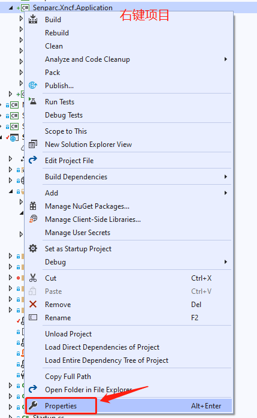

> 2.项目包设置发布选项,勾选生成时创建nuget文件

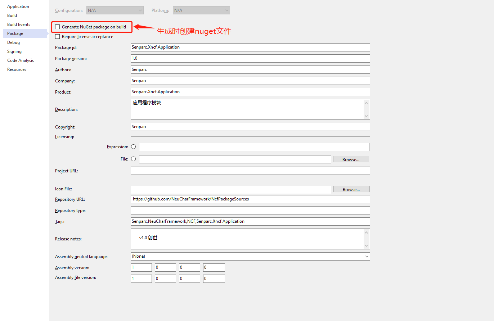

> 3.编辑项目文件

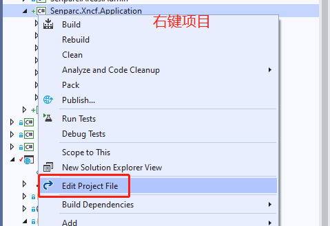

> 4.编辑需要生成Nuget文件的条件及必要参数

```xml
    <Project Sdk="Microsoft.NET.Sdk">
      <PropertyGroup>
        <TargetFramework>netcoreapp3.1</TargetFramework>
        <Version>1.0</Version>
        <AssemblyName>Senparc.Xncf.Application</AssemblyName>
        <RootNamespace>Senparc.Xncf.Application</RootNamespace>
        <GeneratePackageOnBuild Condition=" '$(Configuration)' == 'Release' ">true</GeneratePackageOnBuild>
        <Description>应用程序模块</Description>
        <Copyright>Senparc</Copyright>
        <PackageTags>Senparc,NeuCharFramework,NCF,Senparc.Xncf.Application</PackageTags>
        <Authors>Senparc</Authors>
        <Owners>Senparc</Owners>
        <!-- <PackageLicenseUrl>https://github.com/NeuCharFramework/NcfPackageSources/blob/master/LICENSE</PackageLicenseUrl> -->
        <Title>.应用程序模块</Title>
        <!--<ProjectUrl> https://github.com/NeuCharFramework/NCF</ProjectUrl>
        <PackageProjectUrl>https://github.com/NeuCharFramework/NcfPackageSources</PackageProjectUrl>
        <PackageIconUrl>http://sdk.weixin.senparc.com/Images/logo-square-ncf.jpg</PackageIconUrl>-->
        <PackageReleaseNotes>
          v1.0 创世
        </PackageReleaseNotes>
        <RepositoryUrl> https://github.com/NeuCharFramework/NcfPackageSources</RepositoryUrl>
        <Configurations>Debug;Release;Test</Configurations>
      </PropertyGroup>
      <PropertyGroup Condition=" '$(Configuration)' == 'Release' ">
        <OutputPath>..\..\..\BuildOutPut</OutputPath>
        <DocumentationFile>..\..\..\BuildOutPut\Senparc.Xncf.Application.XML</DocumentationFile>
        <DefineConstants>$(DefineConstants);RELEASE</DefineConstants>
        <Optimize>true</Optimize>
        <DebugType>pdbonly</DebugType>
        <ErrorReport>prompt</ErrorReport>
        <CodeAnalysisRuleSet>MinimumRecommendedRules.ruleset</CodeAnalysisRuleSet>
      </PropertyGroup>
      <ItemGroup>
        <PackageReference Include="Senparc.Ncf.XncfBase" Version="0.3.500-beta1" />
        <ProjectReference Include="..\Senparc.Core\Senparc.Core.csproj" />
        <ProjectReference Include="..\Senparc.Service\Senparc.Service.csproj" />
      </ItemGroup>

        <ItemGroup>
        <PackageReference Include="Microsoft.EntityFrameworkCore.SqlServer" Version="3.1.6" />
        <PackageReference Include="Microsoft.EntityFrameworkCore.SqlServer.Design" Version="2.0.0-preview1-final" />
        <PackageReference Include="Microsoft.EntityFrameworkCore.Tools" Version="3.1.6">
          <PrivateAssets>all</PrivateAssets>
          <IncludeAssets>runtime; build; native; contentfiles; analyzers</IncludeAssets>
        </PackageReference>
    </ItemGroup>

    </Project>
```

> 5.重新生成项目

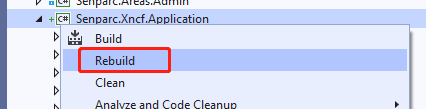

> 6.找到生成的Nuget包(这里用的是Debug环境,所以生成的在Debug目录下)

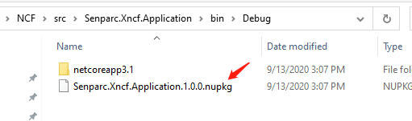

> 7.Copy本地Nuget包到指定的文件目录中(方便引用)

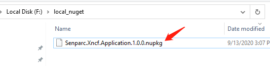

## 引用本地的Nuget源

> 1.进入源设置的方法有2种

> > 1-1.点击工具栏Tools->Options->Nuget Package Manager


> > 1-2.点击项目右键

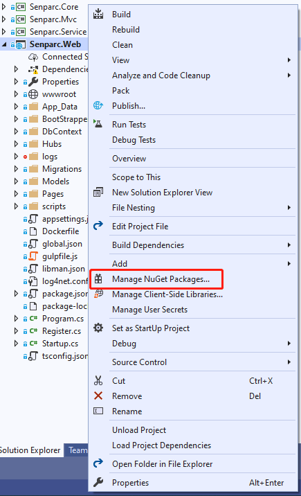

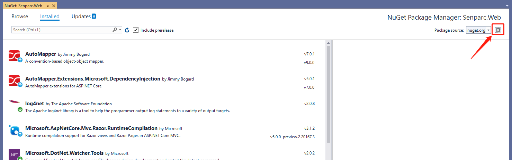


> 2.添加nuget源

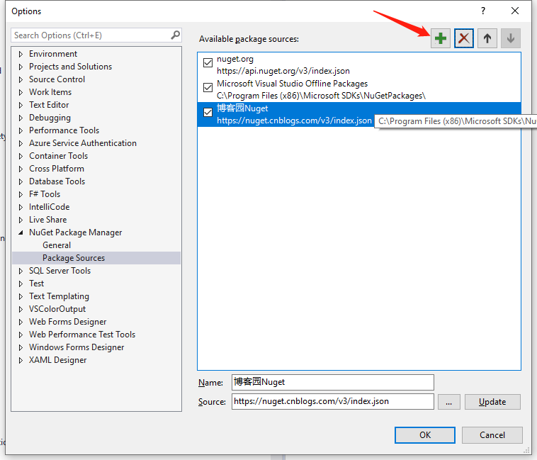

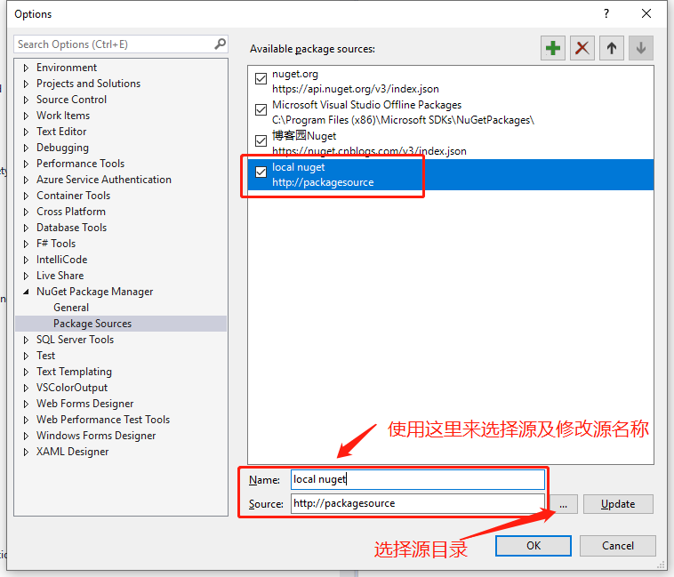

> 3.选择本地nuget源


> 4.引入本地nuget源

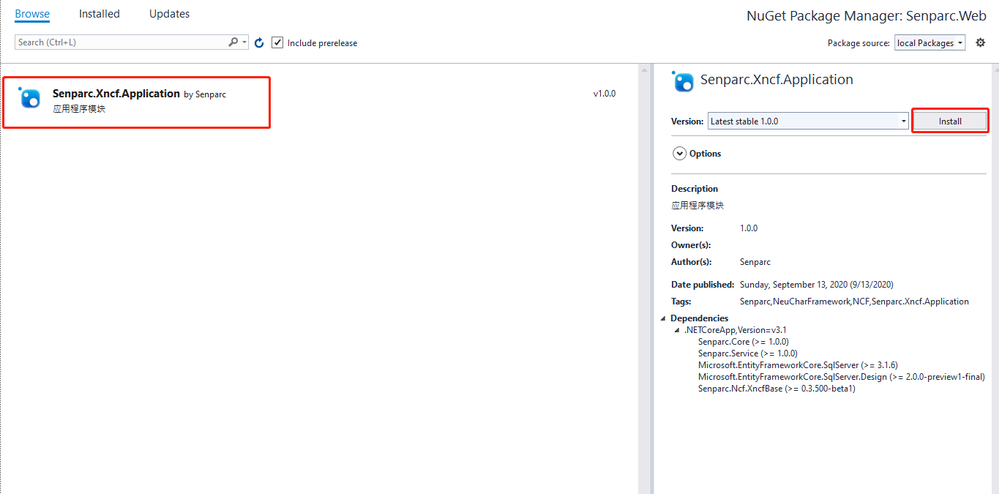

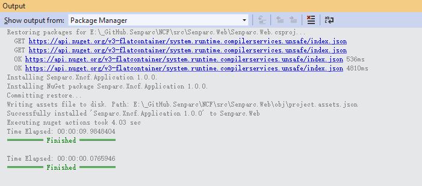

> 5.重新生成项目

> 6.效果展示

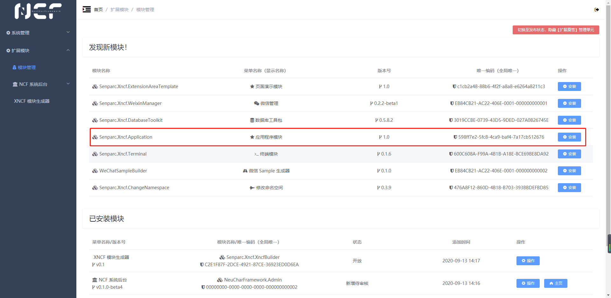

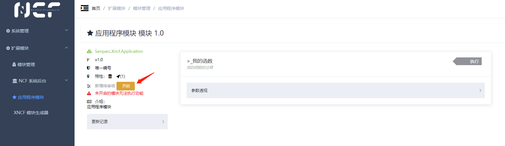

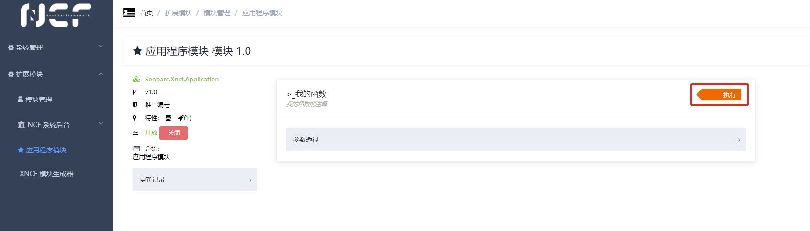

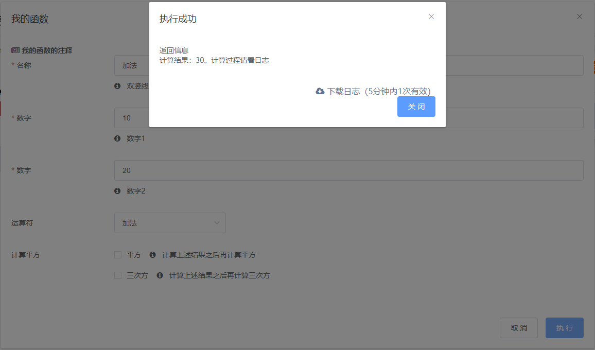
