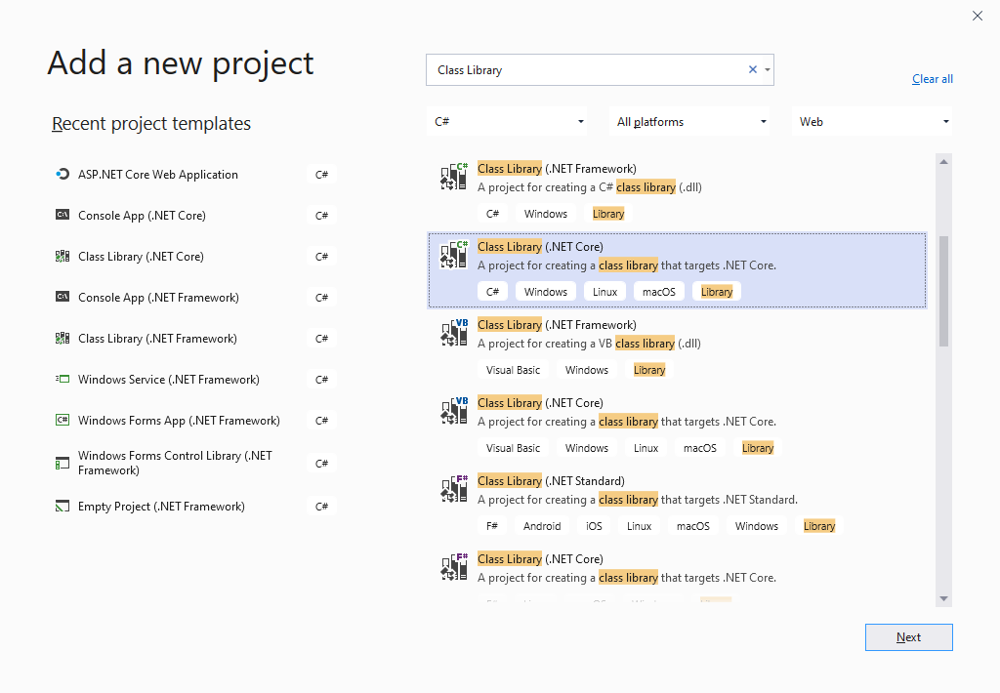
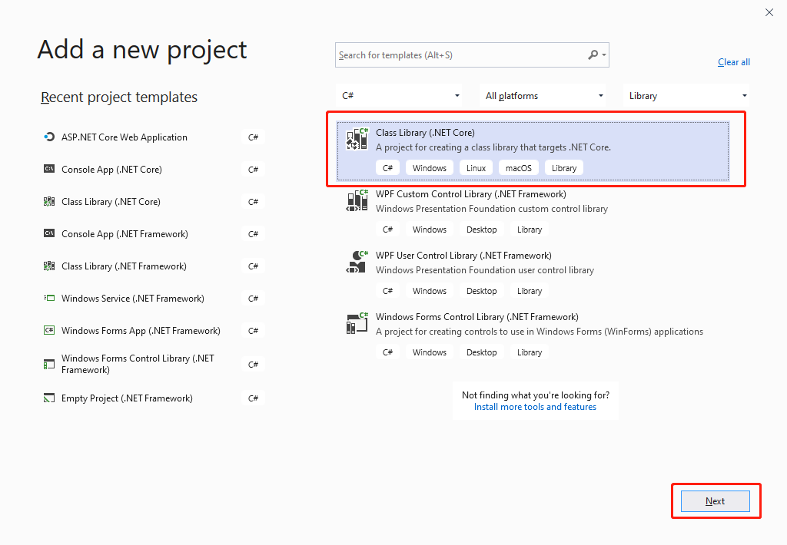

# Xncf 模块开发

NCF 底层支持库官方 Nuget 包源码

## Xncf 单功能执行模块开发

> 1.新建一个Dotnet Core的Class Library项目



> 2.输入Class Libray的名称,点击创建


> 3.建立Register.cs


> 4.配置Register中的必要内容

| 名称        | 说明                                                                           |
| ----------- | ------------------------------------------------------------------------------ |
| Name        | 模块名称                                                                       |
| Uid         | 全球唯一码,最好使用工具生成                                                    |
| Version     | 模块版本号(更新版本靠它识别)                                                   |
| MenuName    | 安装到NCF中以后菜单中显示的名称                                                |
| Icon        | 显示在菜单旁边的[字体图标](https://colorlib.com/polygon/gentelella/icons.html) |
| Description | 模块的说明文字,安装前可以根据此说明了解模块的具体功能                          |


> 5.创建自定义方法类


> 6.完成自定义方法

```csharp
public MyFunction(IServiceProvider serviceProvider) : base(serviceProvider)
{
}

public class Parameters : IFunctionParameter
{
    [Required]
    [MaxLength(50)]
    [Description("名称||双竖线之前为参数名称，双竖线之后为参数注释")]
    public string Name { get; set; }

    [Required]
    [Description("数字||数字1")]
    public int Number1 { get; set; }


    [Required]
    [Description("数字||数字2")]
    public int Number2 { get; set; }

    [Description("运算符||")]//下拉列表
    public SelectionList Operator { get; set; } = new SelectionList(SelectionType.DropDownList, new[] {
            new SelectionItem("+","加法","数字1 + 数字2",false),
            new SelectionItem("-","减法","数字1 - 数字2",true),
            new SelectionItem("×","乘法","数字1 × 数字2",false),
            new SelectionItem("÷","除法","数字1 ÷ 数字2",false)
    });

    [Description("计算平方||")]//多选框
    public SelectionList Power { get; set; } = new SelectionList(SelectionType.CheckBoxList, new[] {
            new SelectionItem("2","平方","计算上述结果之后再计算平方",false),
            new SelectionItem("3","三次方","计算上述结果之后再计算三次方",false)
    });
}


public override string Name => "我的函数";

public override string Description => "我的函数的注释";

public override Type FunctionParameterType => typeof(Parameters);

public override FunctionResult Run(IFunctionParameter param)
{
    return FunctionHelper.RunFunction<Parameters>(param, (typeParam, sb, result) =>
    {
        /* 页面上点击“执行”后，将调用这里的方法
            *
            * 参数说明：
            * param：IFunctionParameter 类型对象
            * typeParam：Senparc.Xncf.Application.MyFunction.Parameters 类型对象
            * sb：日志
            * result：返回结果
            */

        double calcResult = typeParam.Number1;
        var theOperator = typeParam.Operator.SelectedValues.FirstOrDefault();
        switch (theOperator)
        {
            case "+":
                calcResult = calcResult + typeParam.Number2;
                break;
            case "-":
                calcResult = calcResult - typeParam.Number2;
                break;
            case "×":
                calcResult = calcResult * typeParam.Number2;
                break;
            case "÷":
                if (typeParam.Number2 == 0)
                {
                    result.Success = false;
                    result.Message = "被除数不能为0！";
                    return;
                }
                calcResult = calcResult / typeParam.Number2;
                break;
            default:
                result.Success = false;
                result.Message = $"未知的运算符：{theOperator}";
                return;
        }

        sb.AppendLine($"进行运算：{typeParam.Number1} {theOperator} {typeParam.Number2} = {calcResult}");

        Action<int> raisePower = power =>
        {
            if (typeParam.Power.SelectedValues.Contains(power.ToString()))
            {
                var oldValue = calcResult;
                calcResult = Math.Pow(calcResult, power);
                sb.AppendLine($"进行{power}次方运算：{oldValue}{(power == 2 ? "²" : "³")} = {calcResult}");
            }
        };

        raisePower(2);
        raisePower(3);

        result.Message = $"计算结果：{calcResult}。计算过程请看日志";
    });
}
```

> 7.在Register中注册自定义的方法类


> 8.发布Nuget,详细步骤到发布Nuget

## Xncf 自定义带页面功能模块开发

> 1.新建一个DotnetCore Class Library项目，输入项目名称




> > 1.1 目录名称如下


> > 1.2 设置项目支持RazorPage功能


> 2.Senparc.Xncf.ExtensionAreaTemplate新建模型Color类

```csharp
using Senparc.Ncf.Core.Models;
using Senparc.Xncf.ExtensionAreaTemplate.Models.DatabaseModel.Dto;
using System;
using System.ComponentModel.DataAnnotations.Schema;

namespace Senparc.Xncf.ExtensionAreaTemplate
{
    /// <summary>
    /// Color 实体类
    /// </summary>
    [Table(Register.DATABASE_PREFIX + nameof(Color))]//必须添加前缀，防止全系统中发生冲突
    [Serializable]
    public class Color : EntityBase<int>
    {
        /// <summary>
        /// 颜色码，0-255
        /// </summary>
        public int Red { get; private set; }
        /// <summary>
        /// 颜色码，0-255
        /// </summary>
        public int Green { get; private set; }

        /// <summary>
        /// 颜色码，0-255
        /// </summary>
        public int Blue { get; private set; }

        /// <summary>
        /// 附加列，测试多次数据库 Migrate
        /// </summary>
        public string AdditionNote { get; private set; }

        private Color() { }

        public Color(int red, int green, int blue)
        {
            if (red < 0 || green < 0 || blue < 0)
            {
                Random();//随机
            }
            else
            {
                Red = red;
                Green = green;
                Blue = blue;
            }
        }

        public Color(ColorDto colorDto)
        {
            Red = colorDto.Red;
            Green = colorDto.Green;
            Blue = colorDto.Blue;
        }

        public void Random()
        {
            //随机产生颜色代码
            var radom = new Random();
            Func<int> getRadomColorCode = () => radom.Next(0, 255);
            Red = getRadomColorCode();
            Green = getRadomColorCode();
            Blue = getRadomColorCode();
        }

        public void Brighten()
        {
            Red = Math.Min(255, Red + 10);
            Green = Math.Min(255, Green + 10);
            Blue = Math.Min(255, Blue + 10);
        }

        public void Darken()
        {
            Red = Math.Max(0, Red - 10);
            Green = Math.Max(0, Green - 10);
            Blue = Math.Max(0, Blue - 10);
        }
    }
}
```

> 3.Senparc.Xncf.ExtensionAreaTemplate.Models.DatabaseModel.Dto新建ColorDto类


```csharp
using Senparc.Ncf.Core.Models;

namespace Senparc.Xncf.ExtensionAreaTemplate.Models.DatabaseModel.Dto
{
    public class ColorDto : DtoBase
    {
        /// <summary>
        /// 颜色码，0-255
        /// </summary>
        public int Red { get; private set; }
        /// <summary>
        /// 颜色码，0-255
        /// </summary>
        public int Green { get; private set; }
        /// <summary>
        /// 颜色码，0-255
        /// </summary>
        public int Blue { get; private set; }

        private ColorDto() { }
    }
}
```

> 4.AutoMapperConfigs增加以下代码


```csharp
using Microsoft.EntityFrameworkCore.Metadata.Builders;
using Senparc.Ncf.Core.Models.DataBaseModel;
using Senparc.Ncf.XncfBase.Attributes;

namespace Senparc.Xncf.ExtensionAreaTemplate.Models
{
    [XncfAutoConfigurationMapping]
    public class ExtensionAreaTemplate_ColorConfigurationMapping : ConfigurationMappingWithIdBase<Color, int>
    {
        public override void Configure(EntityTypeBuilder<Color> builder)
        {
            builder.Property(e => e.Red).IsRequired();
            builder.Property(e => e.Green).IsRequired();
            builder.Property(e => e.Blue).IsRequired();
        }
    }
}
```

> 5.Senparc.Xncf.ExtensionAreaTemplate.Areas.ExtensionAreaTemplate.Pages下建立页面，更改Index继承为Senparc.Ncf.AreaBase.Admin.AdminXncfModulePageModelBase


```csharp
using Microsoft.AspNetCore.Mvc;
using Senparc.Ncf.Core.Enums;
using Senparc.Ncf.Service;
using Senparc.Xncf.ExtensionAreaTemplate.Models.DatabaseModel.Dto;
using Senparc.Xncf.ExtensionAreaTemplate.Services;
using System;
using System.Threading.Tasks;

namespace Senparc.Xncf.ExtensionAreaTemplate.Areas.ExtensionAreaTemplate.Pages
{
    public class DatabaseSample : Senparc.Ncf.AreaBase.Admin.AdminXncfModulePageModelBase
    {
        public ColorDto ColorDto { get; set; }

        private readonly ColorService _colorService;
        private readonly IServiceProvider _serviceProvider;
        public DatabaseSample(IServiceProvider serviceProvider, ColorService colorService, Lazy<XncfModuleService> xncfModuleService)
            : base(xncfModuleService)
        {
            _colorService = colorService;
            _serviceProvider = serviceProvider;
        }

        public Task OnGetAsync()
        {
            var color = _colorService.GetObject(z => true, z => z.Id, OrderingType.Descending);
            ColorDto = _colorService.Mapper.Map<ColorDto>(color);
            return Task.CompletedTask;
        }

        public IActionResult OnGetDetail()
        {
            var color = _colorService.GetObject(z => true, z => z.Id, OrderingType.Descending);
            var colorDto = _colorService.Mapper.Map<ColorDto>(color);
            //return Task.CompletedTask;
            return Ok(new { colorDto, XncfModuleDto });
        }

        public async Task<IActionResult> OnGetBrightenAsync()
        {
            var colorDto = await _colorService.Brighten().ConfigureAwait(false);
            return Ok(colorDto);
        }

        public async Task<IActionResult> OnGetDarkenAsync()
        {
            var colorDto = await _colorService.Darken().ConfigureAwait(false);
            return Ok(colorDto);
        }
        public async Task<IActionResult> OnGetRandomAsync()
        {
            var colorDto = await _colorService.Random().ConfigureAwait(false);
            return Ok(colorDto);
        }
    }
}
```

> 6.增加Service类


```csharp
using Senparc.Ncf.Core.Enums;
using Senparc.Ncf.Repository;
using Senparc.Ncf.Service;
using Senparc.Xncf.ExtensionAreaTemplate.Models.DatabaseModel.Dto;
using System;
using System.Threading.Tasks;

namespace Senparc.Xncf.ExtensionAreaTemplate.Services
{
    public class ColorService : ServiceBase<Color>
    {
        public ColorService(IRepositoryBase<Color> repo, IServiceProvider serviceProvider)
            : base(repo, serviceProvider)
        {
        }

        public async Task<ColorDto> CreateNewColor()
        {
            Color color = new Color(-1, -1, -1);
            await base.SaveObjectAsync(color).ConfigureAwait(false);
            ColorDto colorDto = base.Mapper.Map<ColorDto>(color);
            return colorDto;
        }

        public async Task<ColorDto> Brighten()
        {
            //TODO:异步方法需要添加排序功能
            var obj = this.GetObject(z => true, z => z.Id, OrderingType.Descending);
            obj.Brighten();
            await base.SaveObjectAsync(obj).ConfigureAwait(false);
            return base.Mapper.Map<ColorDto>(obj);
        }

        public async Task<ColorDto> Darken()
        {
            //TODO:异步方法需要添加排序功能
            var obj = this.GetObject(z => true, z => z.Id, OrderingType.Descending);
            obj.Darken();
            await base.SaveObjectAsync(obj).ConfigureAwait(false);
            return base.Mapper.Map<ColorDto>(obj);
        }

        public async Task<ColorDto> Random()
        {
            //TODO:异步方法需要添加排序功能
            var obj = this.GetObject(z => true, z => z.Id, OrderingType.Descending);
            obj.Random();
            await base.SaveObjectAsync(obj).ConfigureAwait(false);
            return base.Mapper.Map<ColorDto>(obj);
        }

        //TODO: 更多业务方法可以写到这里
    }
}
```

> 7.Senparc.Xncf.ExtensionAreaTemplate.Models.DatabaseModel中ExtensionAreaTemplateSenparcEntities里面增加


```csharp
using Microsoft.EntityFrameworkCore;
using Senparc.Ncf.XncfBase;
using Senparc.Ncf.XncfBase.Database;

namespace Senparc.Xncf.ExtensionAreaTemplate.Models.DatabaseModel
{
    public class ExtensionAreaTemplateSenparcEntities : XncfDatabaseDbContext
    {
        public override IXncfDatabase XncfDatabaseRegister => new Register();
        public ExtensionAreaTemplateSenparcEntities(DbContextOptions<ExtensionAreaTemplateSenparcEntities> dbContextOptions) : base(dbContextOptions)
        {
        }

        public DbSet<Color> Colors { get; set; }

        //DOT REMOVE OR MODIFY THIS LINE 请勿移除或修改本行 - Entities Point
        //ex. public DbSet<Color> Colors { get; set; }

        //如无特殊需需要，OnModelCreating 方法可以不用写，已经在 Register 中要求注册
        //protected override void OnModelCreating(ModelBuilder modelBuilder)
        //{
        //}
    }
}
```

> 8.在Senparc.Web下执行


```csharp
using Senparc.Xncf.ExtensionAreaTemplate.Models.DatabaseModel;
using Senparc.Ncf.XncfBase.Database;
using System;
using System.IO;

namespace Senparc.Xncf.ExtensionAreaTemplate
{
    /// <summary>
    /// 设计时 DbContext 创建（仅在开发时创建 Code-First 的数据库 Migration 使用，在生产环境不会执行）
    /// </summary>
    public class SenparcDbContextFactory : SenparcDesignTimeDbContextFactoryBase<ExtensionAreaTemplateSenparcEntities, Register>
    {
        /// <summary>
        /// 用于寻找 App_Data 文件夹，从而找到数据库连接字符串配置信息
        /// </summary>
        public override string RootDictionaryPath => Path.Combine(AppContext.BaseDirectory, "..\\..\\..\\"/*项目根目录*/, "..\\Senparc.Web"/*找到 Web目录，以获取统一的数据库连接字符串配置*/);
    }
}
```

> 9.根据实际的Entities的名称，添加数据库更新命令


```shell
add-migration Xncf_AreaTemplate_Init2 -Context ExtensionAreaTemplateSenparcEntities
```

> 10.更新新加的数据库表及字段，只需要运行NCF主程序，更新此引用的模块，或者重新安装此模块即可

## 欢迎贡献代码！

[NeuCharFramework](https://github.com/NeuCharFramework/NCF)
