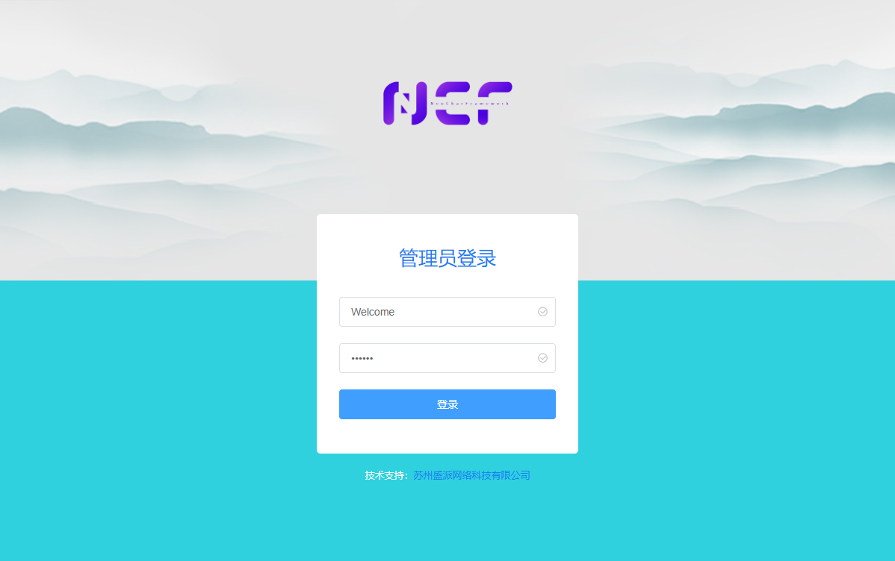

# NCF - NeuCharFramework

NeuCharFramework（以下简称 NCF） 是一整套可用于构建基础项目的 DDD 框架，包含了基础的缓存、数据库、模型、验证及配套管理后台，支持多数据库，高度模块化，具有高度的可扩展性。

## 源码地址

|                   | GitHub                                                                     | Gitee                                                                     | 说明                                                                                                                                       |
| ----------------- | -------------------------------------------------------------------------- | ------------------------------------------------------------------------- | ------------------------------------------------------------------------------------------------------------------------------------------ |
| NCF 模板          | [NCF](https://github.com/NeuCharFramework/NCF)                             | [NCF](https://gitee.com/NeuCharFramework/NCF)                             | 可直接用于开发的基础代码框架，常规开发只需要下载此项目或[使用模板创建项目](/start/start-develop/get-ncf-template.html#从命令行安装-推荐)。 |
| NcfPackageSources | [NcfPackageSources](https://github.com/NeuCharFramework/NcfPackageSources) | [NcfPackageSources](https://gitee.com/NeuCharFramework/NcfPackageSources) | `NCF 模板`项目所引用的基础库代码，以 Nuget 包形式发布，被 `NCF 模板`引用，同样 100% 开源，如需深度开发或研究基础原理可以下载。             |

注意：上述项目主分支为 GitHub 项目，Gitee 项目为镜像，更新可能存在延迟。

<b>当前快速更新分支：[Developer](https://github.com/NeuCharFramework/NCF/tree/Developer)</b>

> NCF 由盛派（Senparc）团队经过多年优化迭代的自用系统底层框架 SenparcCore 整理而来，经历了 .NET Framwork 3.5/4.5 众多系统的实战检验，并最终移植到 .NET Core（同时支持 .NET 5.0/6.0/7.0/8.0），高度模块化。NCF 目前已在众多大中型应用中稳定运行，感谢大家一直以来的支持，欢迎大家多提意见和建议，或加入社区贡献者的行列！

## QQ 技术交流群

## 了解更多

[开始](../instruction/about-ncf.html)
